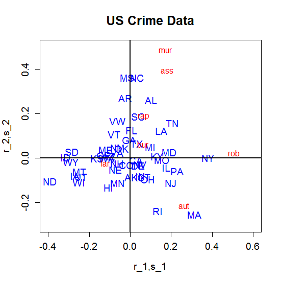

[](http://quantlet.de/index.php?p=info)

## [](http://quantlet.de/) **MVAcorrcrime** [](http://quantlet.de/d3/ia)

```yaml

Name of QuantLet : MVAcorrcrime

Published in : Applied Multivariate Statistical Analysis

Description : 'Performs a correspondence analysis for
the US crime, shows the eigenvalues of the singular
value decomposition of the chi-matrix and displays
graphically its factorial decomposition.'

Keywords :
- correspondence-analysis
- svd
- decomposition
- factorial-decomposition
- eigenvalues
- factorial
- plot
- graphical representation
- data visualization

See also :
- MVAcorrCar
- MVAcorrEyeHair
- MVAcorrjourn
- MVAcorrbac
- SMScorrcrime
- SMScorrcarm
- SMScorrfood
- SMScorrhealth

Author : Zografia Anastasiadou

Submitted : Tue, May 10 2011 by Zografia Anastasiadou

Datafile : uscrime.dat
```




```r

# clear all variables
rm(list = ls(all = TRUE))
graphics.off()

# load data
x1 = read.table("uscrime.dat")
x  = x1[, 3:9]
a  = rowSums(x)
b  = colSums(x)
e  = matrix(a) %*% b/sum(a)

# chi-matrix
cc = (x - e)/sqrt(e)

# singular value decomposition
sv = svd(cc)
g  = sv$u
l  = sv$d
d  = sv$v

# eigenvalues
ll = l * l

# cumulated percentage of the variance
aux  = cumsum(ll)/sum(ll)
perc = cbind(ll, aux)

r1   = matrix(l, nrow = nrow(g), ncol = ncol(g), byrow = T) * g
r    = r1/matrix(sqrt(a), nrow = nrow(g), ncol = ncol(g), byrow = F)
s1   = matrix(l, nrow = nrow(d), ncol = ncol(d), byrow = T) * d
s    = s1/matrix(sqrt(b), nrow = nrow(d), ncol = ncol(d), byrow = F)

rr   = r[, 1:2]
ss   = s[, 1:2]

# labels for crimes
crime = c("mur", "rap", "rob", "ass", "bur", "lar", "aut")

# labels for regions
state = c("ME", "NH", "VT", "MA", "RI", "CT", "NY", "NJ", "PA", "OH", "IN", "IL", 
    "MI", "WI", "MN", "IA", "MO", "ND", "SD", "NE", "KS", "DE", "MD", "VA", "VW", 
    "NC", "SC", "GA", "FL", "KY", "TN", "AL", "MS", "AR", "LA", "OK", "TX", "MT", 
    "ID", "WY", "CO", "NM", "AZ", "UT", "NV", "WA", "OR", "CA", "AK", "HI")

# plot
plot(rr, type = "n", xlim = c(-0.4, 0.6), ylim = c(-0.3, 0.5), xlab = "r_1,s_1", 
    ylab = "r_2,s_2", main = "US Crime Data", cex.axis = 1.2, cex.lab = 1.2, cex.main = 1.6)
points(ss, type = "n")
text(rr, state, cex = 1.2, col = "blue")
text(ss, crime, col = "red")
abline(h = 0, v = 0, lwd = 2)

```
