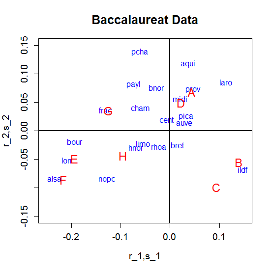
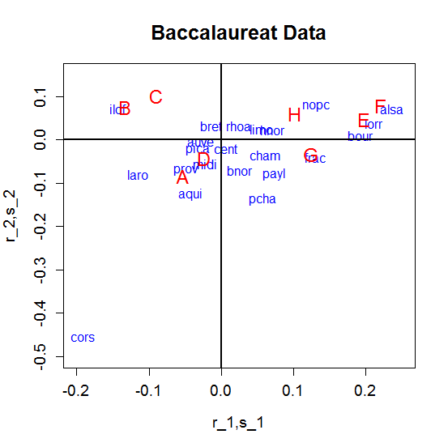

[](http://quantlet.de/index.php?p=info)

## [](http://quantlet.de/) **MVAcorrbac** [](http://quantlet.de/d3/ia)

```yaml

Name of QuantLet : MVAcorrbac

Published in : Applied Multivariate Statistical Analysis

Description : 'Performs a correspondence analysis for the
baccalaureat data, shows the eigenvalues of the singular
value decomposition of the chi-matrix and displays
graphically its factorial decomposition.'

Keywords :
- correspondence-analysis
- svd
- decomposition
- factorial-decomposition
- eigenvalues
- factorial
- plot
- graphical representation
- data visualization

See also :
- MVAcorrCar
- MVAcorrEyeHair
- MVAcorrcrime
- MVAcorrjourn
- SMScorrcrime
- SMScorrcarm
- SMScorrfood
- SMScorrhealth

Author : Zografia Anastasiadou

Submitted : Fri, June 03 2011 by Zografia Anastasiadou

Datafile : bac.dat

Example :
- Without Corsica
- With Corsica
```






```r

# clear all variables
rm(list = ls(all = TRUE))
graphics.off()

# load data
x1       = read.table("bac.dat")
x1       = x1[, 2:ncol(x1)]
wcors    = 0                   # set to 0/1 to ex/include Corsica
wcorsica = c(rep(1, nrow(x1) - 1), wcors)
x        = subset(x1, wcorsica == 1)
a        = rowSums(x)
b        = colSums(x)
e        = matrix(a) %*% b/sum(a)

# chi-matrix
cc   = (x - e)/sqrt(e)

# singular value decomposition
sv   = svd(cc)
g    = sv$u
l    = sv$d
d    = sv$v

# eigenvalues
ll   = l * l

# cumulated percentage of the variance
aux  = cumsum(ll)/sum(ll)
perc = cbind(ll, aux)

r1   = matrix(l, nrow = nrow(g), ncol = ncol(g), byrow = T) * g
r    = (r1/matrix(sqrt(a), nrow = nrow(g), ncol = ncol(g), byrow = F)) * (-1)

s1   = matrix(l, nrow = nrow(d), ncol = ncol(d), byrow = T) * d
s    = (s1/matrix(sqrt(b), nrow = nrow(d), ncol = ncol(d), byrow = F)) * (-1)

car  = matrix(matrix(a), nrow = nrow(r), ncol = ncol(r), byrow = F) * r^2/matrix(l^2, 
    nrow = nrow(r), ncol = ncol(r), byrow = T)           # contribution in r

cas  = matrix(matrix(b), nrow = nrow(s), ncol = ncol(s), byrow = F) * s^2/matrix(l^2, 
    nrow = nrow(s), ncol = ncol(s), byrow = T)           # contribution in s

rr   = r[, 1:2]
ss   = s[, 1:2]

if (wcors == 0) {
    # labels for modalities
    types   = c("A", "B", "C", "D", "E", "F", "G", "H")
    
    # labels for regions
    regions = c("ildf", "cham", "pica", "hnor", "cent", "bnor", "bour", "nopc", 
        "lorr", "alsa", "frac", "payl", "bret", "pcha", "aqui", "midi", "limo", "rhoa", 
        "auve", "laro", "prov")
    
    # plot 1
    plot(rr, type = "n", xlim = c(-0.25, 0.15), ylim = c(-0.15, 0.15), xlab = "r_1,s_1", 
        ylab = "r_2,s_2", main = "Baccalaureat Data", cex.axis = 1.2, cex.lab = 1.2, 
        cex.main = 1.6)
    points(ss, type = "n")
    text(rr, regions, col = "blue")
    text(ss, types, cex = 1.5, col = "red")
    abline(h = 0, v = 0, lwd = 2)
} else {
    # labels for modalities
    types   = c("A", "B", "C", "D", "E", "F", "G", "H")
    
    # labels for regions
    regions = c("ildf", "cham", "pica", "hnor", "cent", "bnor", "bour", "nopc", 
        "lorr", "alsa", "frac", "payl", "bret", "pcha", "aqui", "midi", "limo", "rhoa", 
        "auve", "laro", "prov", "cors")
    
    # plot 2
    plot(rr, type = "n", xlim = c(-0.2, 0.25), ylim = c(-0.5, 0.15), xlab = "r_1,s_1", 
        ylab = "r_2,s_2", main = "Baccalaureat Data", cex.axis = 1.2, cex.lab = 1.2, 
        cex.main = 1.6)
    points(ss, type = "n")
    text(rr, regions, col = "blue")
    text(ss, types, cex = 1.5, col = "red")
    abline(h = 0, v = 0, lwd = 2)
}

```
