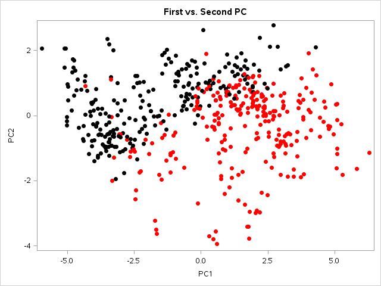
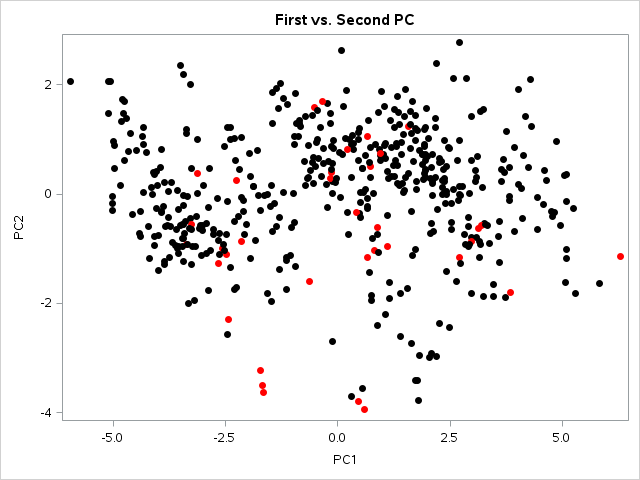
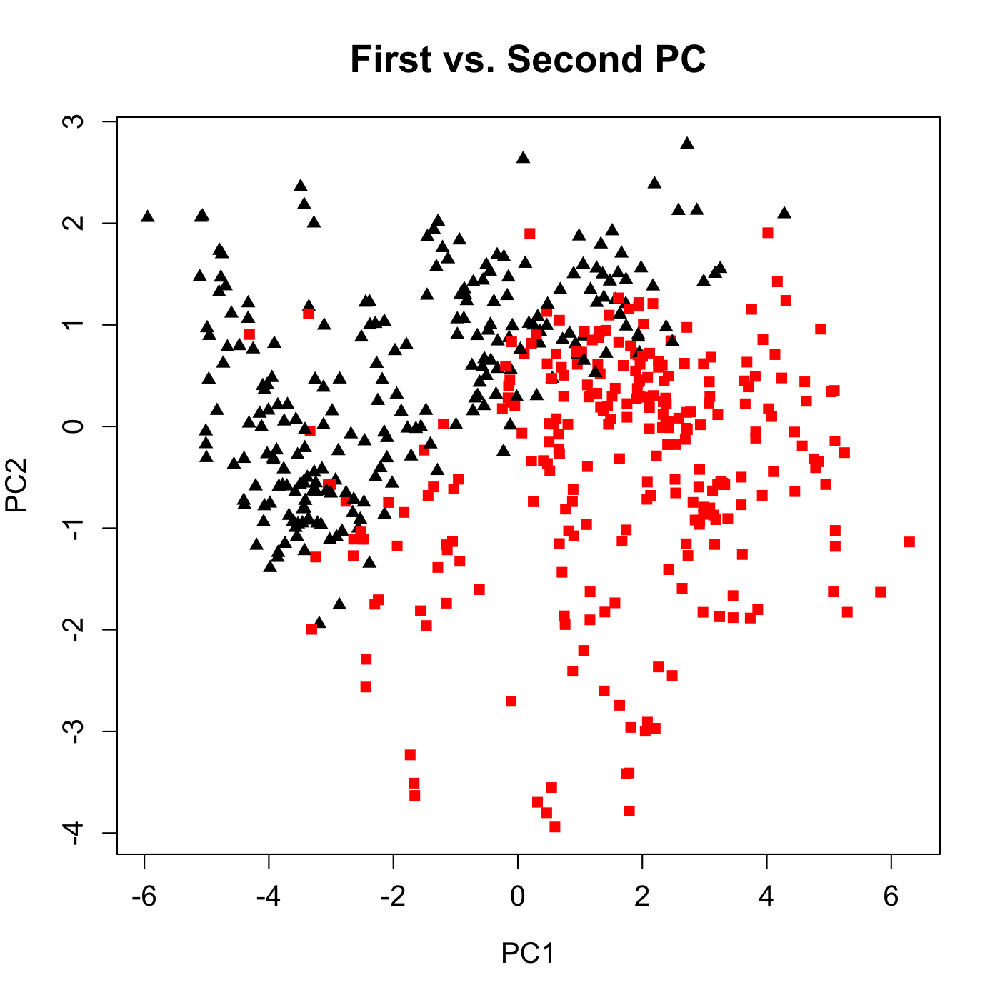

[](http://quantlet.de/index.php?p=info)

## [](http://quantlet.de/) **MVAnpcahous** [](http://quantlet.de/d3/ia)

```yaml

Name of QuantLet : MVAnpcahous

Published in : Applied Multivariate Statistical Analysis

Description : 'Performs a PCA for the standardized Boston housing data. Determines the explained
variance for the eigenvalues, which determine the relevant principal components.'

Keywords : 'principal-components, pca, npca, eigenvalues, standardization, spectral-decomposition,
scatterplot, plot, graphical representation, data visualization, sas'

See also : 'MVAnpcabanki, MVAnpcabank, MVAnpcahousi, MVAnpcatime, MVAnpcafood, MVAnpcausco,
MVAnpcausco2, MVAnpcausco2i, MVAcpcaiv, MVApcabank, MVApcabanki, MVApcabankr, MVApcasimu'

Author : Zografia Anastasiadou

Author[SAS] : Svetlana Bykovskaya

Submitted : Fri, April 11 2014 by Awdesch Melzer

Submitted[SAS] : Wen, April 6 2016 by Svetlana Bykovskaya

Datafile : bostonh.dat

Example: 
- 1: 'Scatterplot of the first two PCs. Houses close to the Charles River are indicated with red
squares.'
- 2: Scatterplot of the first two PCs. More expensive houses are marked with red color.

```








### R Code:
```r

# clear all variables
rm(list = ls(all = TRUE))
graphics.off()

# load data
data = read.table("bostonh.dat")

# transform data
xt       = data
xt[, 1]  = log(data[, 1])
xt[, 2]  = data[, 2]/10
xt[, 3]  = log(data[, 3])
xt[, 5]  = log(data[, 5])
xt[, 6]  = log(data[, 6])
xt[, 7]  = (data[, 7]^(2.5))/10000
xt[, 8]  = log(data[, 8])
xt[, 9]  = log(data[, 9])
xt[, 10] = log(data[, 10])
xt[, 11] = exp(0.4 * data[, 11])/1000
xt[, 12] = data[, 12]/100
xt[, 13] = sqrt(data[, 13])
xt[, 14] = log(data[, 14])
data     = xt[, -4]

n1 = nrow(data)
n2 = ncol(data)

x    = (data - matrix(apply(data, 2, mean), n1, n2, byrow = T))/matrix(sqrt((n1 - 1) * 
    apply(data, 2, var)/n1), n1, n2, byrow = T)  # standardizes the data
eig  = eigen((n1 - 1) * cov(x)/n1)               # spectral decomposition
e    = eig$values
v    = eig$vectors

perc = e/sum(e)                                  # explained variance
cum  = cumsum(e)/sum(e)                          # cumulated explained percentages
xv   = as.matrix(x) %*% v                        # principal components

# correlations of the first 3 PC's with the original variables
corr = cor(x, xv)[, 1:3]
h    = x[, 13]
h[h >= mean(h)] = 15
h1   = h
h1[h1 < mean(x[, 13])] = 17

hr = h1
hr[hr == 15] = "red"                             # mark more expensive houses with red square
hr[hr == 17] = "black"                           # mark cheaper houses with black triangle
xv = xv * (-1)                                   # correction for signs of eigenvectors

# Plot 1
dev.new()
plot(xv[, 1], xv[, 2], pch = h1, col = hr, xlab = "PC1", ylab = "PC2", main = "First vs. Second PC", 
    cex.axis = 1.2, cex.lab = 1.2, cex.main = 1.6)

col = xt[, 4]
col[col == 1] = "red"
col[col == 0] = "black"

h2 = xt[, 4]
h2[h2 == 1] = 15
h2[h2 == 0] = 17

# Plot 2
dev.new()
plot(xv[, 1], xv[, 2], pch = h2, col = col, xlab = "PC1", ylab = "PC2", main = "First vs. Second PC", 
    cex.axis = 1.2, cex.lab = 1.2, cex.main = 1.6)  # houses close to the Charles River are indicated with red squares 

```

### SAS Code:
```sas
* Import the data;
data bostonh;
  infile '/folders/myfolders/data/bostonh.dat';
  input temp1-temp14;
run;

proc iml;
  * Read data into a matrix;
  use bostonh;
    read all var _ALL_ into datax; 
  close bostonh;
  
  xt = datax;
  xt[, 1]  = log(datax[, 1]);
  xt[, 2]  = datax[, 2]/10;
  xt[, 3]  = log(datax[, 3]);
  xt[, 5]  = log(datax[, 5]);
  xt[, 6]  = log(datax[, 6]);
  xt[, 7]  = (datax[, 7] ## (2.5))/10000;
  xt[, 8]  = log(datax[, 8]);
  xt[, 9]  = log(datax[, 9]);
  xt[, 10] = log(datax[, 10]);
  xt[, 11] = exp(0.4 * datax[, 11])/1000;
  xt[, 12] = datax[, 12]/100;
  xt[, 13] = sqrt(datax[, 13]);
  xt[, 14] = log(datax[, 14]);
  datax = xt[,1:3] || xt[,5:14];
  
  n1  = nrow(datax);
  x   = (datax - repeat(datax(|:,|), n1, 1)) / sqrt((n1 - 1) * var(datax) / n1); * standardizes the data;
  eig = (n1 - 1) * cov(x)/n1; * spectral decomposition;
  e   = eigval(eig);
  v   = eigvec(eig);
  
  perc = e/sum(e);            * explained variance;
  cum  = cusum(e)/sum(e);     * cumulated explained percentages;
  xv   = x * v;               * principal components;
  
  h = x[, 13];
  s = mean(h);
  
  * mark more expensive houses with "1", cheaper houses with "2";
  do i = 1 to nrow(h);
    if h[i] >= s then h[i] = 1; else h[i] = 2; 
  end;
  id1 = h;
  
  * mark houses which are close to the Charles River with "1"; 
  id2 = xt[, 4] + 1;
  
  x1  = xv[,1];
  x2  = xv[,2];     
  create plot var {"x1" "x2" "id1" "id2"};
    append;
  close plot;
quit;

proc sgplot data = plot
    noautolegend;
  title 'First vs. Second PC';
  scatter x = x1 y = x2 / colorresponse = id1 colormodel = (red black)
    markerattrs = (symbol = circlefilled);
  xaxis label = 'PC1';
  yaxis label = 'PC2';
run;

proc sgplot data = plot
    noautolegend;
  title 'First vs. Second PC';
  scatter x = x1 y = x2 / colorresponse = id2 colormodel = (black red)
    markerattrs = (symbol = circlefilled);
  xaxis label = 'PC1';
  yaxis label = 'PC2';
run;
```
