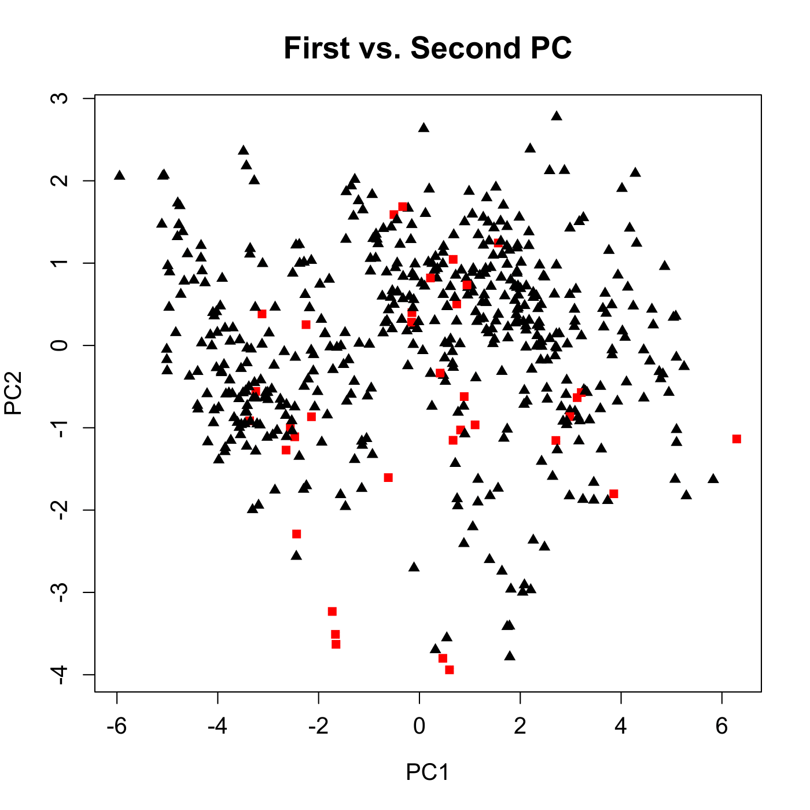

[](http://quantlet.de/index.php?p=info)

## [](http://quantlet.de/) **MVAnpcahous** [](http://quantlet.de/d3/ia)

```yaml

Name of QuantLet : MVAnpcahous

Published in : Applied Multivariate Statistical Analysis

Description : 'Performs a PCA for the standardized Boston
housing data. Determines the explained variance
for the eigenvalues, which determine the relevant
prinicipal components.'

Keywords :
- principal-components
- pca
- npca
- eigenvalues
- standardization
- spectral-decomposition
- scatterplot
- plot
- graphical representation
- data visualization

See also :
- MVAnpcabanki
- MVAnpcabank
- MVAnpcahousi
- MVAnpcatime
- MVAnpcafood
- MVAnpcausco
- MVAnpcausco2
- MVAnpcausco2i
- MVAcpcaiv
- MVApcabank
- MVApcabanki
- MVApcabankr
- MVApcasimu

Author : Zografia Anastasiadou

Submitted : Fri, April 11 2014 by Awdesch Melzer

Datafile : bostonh.dat

Example :
- Scatterplot of the first two PCs. Houses close to the Charles River are indicated with red
squares.
- Scatterplot of the first two PCs. More expensive houses are marked with red color.
```





```r

# clear all variables
rm(list = ls(all = TRUE))
graphics.off()

# load data
data = read.table("bostonh.dat")

# transform data
xt       = data
xt[, 1]  = log(data[, 1])
xt[, 2]  = data[, 2]/10
xt[, 3]  = log(data[, 3])
xt[, 5]  = log(data[, 5])
xt[, 6]  = log(data[, 6])
xt[, 7]  = (data[, 7]^(2.5))/10000
xt[, 8]  = log(data[, 8])
xt[, 9]  = log(data[, 9])
xt[, 10] = log(data[, 10])
xt[, 11] = exp(0.4 * data[, 11])/1000
xt[, 12] = data[, 12]/100
xt[, 13] = sqrt(data[, 13])
xt[, 14] = log(data[, 14])
data     = xt[, -4]

n1 = nrow(data)
n2 = ncol(data)

x    = (data - matrix(apply(data, 2, mean), n1, n2, byrow = T))/matrix(sqrt((n1 - 1) * 
    apply(data, 2, var)/n1), n1, n2, byrow = T)  # standardizes the data
eig  = eigen((n1 - 1) * cov(x)/n1)               # spectral decomposition
e    = eig$values
v    = eig$vectors

perc = e/sum(e)                                  # explained variance
cum  = cumsum(e)/sum(e)                          # cumulated explained percentages
xv   = as.matrix(x) %*% v                        # principal components

# correlations of the first 3 PC's with the original variables
corr = cor(x, xv)[, 1:3]
h    = x[, 13]
h[h >= mean(h)] = 15
h1   = h
h1[h1 < mean(x[, 13])] = 17

hr = h1
hr[hr == 15] = "red"                             # mark more expensive houses with red square
hr[hr == 17] = "black"                           # mark cheaper houses with black triangle
xv = xv * (-1)                                   # correction for signs of eigenvectors

# Plot 1
dev.new()
plot(xv[, 1], xv[, 2], pch = h1, col = hr, xlab = "PC1", ylab = "PC2", main = "First vs. Second PC", 
    cex.axis = 1.2, cex.lab = 1.2, cex.main = 1.6)

col = xt[, 4]
col[col == 1] = "red"
col[col == 0] = "black"

h2 = xt[, 4]
h2[h2 == 1] = 15
h2[h2 == 0] = 17

# Plot 2
dev.new()
plot(xv[, 1], xv[, 2], pch = h2, col = col, xlab = "PC1", ylab = "PC2", main = "First vs. Second PC", 
    cex.axis = 1.2, cex.lab = 1.2, cex.main = 1.6)  # houses close to the Charles River are indicated with red squares 

```
