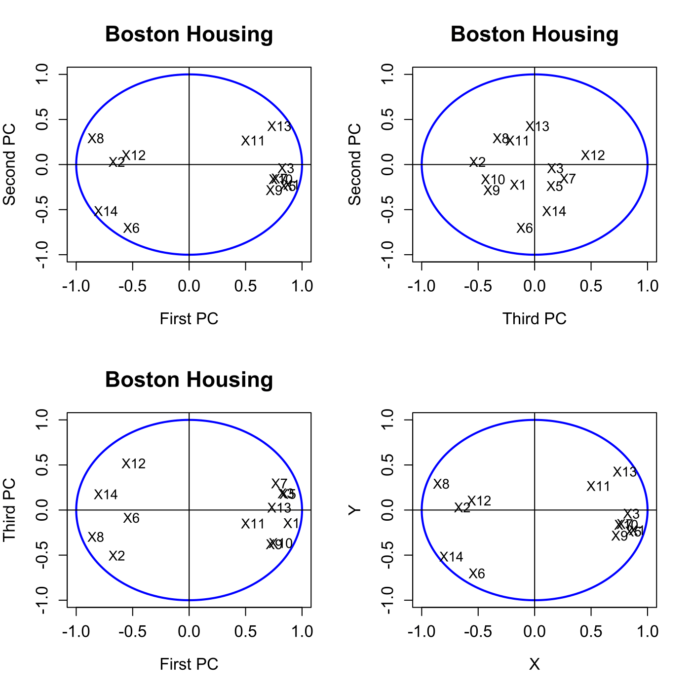

[](http://quantlet.de/index.php?p=info)

## [](http://quantlet.de/) **MVAnpcahousi** [](http://quantlet.de/d3/ia)

```yaml

Name of QuantLet : MVAnpcahousi

Published in : Applied Multivariate Statistical Analysis

Description : 'Calculates and plots the correlations of
the first three PCs with the original variables for
the standardized Boston housing data.'

Keywords :
- principal-components
- pca
- npca
- eigenvalues
- standardization
- spectral-decomposition
- correlation
- plot
- graphical representation
- data visualization

See also :
- MVAnpcabanki
- MVAnpcabank
- MVAnpcahous
- MVAnpcatime
- MVAnpcafood
- MVAnpcausco
- MVAnpcausco2
- MVAnpcausco2i
- MVAcpcaiv
- MVApcabank
- MVApcabanki
- MVApcabankr
- MVApcasimu

Author : Zografia Anastasiadou

Submitted : Tue, March 11 2014 by Awdesch Melzer

Datafile : bostonh.dat
```




```r

# clear all variables
rm(list = ls(all = TRUE))
graphics.off()

# load data
data = read.table("bostonh.dat")

# transform data
xt       = data
xt[, 1]  = log(data[, 1])
xt[, 2]  = data[, 2]/10
xt[, 3]  = log(data[, 3])
xt[, 5]  = log(data[, 5])
xt[, 6]  = log(data[, 6])
xt[, 7]  = (data[, 7]^(2.5))/10000
xt[, 8]  = log(data[, 8])
xt[, 9]  = log(data[, 9])
xt[, 10] = log(data[, 10])
xt[, 11] = exp(0.4 * data[, 11])/1000
xt[, 12] = data[, 12]/100
xt[, 13] = sqrt(data[, 13])
xt[, 14] = log(as.numeric(data[, 14]))
data     = xt[, -4]

n1  = nrow(data)
n2  = ncol(data)
x   = (data - matrix(mean(as.matrix(data)), n1, n2, byrow = T))/matrix(sqrt((n1 - 1) * 
    apply(data, 2, var)/n1), n1, n2, byrow = T)  # standardizes the data
eig = eigen((n1 - 1) * cov(x)/n1)  # spectral decomposition
e   = eig$values
v   = eig$vectors
x1  = as.matrix(x - matrix(mean(as.matrix(x)), nrow(x), ncol(x), byrow = T))
r1  = x1 %*% v
r   = cor(cbind(r1, x))

# correlations between variables and pc's
r12  = r[14:26, 1:2]
r13  = cbind(r[14:26, 1], r[14:26, 3])
r32  = cbind(r[14:26, 3], r[14:26, 2])
r123 = r[14:26, 1:3]

# plot
par(mfrow = c(2, 2))
ucircle = cbind(cos((0:360)/180 * pi), sin((0:360)/180 * pi))
plot(ucircle, type = "l", lty = "solid", col = "blue", xlab = "First PC", ylab = "Second PC", 
    main = "Boston Housing", cex.lab = 1.2, cex.axis = 1.2, cex.main = 1.6, lwd = 2)
abline(h = 0, v = 0)
label = c("X1", "X2", "X3", "X5", "X6", "X7", "X8", "X9", "X10", "X11", "X12", "X13", 
    "X14")
text(r12, label)

ucircle = cbind(cos((0:360)/180 * pi), sin((0:360)/180 * pi))
plot(ucircle, type = "l", lty = "solid", col = "blue", xlab = "Third PC", ylab = "Second PC", 
    main = "Boston Housing", cex.lab = 1.2, cex.axis = 1.2, cex.main = 1.6, lwd = 2)
abline(h = 0, v = 0)
label = c("X1", "X2", "X3", "X5", "X6", "X7", "X8", "X9", "X10", "X11", "X12", "X13", 
    "X14")
text(r32, label)

ucircle = cbind(cos((0:360)/180 * pi), sin((0:360)/180 * pi))
plot(ucircle, type = "l", lty = "solid", col = "blue", xlab = "First PC", ylab = "Third PC", 
    main = "Boston Housing", cex.lab = 1.2, cex.axis = 1.2, cex.main = 1.6, lwd = 2)
abline(h = 0, v = 0)
label = c("X1", "X2", "X3", "X5", "X6", "X7", "X8", "X9", "X10", "X11", "X12", "X13", 
    "X14")
text(r13, label)

ucircle = cbind(cos((0:360)/180 * pi), sin((0:360)/180 * pi))
plot(ucircle, type = "l", lty = "solid", col = "blue", xlab = "X", ylab = "Y", cex.lab = 1.2, 
    cex.axis = 1.2, lwd = 2)
abline(h = 0, v = 0)
label = c("X1", "X2", "X3", "X5", "X6", "X7", "X8", "X9", "X10", "X11", "X12", "X13", 
    "X14")
text(r123, label) 

```
