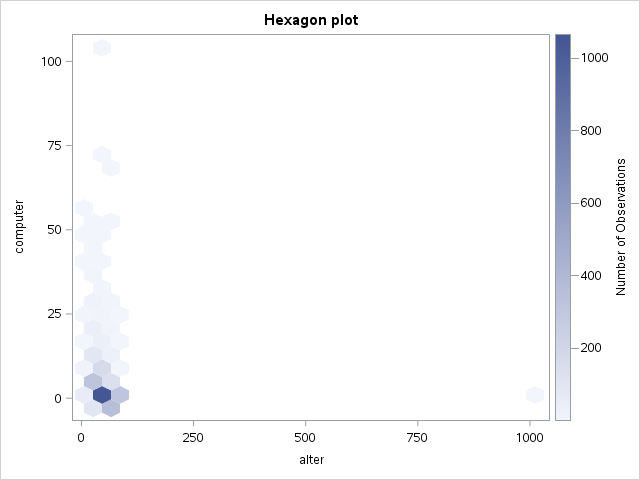

[](http://quantlet.de/index.php?p=info)

## [](http://quantlet.de/) **MVAageCom** [](http://quantlet.de/d3/ia)

```yaml

Name of QuantLet : MVAageCom

Published in : Applied Multivariate Statistical Analysis

Description : Hexagon plot between Age and Time for computer per week.

Keywords : plot, graphical representation, hexagon-plot, data visualization, financial, sas

See also : MVAincomeLi, MVAageIncome

Author : Vinh Hanh Lieu

Author[SAS] : Svetlana Bykovskaya

Submitted : Tue, September 09 2014 by Awdesch Melzer

Submitted[SAS] : Wen, April 6 2016 by Svetlana Bykovskaya

Datafile : allbus.csv

```





### R Code:
```r

# clear all variables
rm(list = ls(all = TRUE))
graphics.off()

# install and load packages
libraries = c("hexbin")
lapply(libraries, function(x) if (!(x %in% installed.packages())) {
    install.packages(x)
})
lapply(libraries, library, quietly = TRUE, character.only = TRUE)

# load data
allbus  = read.csv2("allbus.csv")
allbus4 = allbus[, c(2, 6)]

# Exclude unvalid observations
allbus4  = allbus4[(allbus4$ALTER = 100) & (allbus4$COMPUTER < 999), ]
ages4    = allbus4[, 1]
computer = allbus4[, 2]

# Hexagon plot
hexbinplot(computer ~ ages4, main="Hexagon plot", xlab = "Age", ylab = "Computer time", 
           style = "colorscale", aspect = 1, trans = sqrt, inv = function(ages4) ages4 ^ 2)

```

### SAS Code:
```sas

* Import the data;
data allbus;
  infile '/folders/myfolders/Sas-work/data/allbus.csv' dlm=';' dsd firstobs=2;
  input t1 $ t2 $ t3 $ t4 $ t5 $ t6 $ t7 $ t8 $ t9 $ t10 $ ;
  t6 = input(t6, commax10.);
  drop t1 t3-t5 t7-t10;
run;

proc iml;
  * Read data into a matrix;
  use allbus;
    read all var _ALL_ into x; 
  close allbus;
  
  x = num(x);
  
  create datax from x[colname={"alter" "computer"}];
    append from x;
  close datax;
quit;

* Exclude unvalid observations;
data new;
  set datax;
  if computer < 999;
run;

%macro HexBin(dsName, xName, yName, nBins=36, colorramp=TwoColorRamp);
  ods select none;
  ods output fitplot=_HexMap;  /* write graph data to a data set */
  proc surveyreg data=&dsname plots(nbins=&nBins weight=heatmap)=fit(shape=hex);
    model &yName = &xName;
  run;
  ods select all;
 
  proc sgplot data=_HexMap;
    polygon x=XVar y=YVar ID=hID / colorresponse=WVar fill 
                                    colormodel=&colorramp;
  run;
%mend;

title 'Hexagon plot';
%HexBin(new, alter, computer);


```
