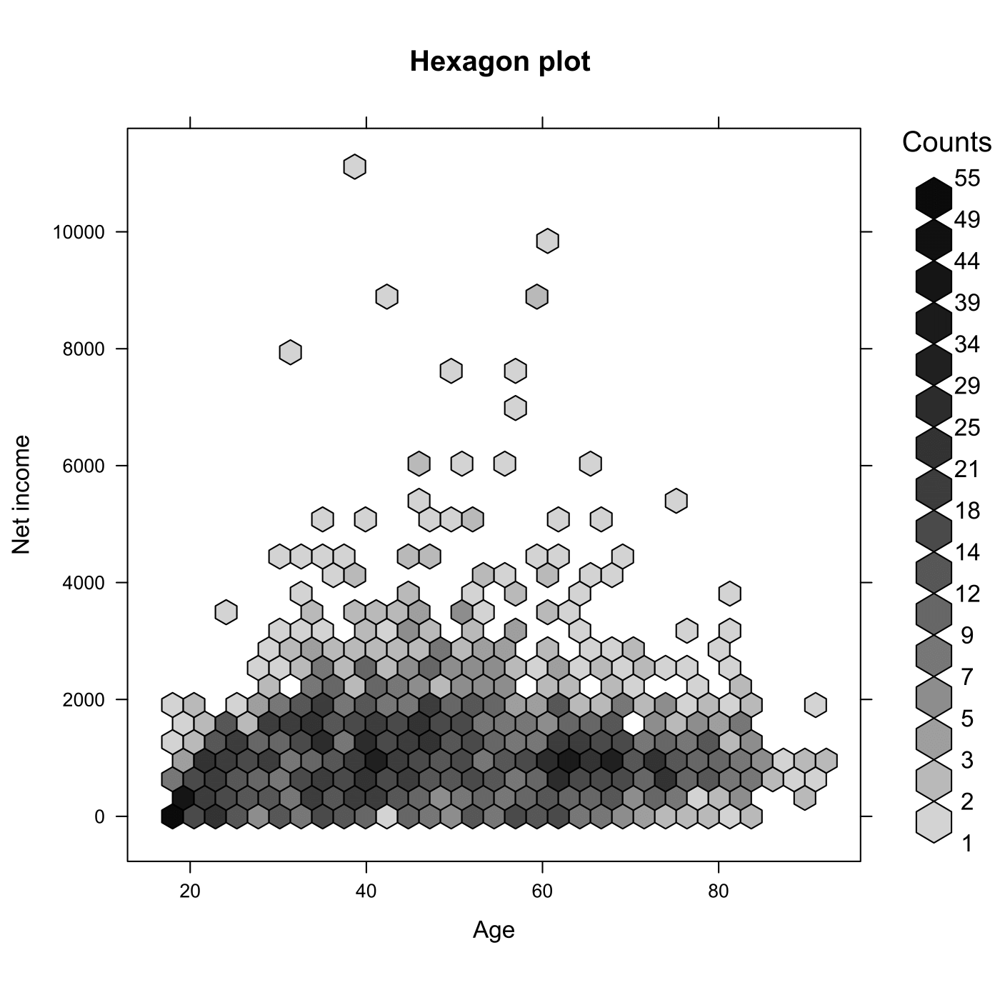
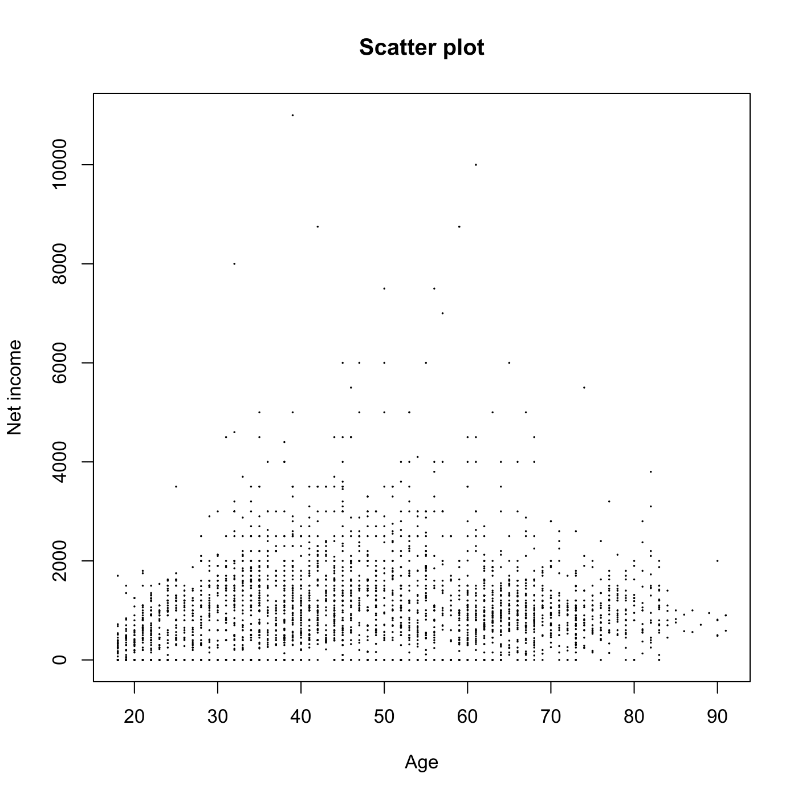

[](http://quantlet.de/index.php?p=info)

## [](http://quantlet.de/) **MVAageIncome** [](http://quantlet.de/d3/ia)

```yaml
Name of QuantLet : MVAageIncome
Published in : Applied Multivariate Statistical Analysis
Description : Produces a hexagon and a scatter plot between Age and Net income.

Keywords :
- plot
- graphical representation
- hexagon-plot
- data visualization
- financial
- scatterplot

See also :
- MVAincomeLi
- MVAageCom
Author : Vinh Hanh Lieu
Submitted : Tue, September 09 2014 by Awdesch Melzer
Datafile : allbus.csv
```






```r

# clear all variables
rm(list = ls(all = TRUE))
graphics.off()

# install and load packages
libraries = c("hexbin")
lapply(libraries, function(x) if (!(x %in% installed.packages())) {
    install.packages(x)
})
lapply(libraries, library, quietly = TRUE, character.only = TRUE)

# load data
allbus     = read.csv2("allbus.csv")
allbus1    = allbus[, 2:3]

# exclude unvalid observations
allbus1    = allbus1[(allbus1$ALTER <= 100) & (allbus1$NETTOEIN < 99997), ]
ages       = allbus1[, 1]                   # Ages
netincome  = allbus1[, 2]                   # Net income

# Scatter plot
dev.new()
plot(ages, netincome, main = "Scatter plot", xaxt = "n", xlab = "Age", ylab = "Net income", 
    cex = 0.1)
axis(1, at = c(20, 30, 40, 50, 60, 70, 80, 90))

# Hexagon plot
dev.new()
hexbinplot(netincome ~ ages, main = "Hexagon plot", xlab = "Age", ylab = "Net income", 
    style = "colorscale", border = TRUE, aspect = 1, trans = sqrt, inv = function(ages) ages^2)

```
