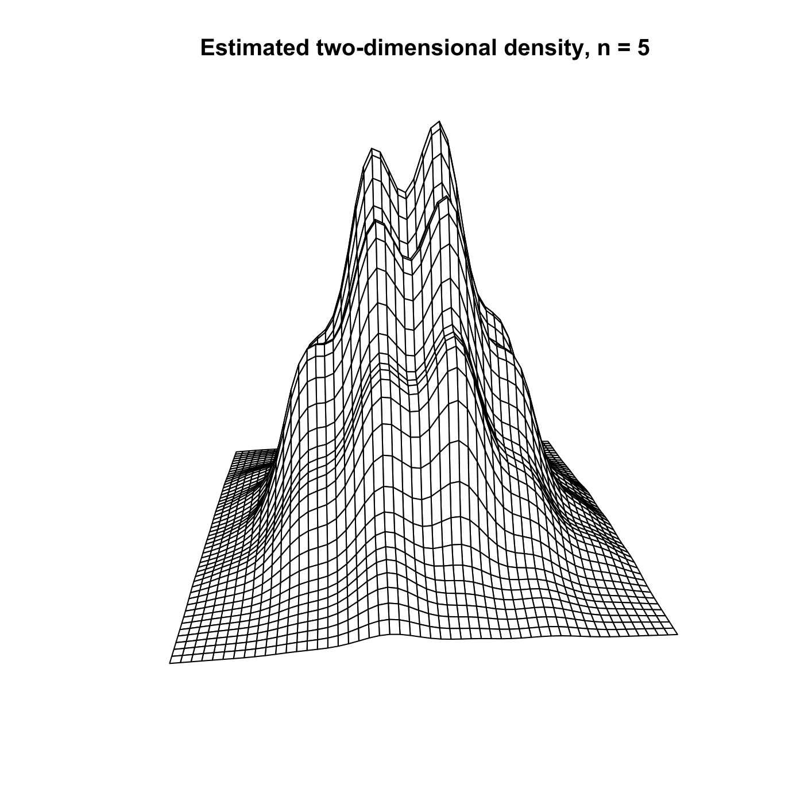
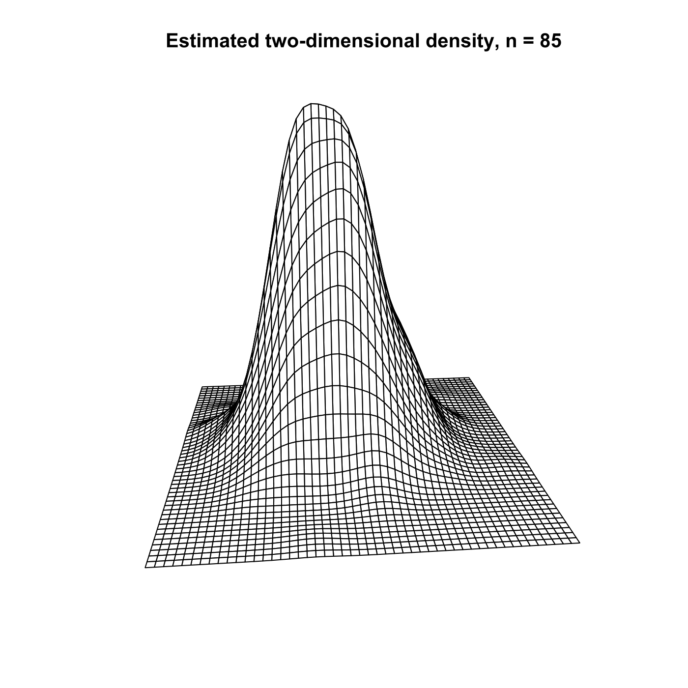

[](http://quantlet.de/index.php?p=info)

## [](http://quantlet.de/) **MVAcltbern2** [](http://quantlet.de/d3/ia)

```yaml

Name of QuantLet : MVAcltbern2

Published in : Applied Multivariate Statistical Analysis

Description : 'Illustrates the 2D Central Limit Theorem (CLT). n*2000 sets of n-dimensional
Bernoulli samples are generated and used to approximate the distribution of t =
sqrt(n)*(mean(x)-mu)/sigma -> N(0,1). The estimated joint density is shown.'

Keywords : 'plot, graphical representation, bernoulli, normal, CLT, density, distribution,
standard-normal, asymptotic'

See also : MVAgausscauchy, MVAcltbern, MVAcauchy, MVAtdis

Author : Wolfgang K. Haerdle

Submitted : Wed, August 03 2011 by Awdesch Melzer

Example: 
- 1: n=5
- 2: n=85

```






```r

# clear all variables
rm(list = ls(all = TRUE))
graphics.off()

# install and load packages
libraries = c("KernSmooth")
lapply(libraries, function(x) if (!(x %in% installed.packages())) {
    install.packages(x)
})
lapply(libraries, library, quietly = TRUE, character.only = TRUE)

p = 0.5
n = 5
bsample     = rbinom(n * 2000, 1, 0.5)      # Random generation of the binomial distribution with parameters 2000*n and 0.5
bsamplem    = matrix(bsample, n, 2000)      # Create a matrix of binomial random variables
bsamplemstd = matrix((colMeans(bsamplem) - p)/sqrt(p * (1 - p)/n), 1000, 2)

dj = bkde2D(bsamplemstd, bandwidth = 1.06 * c(sd(bsamplemstd[, 1]), sd(bsamplemstd[, 
    2])) * 200^(-1/5))                      # Compute 2 dimensional kernel density estimate

persp(dj$x1, dj$x2, dj$fhat, box = FALSE, theta = 265, phi = 15, r = sqrt(3), d = 1, 
    ltheta = -135, lphi = 0, shade = NA) 
title(paste("Estimated two-dimensional density, n =",n ))

```
