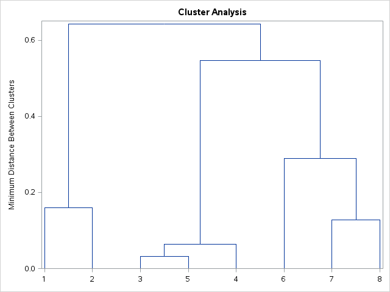
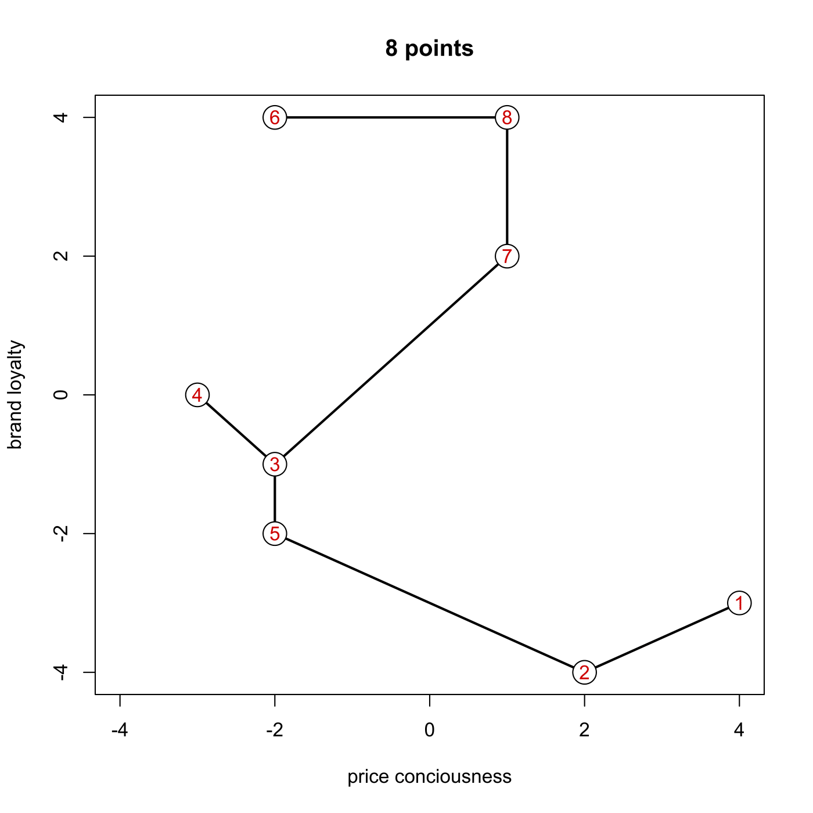
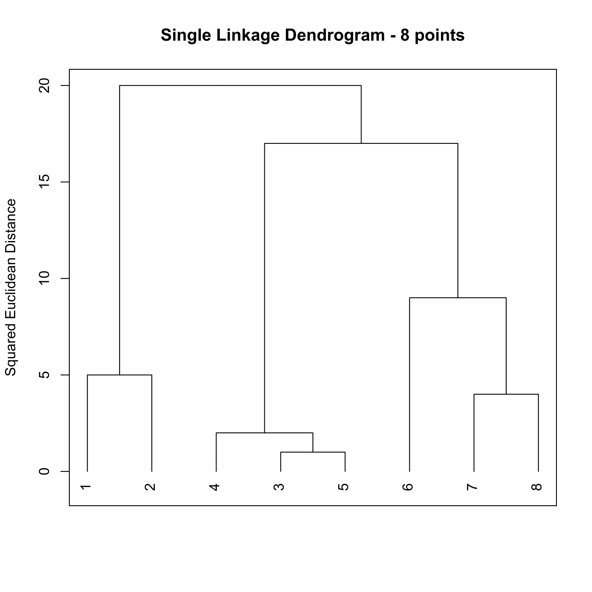

[](http://quantlet.de/index.php?p=info)

## [](http://quantlet.de/) **MVAclus8p** [](http://quantlet.de/d3/ia)

```yaml

Name of QuantLet : MVAclus8p

Published in : Applied Multivariate Statistical Analysis

Description : Performs cluster analysis for 8 data points.

Keywords : cluster-analysis, plot, graphical representation, distance, euclidean, dendrogram, sas

See also : 'MVAclusfood, MVAclusbank, MVAspecclust, MVAclusbh, MVAclususcrime, SMSclus8p,
SMSclus8pd, SMSclus8pmst2, SMSclusbank, SMScluscomp, SMScluscrime, SMScluscrimechi2, SMSclushealth'

Author : Zografia Anastasiadou

Author[SAS] : Svetlana Bykovskaya

Submitted : Thu, September 11 2014 by Franziska Schulz

Submitted[SAS] : Mon, March 14 2016 by Svetlana Bykovskaya

Example: 
- 1: The dendrogram for the 8-point example after Single linkage algorithm.
- 2: The 8-point example.

```









```r

# clear all variables
rm(list = ls(all = TRUE))
graphics.off()

# create matrix from 8 data points and define eight points
eight = cbind(c(-3, -2, -2, -2, 1, 1, 2, 4), c(0, 4, -1, -2, 4, 2, -4, -3))
eight = eight[c(8, 7, 3, 1, 4, 2, 6, 5), ]

# Plot 1: The 8-point example
plot(eight, type = "n", xlab = "price conciousness", ylab = "brand loyalty", xlim = c(-4, 
    4), main = "8 points")
segments(eight[1, 1], eight[1, 2], eight[2, 1], eight[2, 2], lwd = 2)
segments(eight[2, 1], eight[2, 2], eight[5, 1], eight[5, 2], lwd = 2)
segments(eight[5, 1], eight[5, 2], eight[3, 1], eight[3, 2], lwd = 2)
segments(eight[3, 1], eight[3, 2], eight[4, 1], eight[4, 2], lwd = 2)
segments(eight[3, 1], eight[3, 2], eight[7, 1], eight[7, 2], lwd = 2)
segments(eight[7, 1], eight[7, 2], eight[8, 1], eight[8, 2], lwd = 2)
segments(eight[8, 1], eight[8, 2], eight[6, 1], eight[6, 2], lwd = 2)
points(eight, pch = 21, cex = 2.7, bg = "white")
text(eight, as.character(1:8), col = "red3", xlab = "first coordinate", ylab = "second coordinate", 
    main = "8 points", cex = 1)

d  = dist(eight, method = "euclidean", p = 2)  # euclidean distance matrix
dd = d^2                                       # squared euclidean distance matrix
s  = hclust(dd, method = "single")             # cluster analysis with single linkage algorithm                      

# Plot 2: The dendrogram for the 8-point example, Single linkage algorithm.
dev.new()
plot(s, hang = -0.1, frame.plot = TRUE, ann = FALSE)
title(main = "Single Linkage Dendrogram - 8 points", ylab = "Squared Euclidean Distance") 

```
