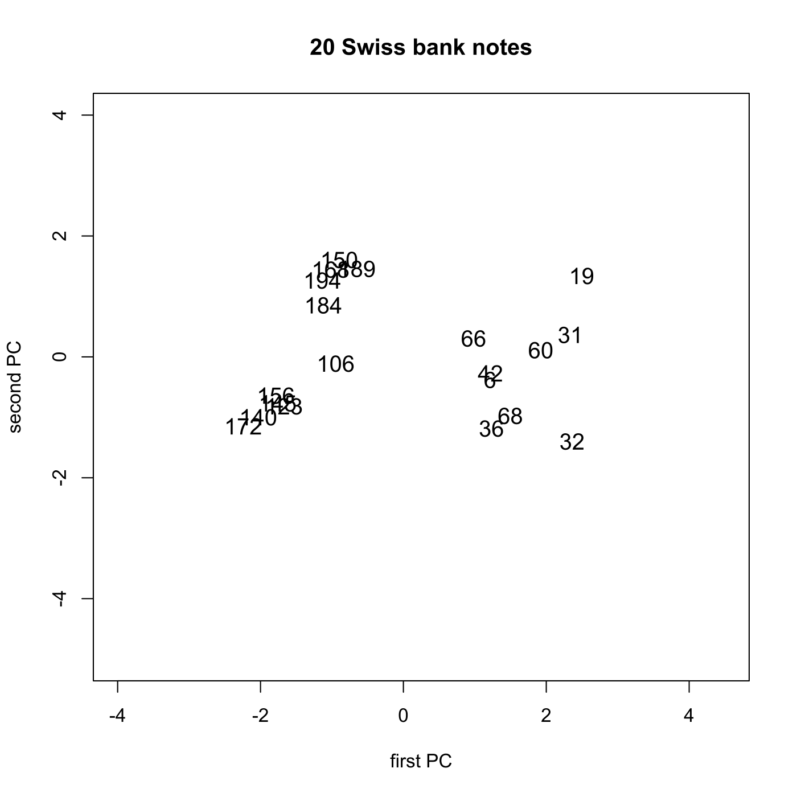

[](http://quantlet.de/index.php?p=info)

## [](http://quantlet.de/) **MVAclusbank** [](http://quantlet.de/d3/ia)

```yaml

Name of QuantLet : MVAclusbank

Published in : Applied Multivariate Statistical Analysis

Description : 'Performs a PCA and a cluster analysis for 20 randomly chosen bank notes from the
swiss bank notes dataset.'

Keywords : 'cluster-analysis, plot, graphical representation, distance, euclidean, data
visualization, dendrogram, principal-components, pca'

See also : 'MVAclus8p, MVAclusfood, MVAspecclust, MVAclusbh, MVAclususcrime, SMSclus8p, SMSclus8pd,
SMSclus8pmst2, SMSclusbank, SMScluscomp, SMScluscrime, SMScluscrimechi2, SMSclushealth'

Author : Zografia Anastasiadou, Simon Trimborn

Submitted : Thu, August 21 2014 by Petra Burdejova

Datafile : bank2.dat

Example: 
- 1: PCA for 20 randomly chosen bank notes.
- 2: The dendrogram for the 20 bank notes after applying the Ward algorithm.
- 3: PCA with clusters

```




```r

# clear all variables
rm(list = ls(all = TRUE))
graphics.off()

# install and load packages
libraries = c("car")
lapply(libraries, function(x) if (!(x %in% installed.packages())) {
    install.packages(x)
})
lapply(libraries, library, quietly = TRUE, character.only = TRUE)

# load data
data = read.table("bank2.dat")
xx   = data[sample(1:nrow(data), 20, replace = F), ]  # sample of 20 randomly chosen bank notes from data  

# PCA
set.seed(3)
mean = as.vector(colMeans(xx))
m    = matrix(mean, nrow(xx), NROW(mean), byrow = T)
x    = xx - m
eig  = eigen(cov(x))  # spectral decomposition  
eva  = eig$values
eve  = eig$vectors
xm   = as.matrix(x)
y    = xm %*% eve
ym   = y[, 1:2]       # first two eigenvectors

# Plot 1: PCA
plot(ym, type = "n", xlab = "first PC", ylab = "second PC", main = "20 Swiss bank notes", 
    ylim = c(-5, 4), xlim = c(-4, 4.5))
text(ym[, 1], ym[, 2], rownames(xx), cex = 1.2)
d  = dist(xx, method = "euclidean", p = 2)  # euclidean distance matrix
dd = d^2                                    # squared euclidean distance matrix                        
w  = hclust(dd, method = "ward.D")          # cluster analysis with ward algorithm

# Plot 2: Dendrogram for the 20 bank notes after applying the Ward algorithm
dev.new()
plot(w, hang = -0.1, frame.plot = TRUE, ann = FALSE)
title(main = "Dendrogram for 20 Swiss bank notes", ylab = "Squared Euclidean Distance", 
    xlab = "Ward algorithm")

# Plot 3: PCA with clusters
dev.new()
groups = cutree(w, h = 60)
merg   = matrix(c(ym, as.matrix(groups)), nrow = 20, ncol = 3)
merg   = merg[sort.list(merg[, 3]), ]
merg1  = merg[1:11, 1:2]
merg2  = merg[12:20, 1:2]
plot(ym, type = "n", xlab = "first PC", ylab = "second PC", main = "20 Swiss bank notes, cut height 60", 
    ylim = c(-5, 4), xlim = c(-4, 4.5))
text(ym[, 1], ym[, 2], rownames(xx), cex = 1.2)
dataEllipse(x = merg1[, 1], y = merg1[, 2], center.pch = 0, col = "red", plot.points = F, 
    add = T, levels = 0.95)
dataEllipse(x = merg2[, 1], y = merg2[, 2], center.pch = 0, col = "blue", plot.points = F, 
    add = T, levels = 0.9) 

```
