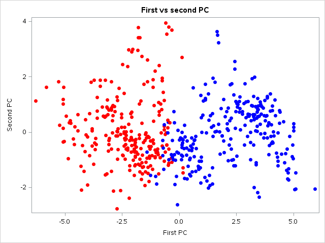
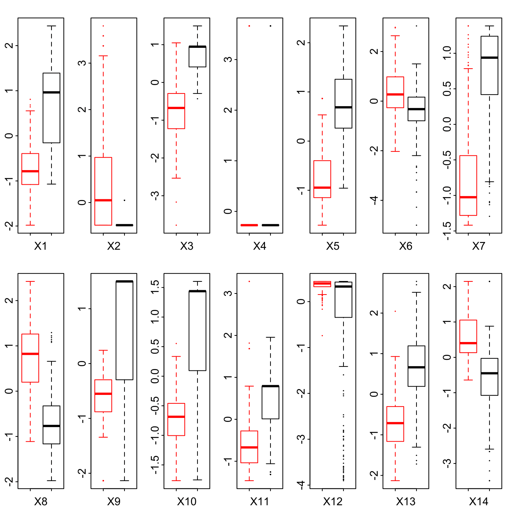
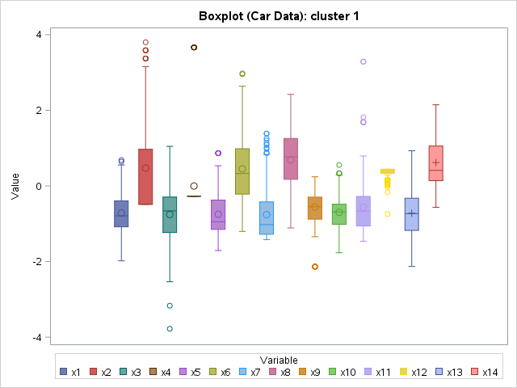
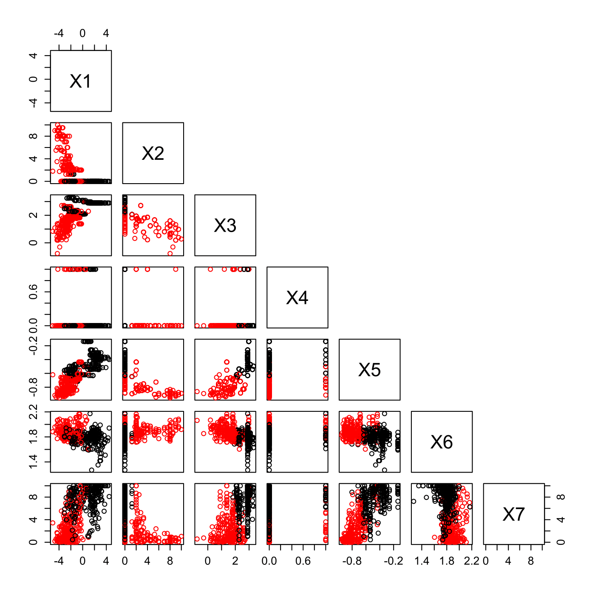
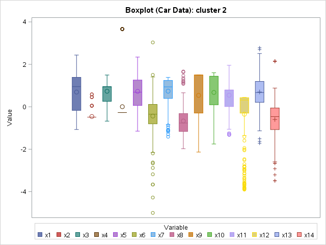
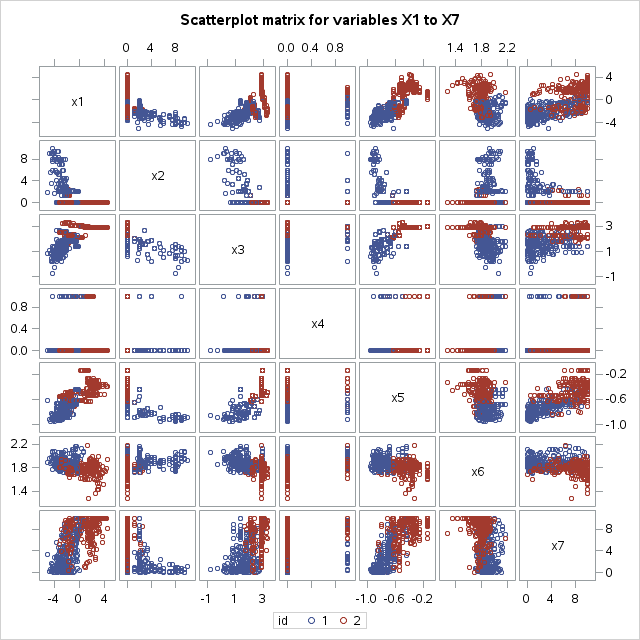
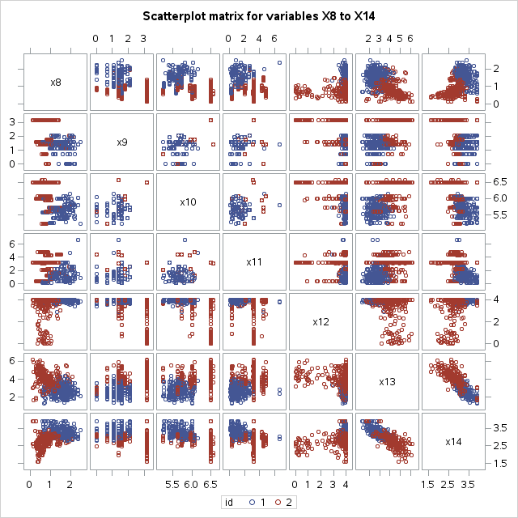

[](http://quantlet.de/index.php?p=info)

## [](http://quantlet.de/) **MVAclusbh** [](http://quantlet.de/d3/ia)

```yaml

Name of QuantLet : MVAclusbh

Published in : Applied Multivariate Statistical Analysis

Description : Performs cluster analysis for the transformed Boston housing data.

Keywords : 'cluster-analysis, plot, graphical representation, distance, euclidean, data
visualization, dendrogram, boxplot, scatterplot, principal-components, pca, standardization, sas'

See also : 'MVAclus8p, MVAclusbank, MVAspecclust, MVAclusfood, MVAclususcrime, SMSclus8p,
SMSclus8pd, SMSclus8pmst2, SMSclusbank, SMScluscomp, SMScluscrime, SMScluscrimechi2, SMSclushealth'

Author : Zografia Anastasiadou

Author[SAS] : Svetlana Bykovskaya

Submitted : Thu, September 11 2014 by Franziska Schulz

Submitted[SAS] : Wen, April 6 2016 by Svetlana Bykovskaya

Datafile : bostonh.dat

Example: 
- 1: Dendrogram of the Boston housing data using the Ward algorithm.
- 2: Scatterplot of the first two PCs displaying the two clusters.
- 3: Boxplots for the transformed variables X1 to X14.
- 4: Scatterplot matrix for the transformed variables X1 to X7 of the Boston housing data.
- 5: Scatterplot matrix for the transformed variables X8 to X14 of the Boston housing data.

```


















### R Code:
```r

# clear all variables
rm(list = ls(all = TRUE))
graphics.off()

# load data
data = read.table("bostonh.dat")

# transform data
xt       = data
xt[, 1]  = log(data[, 1])
xt[, 2]  = data[, 2]/10
xt[, 3]  = log(data[, 3])
xt[, 5]  = log(data[, 5])
xt[, 6]  = log(data[, 6])
xt[, 7]  = (data[, 7]^(2.5))/10000
xt[, 8]  = log(data[, 8])
xt[, 9]  = log(data[, 9])
xt[, 10] = log(data[, 10])
xt[, 11] = exp(0.4 * data[, 11])/1000
xt[, 12] = data[, 12]/100
xt[, 13] = sqrt(data[, 13])
xt[, 14] = log(data[, 14])
data     = xt[, -4]


da   = scale(data)                    # standardize variables
d    = dist(da, "euclidean", p = 2)   # euclidean distance matrix
w    = hclust(d, method = "ward.D")   # cluster analysis with ward algorithm
tree = cutree(w, 2)

t1   = subset(da, tree == 1)
t2   = subset(da, tree == 2)

# Plot 1: Dendrogram for the standardized food.dat after Ward algorithm
plot(w, hang = -0.1, labels = FALSE, frame.plot = TRUE, ann = FALSE, cex.axis = 1.2)
title(main = "Ward method", ylab = "distance", cex.lab = 1.2, cex.main = 1.6)

# means for Cluster 1 and Cluster 2
mc  = cbind(colMeans(subset(da, tree == "1")), colMeans(subset(da, tree == "2")))
# standard deviations for Cluster 1 and Cluster 2
sc  = cbind(sd(t1[, 1:ncol(da)]), sd(t2[, 1:ncol(da)]))
# means and standard deviations of the 13 standardized variables for Cluster 1
# (251 observations) and Cluster 2 (255 observations)
tbl = cbind(mc[, 1], sc[, 1]/sqrt(nrow(t1)), mc[, 2], sc[, 2]/sqrt(nrow(t2)))

# spectral decomposition
eig = eigen(cov(da))
eva = eig$values
eve = eig$vectors[, 1:2]

dav = da %*% eve
tree[tree == 1] = 16
tree[tree == 2] = 17
tr = tree
tr[tr == 16] = "red"
tr[tr == 17] = "black"

# Plot 2: Scatterplot for the first two PCs displaying the two clusters
dev.new()
plot(dav[, 1], dav[, 2], pch = tree, col = tr, xlab = "PC1", ylab = "PC2", main = "first vs. second PC", 
    cex.main = 1.8, cex.axis = 1.4, cex.lab = 1.4)

#  Plot 3: Boxplots for variables X1 to X14
dat = scale(xt)
t3 = subset(dat, tree == 16)
t4 = subset(dat, tree == 17)
tree[tree == 16] = "red"
tree[tree == 17] = "black"
t = tree

dev.new()
par(mfrow = c(2, 7), cex = 0.3)
boxplot(t3[, 1], t4[, 1], border = c("red", "black"), xlab = "X1", cex.lab = 3, cex.axis = 3)
boxplot(t3[, 2], t4[, 2], border = c("red", "black"), xlab = "X2", cex.lab = 3, cex.axis = 3)
boxplot(t3[, 3], t4[, 3], border = c("red", "black"), xlab = "X3", cex.lab = 3, cex.axis = 3)
boxplot(t3[, 4], t4[, 4], border = c("red", "black"), xlab = "X4", cex.lab = 3, cex.axis = 3)
boxplot(t3[, 5], t4[, 5], border = c("red", "black"), xlab = "X5", cex.lab = 3, cex.axis = 3)
boxplot(t3[, 6], t4[, 6], border = c("red", "black"), xlab = "X6", cex.lab = 3, cex.axis = 3)
boxplot(t3[, 7], t4[, 7], border = c("red", "black"), xlab = "X7", cex.lab = 3, cex.axis = 3)
boxplot(t3[, 8], t4[, 8], border = c("red", "black"), xlab = "X8", cex.lab = 3, cex.axis = 3)
boxplot(t3[, 9], t4[, 9], border = c("red", "black"), xlab = "X9", cex.lab = 3, cex.axis = 3)
boxplot(t3[, 10], t4[, 10], border = c("red", "black"), xlab = "X10", cex.lab = 3, 
    cex.axis = 3)
boxplot(t3[, 11], t4[, 11], border = c("red", "black"), xlab = "X11", cex.lab = 3, 
    cex.axis = 3)
boxplot(t3[, 12], t4[, 12], border = c("red", "black"), xlab = "X12", cex.lab = 3, 
    cex.axis = 3)
boxplot(t3[, 13], t4[, 13], border = c("red", "black"), xlab = "X13", cex.lab = 3, 
    cex.axis = 3)
boxplot(t3[, 14], t4[, 14], border = c("red", "black"), xlab = "X14", cex.lab = 3, 
    cex.axis = 3)

#  Plot 4: Scatterplot matrix for variables X1 to X7
dev.new()
pairs(xt[, 1:7], col = tr, upper.panel = NULL, labels = c("X1", "X2", "X3", "X4", 
    "X5", "X6", "X7"), cex.axis = 1.2)
dev.new()

#  Plot 5: Scatterplot matrix for variables X8 to X14
pairs(xt[, 8:14], col = tr, upper.panel = NULL, labels = c("X8", "X9", "X10", "X11", 
    "X12", "X13", "X14"), cex.axis = 1.2) 

```

### SAS Code:
```sas
* Import the data;
data bostonh;
  infile '/folders/myfolders/data/bostonh.dat';
  input temp1-temp14;
run;

proc iml;
  * Read data into a matrix;
  use bostonh;
    read all var _ALL_ into datax; 
  close bostonh;
  
  xt = datax;
  xt[, 1]  = log(datax[, 1]);
  xt[, 2]  = datax[, 2]/10;
  xt[, 3]  = log(datax[, 3]);
  xt[, 5]  = log(datax[, 5]);
  xt[, 6]  = log(datax[, 6]);
  xt[, 7]  = (datax[, 7] ## (2.5))/10000;
  xt[, 8]  = log(datax[, 8]);
  xt[, 9]  = log(datax[, 9]);
  xt[, 10] = log(datax[, 10]);
  xt[, 11] = exp(0.4 * datax[, 11])/1000;
  xt[, 12] = datax[, 12]/100;
  xt[, 13] = sqrt(datax[, 13]);
  xt[, 14] = log(datax[, 14]);
  datax = xt[,1:3] || xt[,5:14];
  
  create dat from datax[colname={"t1" "t2" "t3" "t4" "t5" "t6" "t7" "t8" "t9" "t10" "t11" "t12" "t13"}];
    append from datax;
  close dat;
  
  create dat2 from xt[colname={"t1" "t2" "t3" "t4" "t5" "t6" "t7" "t8" "t9" "t10" "t11" "t12" "t13" "t14"}];
    append from xt;
  close dat2;
quit;

* standardize the data matrix;
proc standard data = dat mean = 0 std = 1 out = ydat;
  var t1-t13;
run;

proc iml;
  use ydat;
    read all var _ALL_ into x; 
  close ydat;
  
  * PCA;
  e   = cov(x);           * spectral decomposition;
  eva = eigval(e);
  eve = eigvec(e);
  y   = (x * eve)[, 1:2]; * first two eigenvectors;
  
  x1 = -y[,1];
  x2 = -y[,2];
  
  id = 1:nrow(x1);
  create plot var {"x1" "x2" "id"};
    append;
  close plot;
quit;

data y2;
  id + 1;
  set ydat;
run;

* Plot 2: Dendrogram for standardized data after applying the Ward algorithm;
proc distance data = y2 out = dist method = euclid nostd;
  var interval (t1--t13);
run;

data newdist;
  id + 1;
  set dist;
run;

ods graphics on;
proc cluster data = newdist(type = distance)
    method = ward 
    plots(only maxpoints = 600) = (Pseudo Dendrogram(vertical))
    print = 0
    outtree = stat;
  id id;
  title 'Ward Dendrogram for standardized data';
run;
ods graphics off;

* Plot 3: PCA with clusters;
proc tree data = stat noprint out = sol nclusters = 2;
  id id;
run;

proc sort data = sol;
  by id;
run;

proc sort data = plot;
  by id;
run;

data plot2;
  set plot;
  set sol;
run;

proc sgplot data = plot2
    noautolegend;
  title 'First vs second PC';
  scatter x = x1 y = x2 / colorresponse = CLUSTER colormodel = (red blue)
    markerattrs = (symbol = circlefilled);
  xaxis label = 'First PC';
  yaxis label = 'Second PC';
run;
  
* Plots 3 and 4: Boxplots for variables X1 to X14;
* standardize the data matrix;
proc standard data = dat2 mean = 0 std = 1 out = ydat2;
  var t1-t14;
run;  

data t3;
  set sol;
  if CLUSTER = 1;
run;

data t4;
  set sol;
  if CLUSTER = 2;
run;

data ydat2;
  id + 1;
  set ydat2;
run;

proc iml;
  * all data;
  use ydat2;
    read all var _ALL_ into main; 
  close ydat2;
  
  * cluster 1;
  use t3;
    read all var _ALL_ into r3; 
  close t3;
  
  * cluster 2;
  use t4;
    read all var _ALL_ into r4; 
  close t4;
  
  * original data;
  use dat2;
    read all var _ALL_ into z; 
  close dat2;
  
  idd1 = r3[,1];
  idd2 = r4[,1];
  
  d1 = main[idd1,];
  d2 = main[idd2,];
  
  n = nrow(z);
  z = (1:n)` || z;
  
  * marker for cluster 1;
  do i = 1 to nrow(idd1);
    z[idd1[i],1] = 1;
  end;
  
  * marker for cluster 2;
  do i = 1 to nrow(idd2);
    z[idd2[i],1] = 2;
  end;
  
  * data from cluster 1;
  create dd1 from d1[colname={"id" "x1" "x2" "x3" "x4" "x5" "x6" "x7" "x8" "x9" "x10" "x11" "x12" "x13" "x14"}];
    append from d1;
  close dd1;
  
  * data from cluster 2;
  create dd2 from d2[colname={"id" "x1" "x2" "x3" "x4" "x5" "x6" "x7" "x8" "x9" "x10" "x11" "x12" "x13" "x14"}];
    append from d2;
  close dd2;
  
  * original data with cluster ids;
  create dd from z[colname={"id" "x1" "x2" "x3" "x4" "x5" "x6" "x7" "x8" "x9" "x10" "x11" "x12" "x13" "x14"}];
    append from z;
  close dd;
quit;

proc transpose data = dd1 out = dd1_t;
  by id;
run;

proc transpose data = dd2 out = dd2_t;
  by id;
run;

data dd1_t;
  set dd1_t;
  label _name_ = "Variable";
  label col1 = "Value";
run;

data dd2_t;
  set dd2_t;
  label _name_ = "Variable";
  label col1 = "Value";
run;

title "Boxplot (Car Data): cluster 1";
proc sgplot data = dd1_t;
  vbox col1 / group = _name_ ;
run;

title "Boxplot (Car Data): cluster 2";
proc sgplot data = dd2_t;
  vbox col1 / group = _name_ ;
run;
  
* Plot 5: Scatterplot matrix for variables X1 to X7;
title 'Scatterplot matrix for variables X1 to X7';
proc sgscatter data = dd; 
     matrix x1--x7 / group = id;
run; 

* Plot 6: Scatterplot matrix for variables X8 to X14;
title 'Scatterplot matrix for variables X8 to X14';
proc sgscatter data = dd; 
     matrix x8--x14 / group = id;
run;

```
