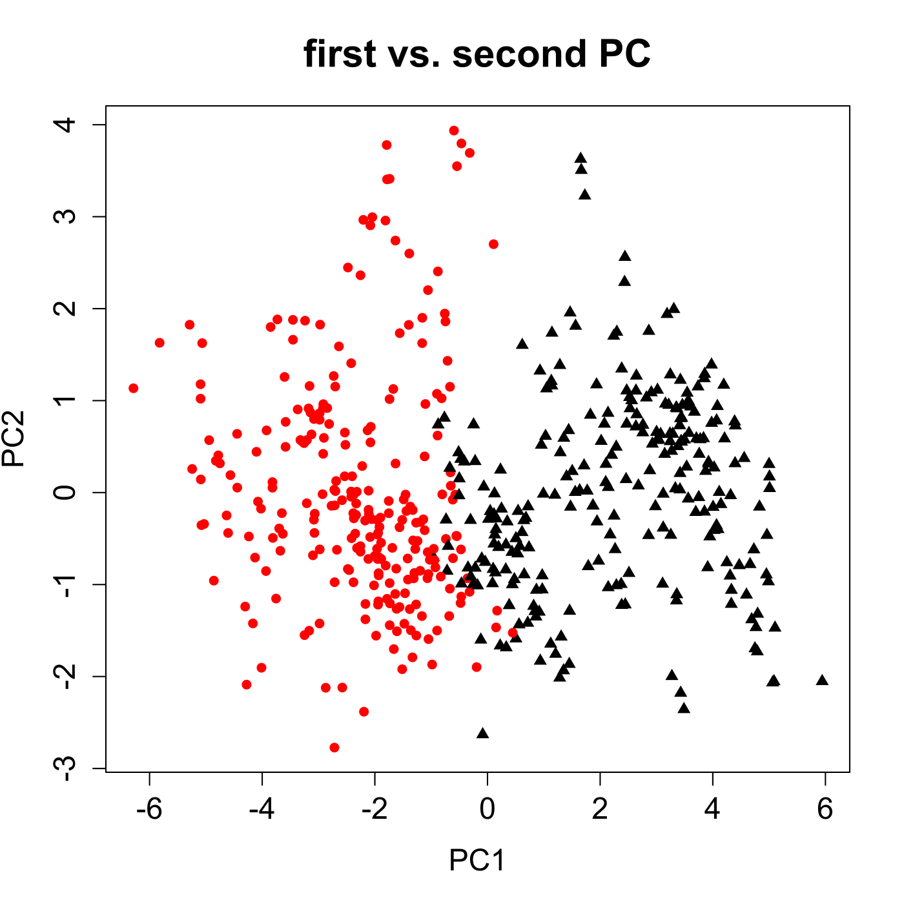
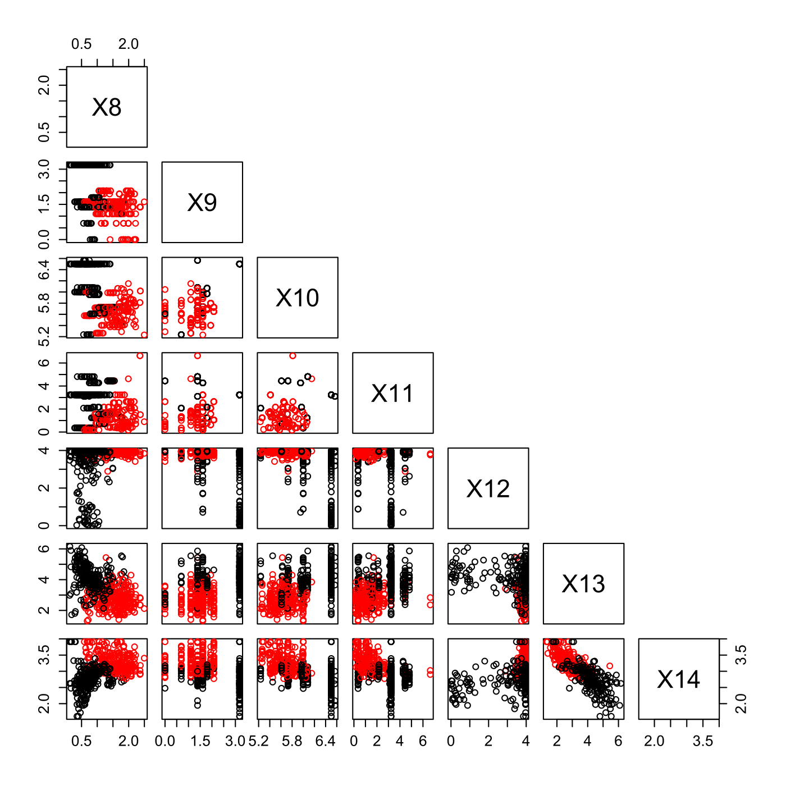

[](http://quantlet.de/index.php?p=info)

## [](http://quantlet.de/) **MVAclusbh** [](http://quantlet.de/d3/ia)

```yaml

Name of QuantLet : MVAclusbh

Published in : Applied Multivariate Statistical Analysis

Description : 'Performs cluster analysis for the transformed Boston
housing data.'

Keywords :
- cluster-analysis
- plot
- graphical representation
- distance
- euclidean
- data visualization
- dendrogram
- boxplot
- scatterplot
- principal-components
- pca
- standardization

See also :
- MVAclus8p
- MVAclusbank
- MVAspecclust
- MVAclusfood
- MVAclususcrime
- SMSclus8p
- SMSclus8pd
- SMSclus8pmst2
- SMSclusbank
- SMScluscomp
- SMScluscrime
- SMScluscrimechi2
- SMSclushealth

Author : Zografia Anastasiadou

Submitted : Thu, September 11 2014 by Franziska Schulz

Datafile : bostonh.dat

Example :
- Dendrogram of the Boston housing data using the Ward algorithm.
- Scatterplot of the first two PCs displaying the two clusters.
- Boxplots for the transformed variables X1 to X14.
- Scatterplot matrix for the transformed variables X1 to X7 of the Boston housing data.
- Scatterplot matrix for the transformed variables X8 to X14 of the Boston housing data.
```








```r
# −−−−−−−−−−−−−−−−−−−−−−−−−−−−−−−−−−−−−−−−−−−−−−−−−−−−−−
# Name of QuantLet : MVAclusbh
# −−−−−−−−−−−−−−−−−−−−−−−−−−−−−−−−−−−−−−−−−−−−−−−−−−−−−−
# Published in : Applied Multivariate Statistical Analysis
# −−−−−−−−−−−−−−−−−−−−−−−−−−−−−−−−−−−−−−−−−−−−−−−−−−−−−−
# Description : Performs cluster analysis for the transformed Boston 
# housing data. 
# −−−−−−−−−−−−−−−−−−−−−−−−−−−−−−−−−−−−−−−−−−−−−−−−−−−−−−
# Keywords : cluster-analysis, plot, graphical representation, 
# distance, euclidean, data visualization, dendrogram,
# boxplot, scatterplot, principal-components, pca,
# standardization
# −−−−−−−−−−−−−−−−−−−−−−−−−−−−−−−−−−−−−−−−−−−−−−−−−−−−−−
# See also : MVAclus8p, MVAclusbank, MVAspecclust, MVAclusfood, 
# MVAclususcrime, SMSclus8p, SMSclus8pd, SMSclus8pmst2, 
# SMSclusbank, SMScluscomp, SMScluscrime, SMScluscrimechi2, 
# SMSclushealth
# −−−−−−−−−−−−−−−−−−−−−−−−−−−−−−−−−−−−−−−−−−−−−−−−−−−−−−
# Author : Zografia Anastasiadou
# −−−−−−−−−−−−−−−−−−−−−−−−−−−−−−−−−−−−−−−−−−−−−−−−−−−−−−
# Submitted : Thu, September 11 2014 by Franziska Schulz
# −−−−−−−−−−−−−−−−−−−−−−−−−−−−−−−−−−−−−−−−−−−−−−−−−−−−−−
# Datafile : bostonh.dat
# −−−−−−−−−−−−−−−−−−−−−−−−−−−−−−−−−−−−−−−−−−−−−−−−−−−−−−
# Example 1 : Dendrogram of the Boston housing data using the Ward algorithm.
# −−−−−−−−−−−−−−−−−−−−−−−−−−−−−−−−−−−−−−−−−−−−−−−−−−−−−−
# Example 2 : Scatterplot of the first two PCs displaying the two clusters.
# −−−−−−−−−−−−−−−−−−−−−−−−−−−−−−−−−−−−−−−−−−−−−−−−−−−−−−
# Example 3 : Boxplots for the transformed variables X1 to X14.
# −−−−−−−−−−−−−−−−−−−−−−−−−−−−−−−−−−−−−−−−−−−−−−−−−−−−−−
# Example 4 : Scatterplot matrix for the transformed variables X1 to X7 of the Boston housing data.
# −−−−−−−−−−−−−−−−−−−−−−−−−−−−−−−−−−−−−−−−−−−−−−−−−−−−−−
# Example 5 : Scatterplot matrix for the transformed variables X8 to X14 of the Boston housing data.
# −−−−−−−−−−−−−−−−−−−−−−−−−−−−−−−−−−−−−−−−−−−−−−−−−−−−−−

# clear all variables
rm(list = ls(all = TRUE))
graphics.off()

# load data
data = read.table("bostonh.dat")

# transform data
xt       = data
xt[, 1]  = log(data[, 1])
xt[, 2]  = data[, 2]/10
xt[, 3]  = log(data[, 3])
xt[, 5]  = log(data[, 5])
xt[, 6]  = log(data[, 6])
xt[, 7]  = (data[, 7]^(2.5))/10000
xt[, 8]  = log(data[, 8])
xt[, 9]  = log(data[, 9])
xt[, 10] = log(data[, 10])
xt[, 11] = exp(0.4 * data[, 11])/1000
xt[, 12] = data[, 12]/100
xt[, 13] = sqrt(data[, 13])
xt[, 14] = log(data[, 14])
data     = xt[, -4]


da   = scale(data)                    # standardize variables
d    = dist(da, "euclidean", p = 2)   # euclidean distance matrix
w    = hclust(d, method = "ward.D")   # cluster analysis with ward algorithm
tree = cutree(w, 2)

t1   = subset(da, tree == 1)
t2   = subset(da, tree == 2)

# Plot 1: Dendrogram for the standardized food.dat after Ward algorithm
plot(w, hang = -0.1, labels = FALSE, frame.plot = TRUE, ann = FALSE, cex.axis = 1.2)
title(main = "Ward method", ylab = "distance", cex.lab = 1.2, cex.main = 1.6)

# means for Cluster 1 and Cluster 2
mc  = cbind(colMeans(subset(da, tree == "1")), colMeans(subset(da, tree == "2")))
# standard deviations for Cluster 1 and Cluster 2
sc  = cbind(sd(t1[, 1:ncol(da)]), sd(t2[, 1:ncol(da)]))
# means and standard deviations of the 13 standardized variables for Cluster 1
# (251 observations) and Cluster 2 (255 observations)
tbl = cbind(mc[, 1], sc[, 1]/sqrt(nrow(t1)), mc[, 2], sc[, 2]/sqrt(nrow(t2)))

# spectral decomposition
eig = eigen(cov(da))
eva = eig$values
eve = eig$vectors[, 1:2]

dav = da %*% eve
tree[tree == 1] = 16
tree[tree == 2] = 17
tr = tree
tr[tr == 16] = "red"
tr[tr == 17] = "black"

# Plot 2: Scatterplot for the first two PCs displaying the two clusters
dev.new()
plot(dav[, 1], dav[, 2], pch = tree, col = tr, xlab = "PC1", ylab = "PC2", main = "first vs. second PC", 
    cex.main = 1.8, cex.axis = 1.4, cex.lab = 1.4)

#  Plot 3: Boxplots for variables X1 to X14
dat = scale(xt)
t3 = subset(dat, tree == 16)
t4 = subset(dat, tree == 17)
tree[tree == 16] = "red"
tree[tree == 17] = "black"
t = tree

dev.new()
par(mfrow = c(2, 7), cex = 0.3)
boxplot(t3[, 1], t4[, 1], border = c("red", "black"), xlab = "X1", cex.lab = 3, cex.axis = 3)
boxplot(t3[, 2], t4[, 2], border = c("red", "black"), xlab = "X2", cex.lab = 3, cex.axis = 3)
boxplot(t3[, 3], t4[, 3], border = c("red", "black"), xlab = "X3", cex.lab = 3, cex.axis = 3)
boxplot(t3[, 4], t4[, 4], border = c("red", "black"), xlab = "X4", cex.lab = 3, cex.axis = 3)
boxplot(t3[, 5], t4[, 5], border = c("red", "black"), xlab = "X5", cex.lab = 3, cex.axis = 3)
boxplot(t3[, 6], t4[, 6], border = c("red", "black"), xlab = "X6", cex.lab = 3, cex.axis = 3)
boxplot(t3[, 7], t4[, 7], border = c("red", "black"), xlab = "X7", cex.lab = 3, cex.axis = 3)
boxplot(t3[, 8], t4[, 8], border = c("red", "black"), xlab = "X8", cex.lab = 3, cex.axis = 3)
boxplot(t3[, 9], t4[, 9], border = c("red", "black"), xlab = "X9", cex.lab = 3, cex.axis = 3)
boxplot(t3[, 10], t4[, 10], border = c("red", "black"), xlab = "X10", cex.lab = 3, 
    cex.axis = 3)
boxplot(t3[, 11], t4[, 11], border = c("red", "black"), xlab = "X11", cex.lab = 3, 
    cex.axis = 3)
boxplot(t3[, 12], t4[, 12], border = c("red", "black"), xlab = "X12", cex.lab = 3, 
    cex.axis = 3)
boxplot(t3[, 13], t4[, 13], border = c("red", "black"), xlab = "X13", cex.lab = 3, 
    cex.axis = 3)
boxplot(t3[, 14], t4[, 14], border = c("red", "black"), xlab = "X14", cex.lab = 3, 
    cex.axis = 3)

#  Plot 4: Scatterplot matrix for variables X1 to X7
dev.new()
pairs(xt[, 1:7], col = tr, upper.panel = NULL, labels = c("X1", "X2", "X3", "X4", 
    "X5", "X6", "X7"), cex.axis = 1.2)
dev.new()

#  Plot 5: Scatterplot matrix for variables X8 to X14
pairs(xt[, 8:14], col = tr, upper.panel = NULL, labels = c("X8", "X9", "X10", "X11", 
    "X12", "X13", "X14"), cex.axis = 1.2) 

```
