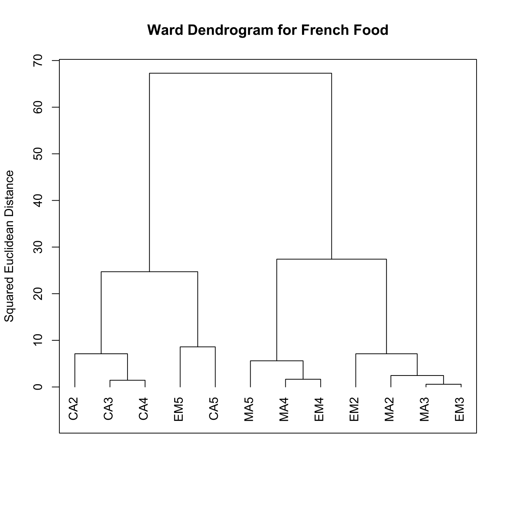
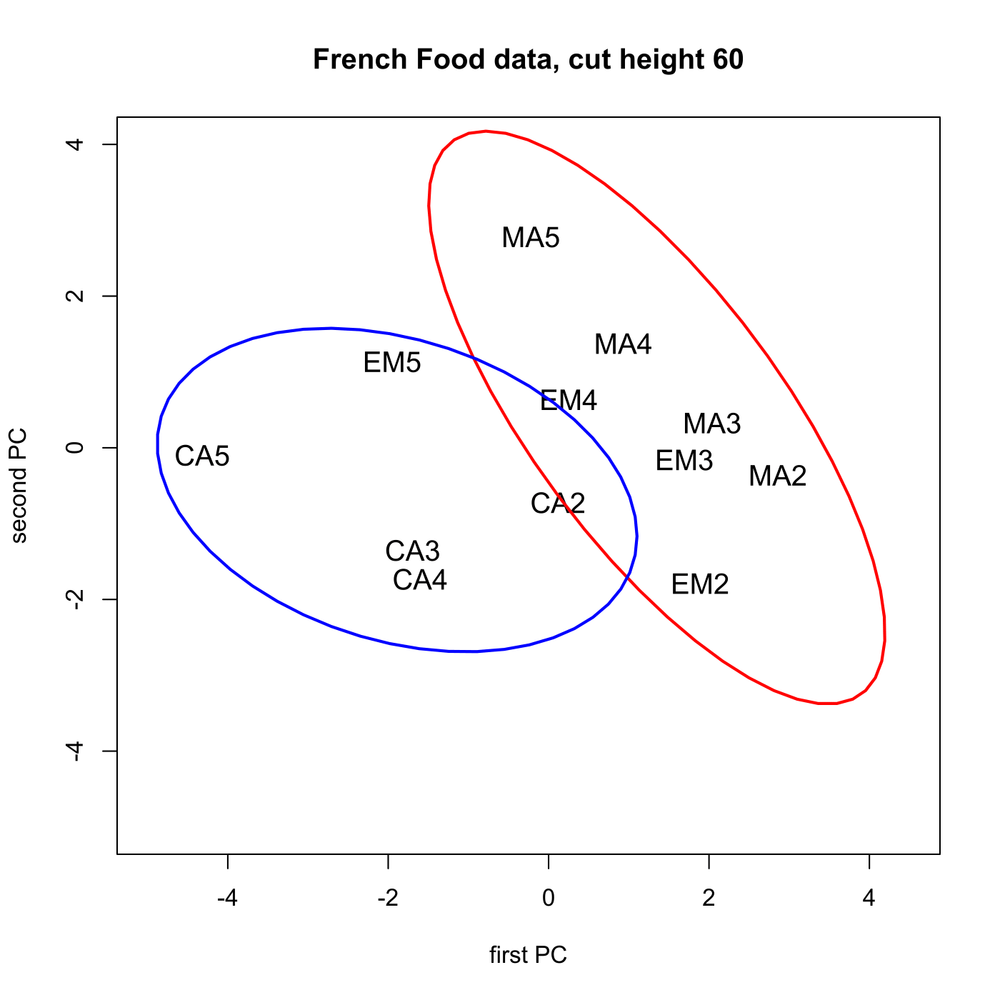

[](http://quantlet.de/index.php?p=info)

## [](http://quantlet.de/) **MVAclusfood** [](http://quantlet.de/d3/ia)

```yaml

Name of QuantLet : MVAclusfood

Published in : Applied Multivariate Statistical Analysis

Description : 'Performs cluster analysis for the french food data
after standardization of the variables.'

Keywords : 
- cluster-analysis
- plot
- graphical representation
- distance
- euclidean
- data visualization
- dendrogram
- principal-components
- pca
- standardization

See also : 
- MVAclus8p
- MVAclusbank
- MVAspecclust
- MVAclusbh
- MVAclususcrime
- SMSclus8p
- SMSclus8pd
- SMSclus8pmst2
- SMSclusbank
- SMScluscomp
- SMScluscrime
- SMScluscrimechi2 
- SMSclushealth

Author : 
- Zografia Anastasiadou
- Simon Trimborn

Submitted : Sun, September 07 2014 by Awdesch Melzer

Datafile : food.dat

Example : 
- First vs second PC 
- The dendrogram for the French food expenditures after applying the Ward algorithm
- First vs second PC with clusters

```







```r
# −−−−−−−−−−−−−−−−−−−−−−−−−−−−−−−−−−−−−−−−−−−−−−−−−−−−−−
# Name of QuantLet : MVAclusfood
# −−−−−−−−−−−−−−−−−−−−−−−−−−−−−−−−−−−−−−−−−−−−−−−−−−−−−−
# Published in : Applied Multivariate Statistical Analysis
# −−−−−−−−−−−−−−−−−−−−−−−−−−−−−−−−−−−−−−−−−−−−−−−−−−−−−−
# Description : Performs cluster analysis for the french food data
# after standardization of the variables. 
# −−−−−−−−−−−−−−−−−−−−−−−−−−−−−−−−−−−−−−−−−−−−−−−−−−−−−−
# Keywords : cluster-analysis, plot, graphical representation, 
# distance, euclidean, data visualization, dendrogram,
# principal-components, pca, standardization
# −−−−−−−−−−−−−−−−−−−−−−−−−−−−−−−−−−−−−−−−−−−−−−−−−−−−−−
# See also : MVAclus8p, MVAclusbank, MVAspecclust, MVAclusbh, 
# MVAclususcrime, SMSclus8p, SMSclus8pd, SMSclus8pmst2, 
# SMSclusbank, SMScluscomp, SMScluscrime, SMScluscrimechi2, 
# SMSclushealth
# −−−−−−−−−−−−−−−−−−−−−−−−−−−−−−−−−−−−−−−−−−−−−−−−−−−−−−
# Author : Zografia Anastasiadou, Simon Trimborn
# −−−−−−−−−−−−−−−−−−−−−−−−−−−−−−−−−−−−−−−−−−−−−−−−−−−−−−
# Submitted : Sun, September 07 2014 by Awdesch Melzer
# −−−−−−−−−−−−−−−−−−−−−−−−−−−−−−−−−−−−−−−−−−−−−−−−−−−−−−
# Datafile : food.dat
# −−−−−−−−−−−−−−−−−−−−−−−−−−−−−−−−−−−−−−−−−−−−−−−−−−−−−−
# Example 1: First vs second PC 
# −−−−−−−−−−−−−−−−−−−−−−−−−−−−−−−−−−−−−−−−−−−−−−−−−−−−−−
# Example 2: The dendrogram for the French food expenditures 
# after applying the Ward algorithm
# −−−−−−−−−−−−−−−−−−−−−−−−−−−−−−−−−−−−−−−−−−−−−−−−−−−−−−
# Example 3: First vs second PC with clusters
# −−−−−−−−−−−−−−−−−−−−−−−−−−−−−−−−−−−−−−−−−−−−−−−−−−−−−−

# clear all variables
rm(list = ls(all = TRUE))
graphics.off()

# install and load packages
libraries = c("car")
lapply(libraries, function(x) if (!(x %in% installed.packages())) {
    install.packages(x)
})
lapply(libraries, library, quietly = TRUE, character.only = TRUE)

# load data
fooddat = read.table("food.dat")
food    = fooddat[, -1]                         # delete the first column (types of families)
rownames(food) = c("MA2", "EM2", "CA2", "MA3", "EM3", "CA3", "MA4", "EM4", "CA4", 
    "MA5", "EM5", "CA5")                        # define types of families
f       = scale(food)                           # standardize variables

# PCA
mean = as.vector(colMeans(f))
m    = matrix(mean, nrow(f), NROW(mean), byrow = T)
x    = f - m
eig  = eigen(cov(x))  # spectral decomposition  
eva  = eig$values
eve  = eig$vectors
xm   = as.matrix(x)
y    = xm %*% eve
ym   = y[, 1:2]       # first two eigenvectors

# Plot 1: PCA
dev.new()
plot(ym, type = "n", xlab = "first PC", ylab = "second PC", main = "French Food data", 
    ylim = c(-5, 4), xlim = c(-5, 4.5))
text(ym[, 1], ym[, 2], rownames(f), cex = 1.2)

d  = dist(f, "euclidean", p = 2)      # euclidean distance matrix
dd = d^2                              # squared euclidean distance matrix                                  
w  = hclust(dd, method = "ward.D")    # cluster analysis with ward algorithm

# Plot 2: Dendrogram for the standardized food.dat after Ward algorithm
dev.new()
plot(w, hang = -0.1, frame.plot = TRUE, ann = FALSE)
title(main = "Ward Dendrogram for French Food", ylab = "Squared Euclidean Distance")

groups = cutree(w, h = 60)
merg   = matrix(c(ym, as.matrix(groups)), nrow = 12, ncol = 3)
merg   = merg[sort.list(merg[, 3]), ]
merg1  = merg[1:7, 1:2]
merg2  = merg[8:12, 1:2]

# Plot 3: PCA with clusters
dev.new()
plot(ym, type = "n", xlab = "first PC", ylab = "second PC", main = "French Food data, cut height 60", 
    ylim = c(-5, 4), xlim = c(-5, 4.5))
text(ym[, 1], ym[, 2], rownames(f), cex = 1.2)
dataEllipse(x = merg1[, 1], y = merg1[, 2], center.pch = 0, col = "red", plot.points = F, 
    add = T, levels = 0.9)
dataEllipse(x = merg2[, 1], y = merg2[, 2], center.pch = 0, col = "blue", plot.points = F, 
    add = T, levels = 0.72) 

```
