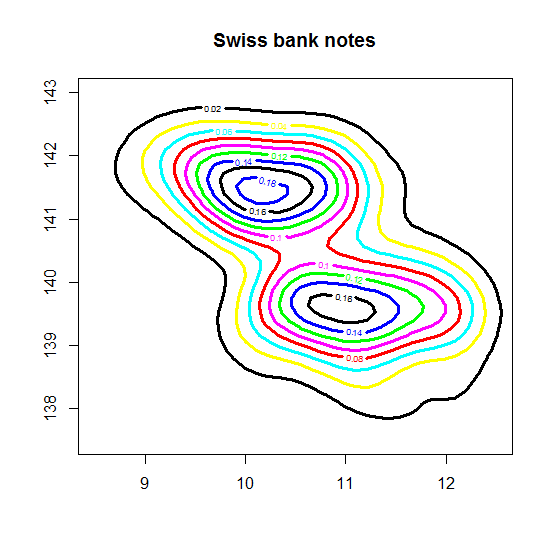

[](http://quantlet.de/index.php?p=info)

## [](http://quantlet.de/) **MVAcontbank2** [](http://quantlet.de/d3/ia)

```yaml

Name of QuantLet : MVAcontbank2

Published in : Applied Multivariate Statistical Analysis

Description : 'Gives a contour plot of the kernel density estimate of variables X5 and X6 of the
Swiss bank notes.'

Keywords : 'contour, data visualization, plot, graphical representation, financial, density,
descriptive, descriptive-statistics, empirical, kde, kernel, smoothing, visualization'

See also : 'MVAboxbank6, MVAdraftbank4, MVAscabank45, MVAscabank456, SPMdenepatri, SPMkdeconstruct,
SPMkernel'

Author : Song Song

Submitted : Tue, September 09 2014 by Awdesch Melzer

Datafiles : bank2.dat

Example : Contours of the density of X5 and X6 of genuine and counterfeit bank notes.

```




```r

# clear variables and close windows
rm(list = ls(all = TRUE))
graphics.off()

# install and load packages
libraries = c("KernSmooth", "graphics")
lapply(libraries, function(x) if (!(x %in% installed.packages())) {
install.packages(x)
})
lapply(libraries, library, quietly = TRUE, character.only = TRUE)

# load data
xx = read.table("bank2.dat")

d  = bkde2D(xx[, 5:6], bandwidth = 1.06 * c(sd(xx[, 5]), sd(xx[, 6])) * 200^(-1/5))

# plot
contour(d$x1, d$x2, d$fhat, xlim = c(8.5, 12.5), ylim = c(137.5, 143), col = c("blue", 
    "black", "yellow", "cyan", "red", "magenta", "green", "blue", "black"), lwd = 3, 
    cex.axis = 1, main = "Swiss bank notes")
	
```
