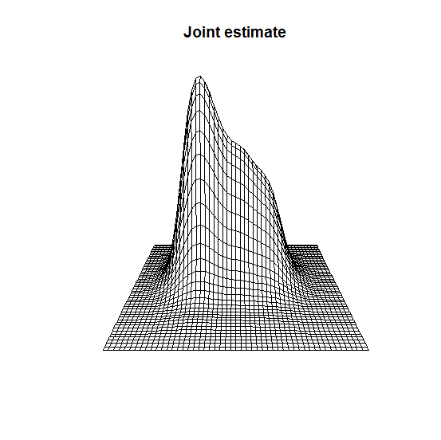
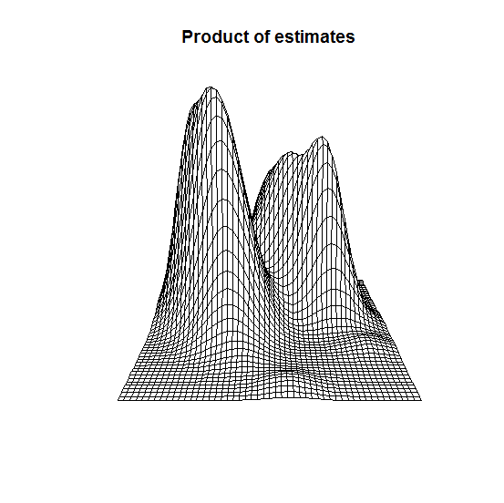

[](http://quantlet.de/index.php?p=info)

## [](http://quantlet.de/) **MVAdenbank3** [](http://quantlet.de/d3/ia)

```yaml

Name of QuantLet : MVAdenbank3

Published in : Applied Multivariate Statistical Analysis

Description : 'Gives plots of the product of univariate and joint kernel density estimates of
variables X4 and X5 of the Swiss bank notes.'

Keywords : '3D, data visualization, plot, graphical representation, financial, density,
descriptive, descriptive-statistics, empirical, gaussian, kde, kernel, smoothing, univariate,
visualization, joint distribution'

See also : 'MVAdenbank, MVAdenbank2, MVAdraftbank4, MVAscabank45, MVAscabank456, SPMdenepatri,
SPMkdeconstruct, SPMkernel'

Author : Song Song

Submitted : Tue, September 09 2014 by Awdesch Melzer

Datafiles : bank2.dat

Example: 
- 1: Joint density estimate for X4 and X5 of the bank notes.
- 2: The product of univariate density estimates for X4 and X5 of the bank notes.

```






```r

# clear variables and close windows
rm(list = ls(all = TRUE))
graphics.off()

# install and load packages
libraries = c("KernSmooth", "graphics")
lapply(libraries, function(x) if (!(x %in% installed.packages())) {
install.packages(x)
})
lapply(libraries, library, quietly = TRUE, character.only = TRUE)

# load data
xx = read.table("bank2.dat")

# Compute a kernel density estimates
dj = bkde2D(xx[, 4:5], bandwidth = 1.06 * c(sd(xx[, 4]), sd(xx[, 5])) * 200^(-1/5))
d1 = bkde(xx[, 4], gridsize = 51)
d2 = bkde(xx[, 5], gridsize = 51)
dp = (d1$y) %*% t(d2$y)

# plot
persp(d1$x, d2$x, dp, box = FALSE, main = "Joint estimate")
persp(dj$x1, dj$x2, dj$fhat, box = FALSE, main = "Product of estimates")

```
