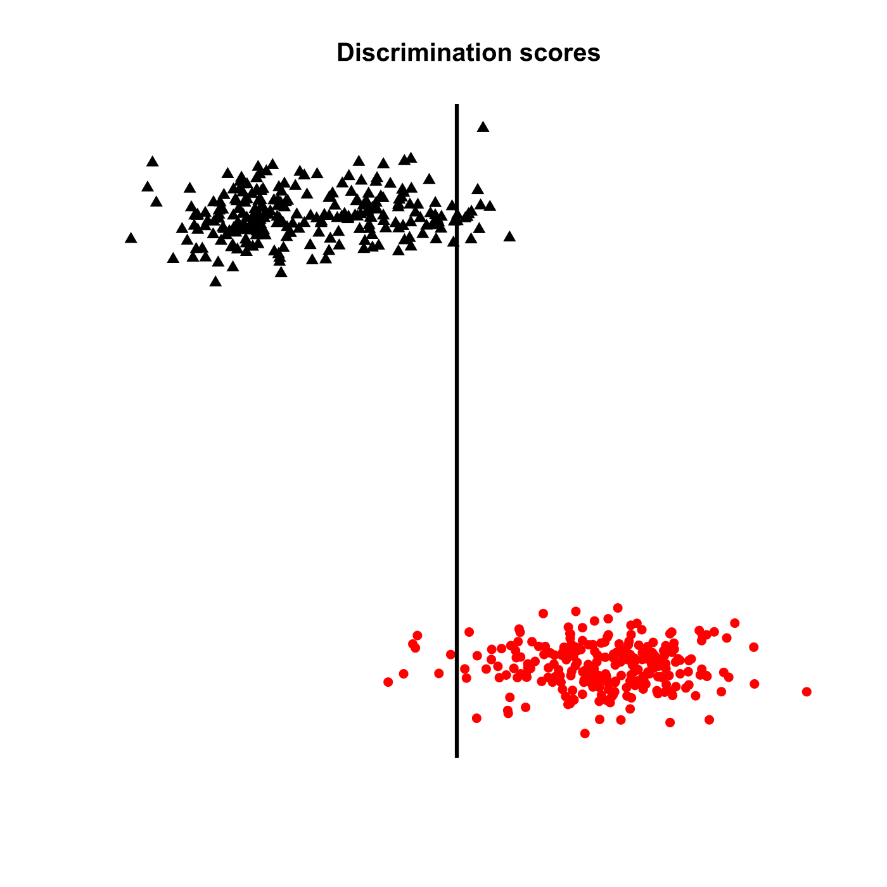

[](http://quantlet.de/index.php?p=info)

## [](http://quantlet.de/) **MVAdiscbh** [](http://quantlet.de/d3/ia)

```yaml

Name of QuantLet : MVAdiscbh

Published in : Applied Multivariate Statistical Analysis

Description : 'Demonstrates maximum likelihood discrimination rule (ML rule) for the Boston housing
data.'

Keywords : 'apparent-error-rate, discrimination, cluster-analysis, estimation,
discriminant-analysis, euclidean-distance-matrix, maximum-likelihood, plot, graphical
representation, financial'

See also : MVAaer, MVAaper, MVAaerbh, MVAdisfbank, MVAdisnorm

Author : Zografia Anastasiadou

Submitted : Thu, August 04 2011 by Awdesch Melzer

Datafile : bostonh.dat

Example : Discrimination scores for the two clusters created from the Boston housing data.

```




```r

# clear all variables
rm(list = ls(all = TRUE))
graphics.off()

# load data
data = read.table("bostonh.dat")

# transform data
xt        = data
xt[, 1]   = log(data[, 1])
xt[, 2]   = data[, 2]/10
xt[, 3]   = log(data[, 3])
xt[, 5]   = log(data[, 5])
xt[, 6]   = log(data[, 6])
xt[, 7]   = (data[, 7]^(2.5))/10000
xt[, 8]   = log(data[, 8])
xt[, 9]   = log(data[, 9])
xt[, 10]  = log(data[, 10])
xt[, 11]  = exp(0.4 * data[, 11])/1000
xt[, 12]  = data[, 12]/100
xt[, 13]  = sqrt(data[, 13])
xt[, 14]  = log(data[, 14])
data      = xt[, -4]

da    = scale(data)                     # standardize variables
d     = dist(da, "euclidean", p = 2)    # euclidean distance matrix
w     = hclust(d, method = "ward.D")    # cluster analysis with ward algorithm
tree  = cutree(w, 2)                    # define the clusters, tree=1 if cluster=1

# the following two lines under comments are for price of Boston houses
# tree=(xt[,14]>median(xt[,14]))+1 
# da=da[,1:12]

t1  = subset(da, tree == 1)
t2  = subset(da, tree == 2)

m1  = colMeans(t1)                      # mean of first cluster
m2  = colMeans(t2)                      # mean of second cluster
m   = (m1 + m2)/2                       # mean of both clusters
s = ((nrow(t1) - 1) * cov(t1) + (nrow(t2) - 1) * cov(t2))/(nrow(xt) - 2)    # common variance matrix
alpha = solve(s) %*% (m1 - m2)                                              # alpha for the discrimination rule

# APER for clusters of Boston houses
mis1  = sum((t1 - m) %*% alpha < 0)     # misclassified 1
mis2  = sum((t2 - m) %*% alpha > 0)     # misclassified 2
corr1 = sum((t1 - m) %*% alpha > 0)     # correct 1
corr2 = sum((t2 - m) %*% alpha < 0)     # correct 2
aper  = (mis1 + mis2)/nrow(xt)          # APER (apparent error rate)
alph  = (da - matrix(m, nrow(da), ncol(da), byrow = T)) %*% alpha
set.seed(1)

# discrimination scores
p = cbind(alph, tree + 0.05 * rnorm(NROW(tree)))
tree[tree == 1] = 16
tree[tree == 2] = 17
tr = tree
tr[tr == 16] = "red"
tr[tr == 17] = "black"

# plot of discrimination scores
plot(p[, 1], p[, 2], pch = tree, col = tr, xaxt = "n", yaxt = "n", xlab = "", ylab = "", 
    bty = "n")
abline(v = 0, lwd = 3) 
title(paste("Discrimination scores"))

```
