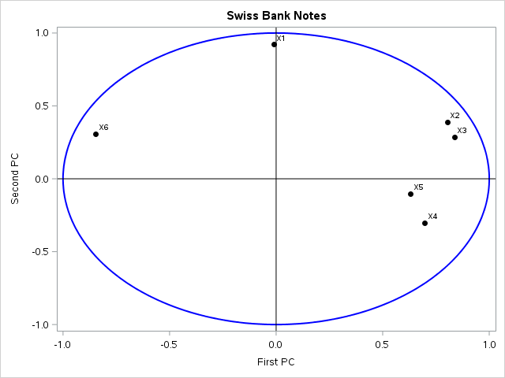

[](http://quantlet.de/index.php?p=info)

## [](http://quantlet.de/) **MVAnpcabanki** [](http://quantlet.de/d3/ia)

```yaml

Name of QuantLet : MVAnpcabanki

Published in : Applied Multivariate Statistical Analysis

Description : 'Shows a screeplot of the eigenvalues for the PCA of the standardized Swiss bank
notes. Additionally, it computes the correlations between the variables and the principal
components and displays the first two of them.'

Keywords : 'principal-components, pca, npca, eigenvalues, standardization, correlation, screeplot,
plot, graphical representation, data visualization, sas'

See also : 'MVAnpcabank, MVAnpcahous, MVAnpcahousi, MVAnpcatime, MVAnpcafood, MVAnpcausco,
MVAnpcausco2, MVAnpcausco2i, MVAcpcaiv, MVApcabank, MVApcabanki, MVApcabankr, MVApcasimu'

Author : Zografia Anastasiadou

Author[SAS] : Svetlana Bykovskaya

Submitted : Tue, March 11 2014 by Awdesch Melzer

Submitted[SAS] : Wen, April 6 2016 by Svetlana Bykovskaya

Datafile : bank2.dat

Example: 
- 1: Screeplot of the eigenvalues for the PCA of the standardized Swiss bank notes.
- 2: The correlations of the original variables with the PCs.

```





### R Code:
```r

# clear all variables
rm(list = ls(all = TRUE))
graphics.off()

# load data
x = read.table("bank2.dat")

x  = scale(x)       # standardizes the data matrix
n  = nrow(x)
e  = eigen(cov(x))  # calculates eigenvalues and eigenvectors and sorts them by size
e1 = e$values

# Plot 1: the relative proportion of variance explained by PCs
dev.new()
plot(e1, xlab = "Index", ylab = "Lambda", main = "Swiss Bank Notes", cex.lab = 1.2, 
    cex.axis = 1.2, cex.main = 1.8)
m    = mean(x)
temp = as.matrix(x - matrix(m, n, ncol(x), byrow = T))
r    = temp %*% e$vectors
r    = cor(cbind(r, x))      # correlation between PCs and variables
r1   = r[7:12, 1:2]          # correlation of the two most important PCs and variables

# Plot 2: the correlations of the original variables with the PCs
dev.new()
ucircle = cbind(cos((0:360)/180 * pi), sin((0:360)/180 * pi))
plot(ucircle, type = "l", lty = "solid", col = "blue", xlab = "First PC", ylab = "Second PC", 
    main = "Swiss Bank Notes", cex.lab = 1.2, cex.axis = 1.2, cex.main = 1.8, lwd = 2)
abline(h = 0, v = 0)
label = c("X1", "X2", "X3", "X4", "X5", "X6")
text(r1, label, cex = 1.2) 

```

### SAS Code:
```sas

* Import the data;
data b2;
  infile '/folders/myfolders/Sas-work/data/bank2.dat';
  input x1-x6;
run;

* standardize the data matrix;
proc standard data = b2 mean = 0 std = 1 out = y;
  var x1 x2 x3 x4 x5 x6;
run;

proc iml;
  * Read data into a matrix;
  use y;
    read all var _ALL_ into x; 
  close y;
  
  n  = nrow(x);
  e  = cov(x);
  e2 = eigval(e);
  e1 = 1:nrow(e2);
  
  m  = x[:];
  t  = x - repeat(m, n, ncol(x));
  r  = t * eigvec(e);
  r  = corr(r || x);    * correlation between PCs and variables;
  r  = r[7:12, 1:2];    * correlation of the two most important PCs and variables;
  
  r1 = -r[,1];
  r2 = r[,2];
  
  pi = constant("pi");
  uc = (cos((0:360)/180 * pi) // sin((0:360)/180 * pi))`;
  u1 = uc[,1];
  u2 = uc[,2];
  names = {"X1", "X2", "X3", "X4", "X5", "X6"};

  create plot var {"e1" "e2" "u1" "u2" "r1" "r2" "names"};
    append;
  close plot;
quit;

* Plot 1: the relative proportion of variance explained by PCs;
proc sgplot data = plot
    noautolegend;
  title 'Eigenvalues of S';
  scatter x = e1 y = e2 / markerattrs = (color = blue);
  xaxis label = 'Index';
  yaxis label = 'Lambda';
run;

* Plot 2: the correlations of the original variables with the PCs;
proc sgplot data = plot
    noautolegend;
  title 'Swiss Bank Notes';
  series  x = u1 y = u2 / lineattrs = (color = blue THICKNESS = 2);
  scatter x = r1 y = r2 / markerattrs = (color = black symbol = circlefilled)
    datalabel = names;
  refline 0 / lineattrs = (color = black);
  refline 0 / axis = x lineattrs = (color = black);
  xaxis label = 'First PC';
  yaxis label = 'Second PC';
run;

   
```
