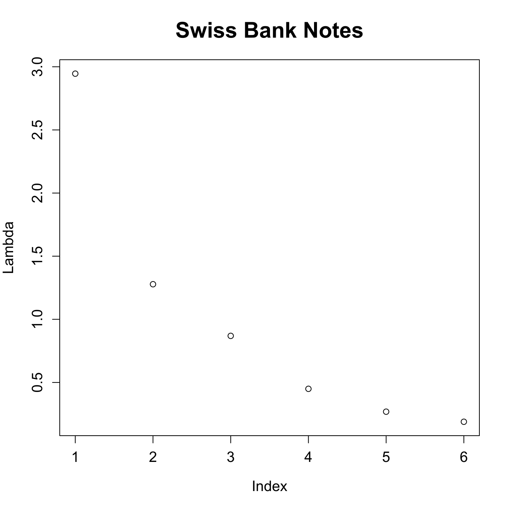
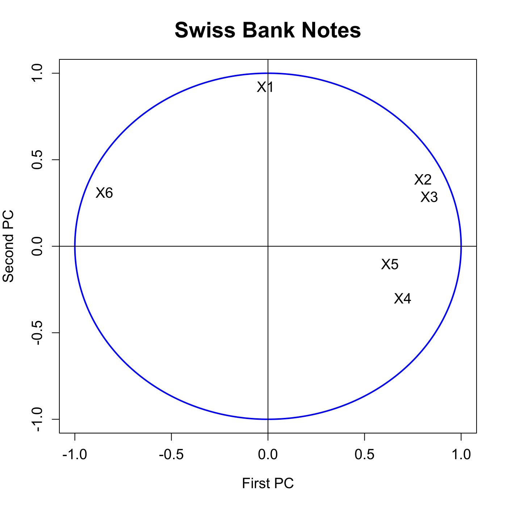

[](http://quantlet.de/index.php?p=info)

## [](http://quantlet.de/) **MVAnpcabanki** [](http://quantlet.de/d3/ia)

```yaml

Name of QuantLet : MVAnpcabanki

Published in : Applied Multivariate Statistical Analysis

Description : 'Shows a screeplot of the eigenvalues for the PCA of the standardized Swiss bank
notes. Additionally, it computes the correlations between the variables and the principal
components and displays the first two of them.'

Keywords : 'principal-components, pca, npca, eigenvalues, standardization, correlation, screeplot,
plot, graphical representation, data visualization'

See also : 'MVAnpcabank, MVAnpcahous, MVAnpcahousi, MVAnpcatime, MVAnpcafood, MVAnpcausco,
MVAnpcausco2, MVAnpcausco2i, MVAcpcaiv, MVApcabank, MVApcabanki, MVApcabankr, MVApcasimu'

Author : Zografia Anastasiadou

Submitted : Tue, March 11 2014 by Awdesch Melzer

Datafile : bank2.dat

Example: 
- 1: Screeplot of the eigenvalues for the PCA of the standardized Swiss bank notes.
- 2: The correlations of the original variables with the PCs.

```






```r

# clear all variables
rm(list = ls(all = TRUE))
graphics.off()

# load data
x = read.table("bank2.dat")

x  = scale(x)       # standardizes the data matrix
n  = nrow(x)
e  = eigen(cov(x))  # calculates eigenvalues and eigenvectors and sorts them by size
e1 = e$values

# Plot 1: the relative proportion of variance explained by PCs
dev.new()
plot(e1, xlab = "Index", ylab = "Lambda", main = "Swiss Bank Notes", cex.lab = 1.2, 
    cex.axis = 1.2, cex.main = 1.8)
m    = mean(x)
temp = as.matrix(x - matrix(m, n, ncol(x), byrow = T))
r    = temp %*% e$vectors
r    = cor(cbind(r, x))      # correlation between PCs and variables
r1   = r[7:12, 1:2]          # correlation of the two most important PCs and variables

# Plot 2: the correlations of the original variables with the PCs
dev.new()
ucircle = cbind(cos((0:360)/180 * pi), sin((0:360)/180 * pi))
plot(ucircle, type = "l", lty = "solid", col = "blue", xlab = "First PC", ylab = "Second PC", 
    main = "Swiss Bank Notes", cex.lab = 1.2, cex.axis = 1.2, cex.main = 1.8, lwd = 2)
abline(h = 0, v = 0)
label = c("X1", "X2", "X3", "X4", "X5", "X6")
text(r1, label, cex = 1.2) 

```
