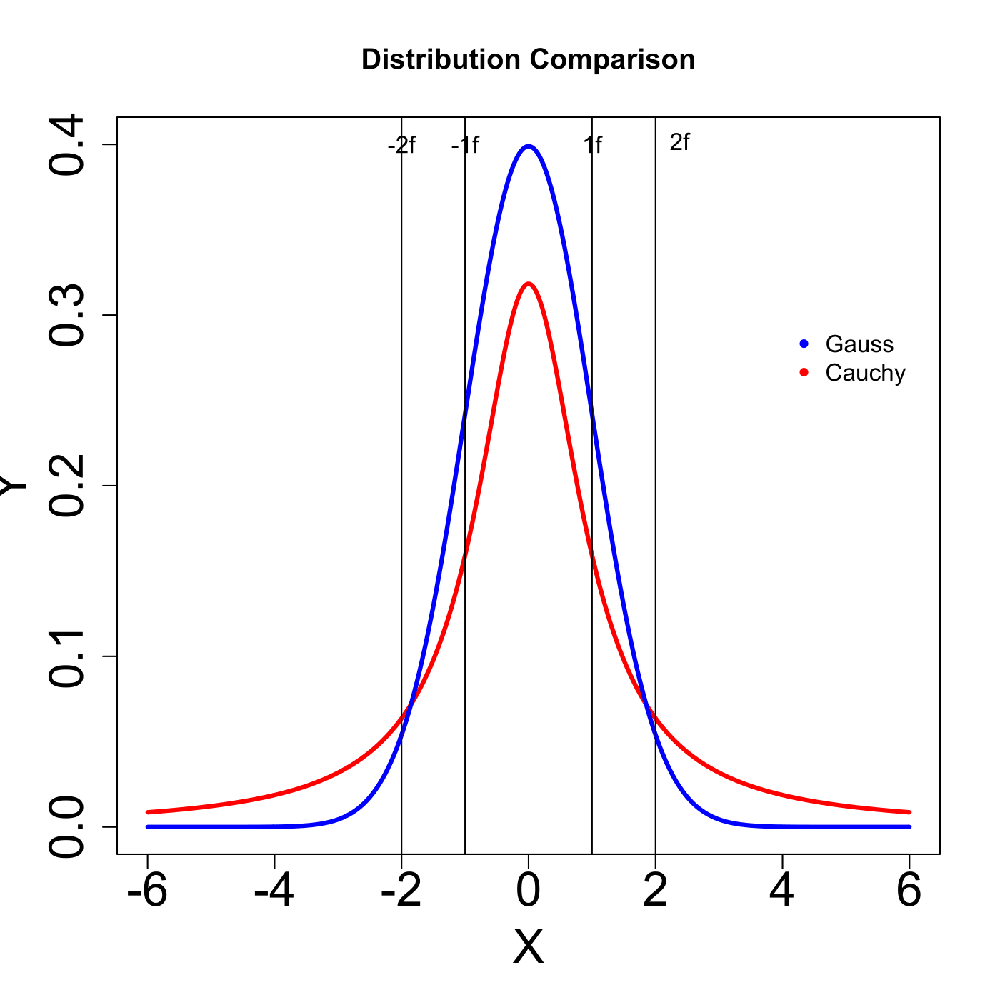

[](http://quantlet.de/index.php?p=info)

## [](http://quantlet.de/) **MVAgausscauchy** [](http://quantlet.de/d3/ia)

```yaml

Name of QuantLet : MVAgausscauchy

Published in : Applied Multivariate Statistical Analysis

Description : 'Demonstrates the differences of the pdf curves of a standard Gaussian distribution
and a Cauchy distribution with location parameter mu = 0 and scale parameter sigma = 1.'

Keywords : 'plot, graphical representation, cauchy, normal, pdf, density, distribution,
standard-normal, gaussian'

See also : MVAcltbern, MVAcltbern2, MVAcauchy, MVAtdis

Author : Wolfgang K. Haerdle

Submitted : Wed, September 07 2011 by Awdesch Melzer

```




```r

# clear all variables
rm(list = ls(all = TRUE))
graphics.off()

# Plot the Cauchy density
plot(seq(-6, 6, 0.02), dcauchy(seq(-6, 6, 0.02), 0, 1), type = "l", ylim = c(0, 0.4), 
    ylab = "Y", xlab = "X", col = "red", lwd = 3, cex.lab = 2, cex.axis = 2)

# Plot the standard normal density
lines(seq(-6, 6, 0.02), dnorm(seq(-6, 6, 0.02)), type = "l", ylim = c(0, 0.4), col = "blue", 
    lwd = 3)

abline(v = -2)
abline(v = -1)
abline(v = 1)
abline(v = 2)

text(-2, 0.4, label = "-2f")
text(-1, 0.4, label = "-1f")
text(1, 0.4, label = "1f")
text(2, 0.4, pos = 4, label = "2f")

legend(x = 4, y = 0.3, legend = c("Gauss", "Cauchy"), pch = c(20, 20), col = c("blue", 
    "red"), bty = "n")

title("Distribution Comparison")

```
