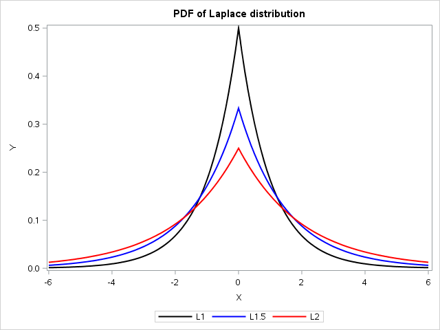
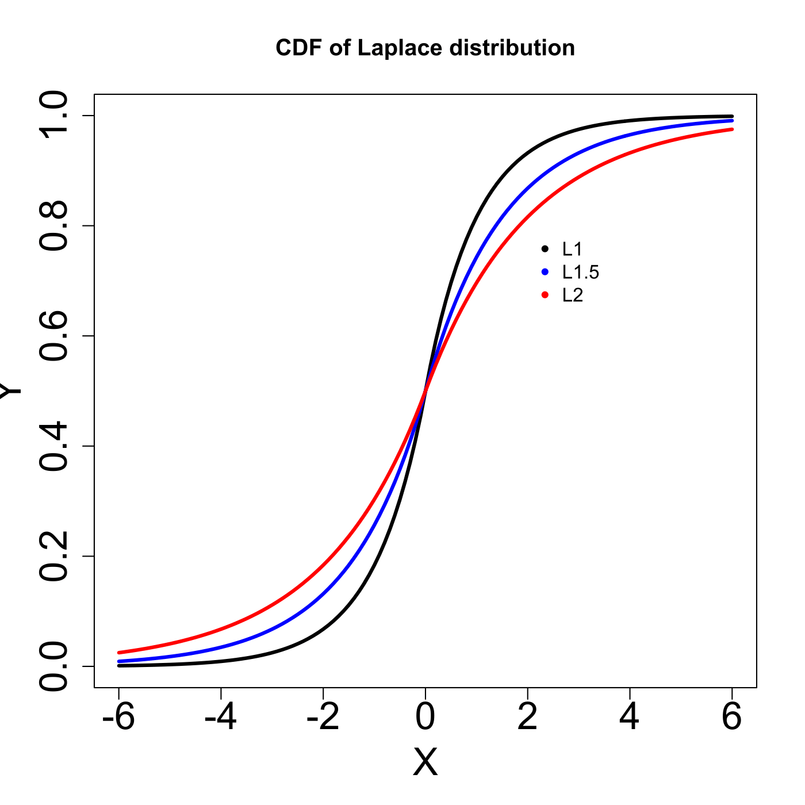

[](http://quantlet.de/index.php?p=info)

## [](http://quantlet.de/) **MVAlaplacedis** [](http://quantlet.de/d3/ia)

```yaml

Name of QuantLet : MVAlaplacedis

Published in : Applied Multivariate Statistical Analysis

Description : 'Plots three probability density functions and three cumulative density functions of
the Laplace-distribution with different scale (L1 stands for Laplace-distribution with scale 1,
etc).'

Keywords : 'pdf, probability, density, cdf, multivariate, laplace, scale, plot, graphical
representation, distribution, heavy-tailed, sas'

Author : Wolfgang K. Haerdle

Author[SAS] : Svetlana Bykovskaya

Submitted : Sun, January 29 2012 by Dedy Dwi Prastyo

Submitted[SAS] : Wen, April 6 2016 by Svetlana Bykovskaya

```







### R Code:
```r

# clear variables and close windows
rm(list = ls(all = TRUE))
graphics.off()

# install and load packages
libraries = c("VGAM")
lapply(libraries, function(x) if (!(x %in% installed.packages())) {
    install.packages(x)
})
lapply(libraries, library, quietly = TRUE, character.only = TRUE)

# PDF of Laplace Distribution
xx = seq(-6, 6, by = 0.1)
plot(xx, dlaplace(xx, location = 0, scale = 1), type = "l", ylab = "Y", xlab = "X", 
    col = "black", lwd = 3, cex.lab = 2, cex.axis = 2)
lines(xx, dlaplace(xx, location = 0, scale = 1.5), type = "l", col = "blue", lwd = 3)
lines(xx, dlaplace(xx, location = 0, scale = 2), type = "l", col = "red", lwd = 3)
legend(x = 2, y = 0.4, legend = c("L1", "L1.5", "L2"), pch = c(20, 20), col = c("black", 
    "blue", "red"), bty = "n")
title("PDF of Laplace distribution")

# CDF of Laplace Distribution
dev.new()
plot(xx, plaplace(xx, location = 0, scale = 1), type = "l", ylab = "Y", xlab = "X", 
    col = "black", lwd = 3, cex.lab = 2, cex.axis = 2)
lines(xx, plaplace(xx, location = 0, scale = 1.5), type = "l", col = "blue", lwd = 3)
lines(xx, plaplace(xx, location = 0, scale = 2), type = "l", col = "red", lwd = 3)
legend(x = 2, y = 0.8, legend = c("L1", "L1.5", "L2"), pch = c(20, 20), col = c("black", 
    "blue", "red"), bty = "n")
title("CDF of Laplace distribution") 

```

### SAS Code:
```sas
data pdf;
  do x = -6 to 6 by 0.1;
    p1 = pdf("Laplace", x, 0, 1);
    p2 = pdf("Laplace", x, 0, 1.5);
    p3 = pdf("Laplace", x, 0, 2);
    c1 = cdf("Laplace", x, 0, 1);
    c2 = cdf("Laplace", x, 0, 1.5);
    c3 = cdf("Laplace", x, 0, 2);
    output;
  end;
run;
 
* PDF of Laplace Distribution;
proc sgplot data = pdf;
  title 'PDF of Laplace distribution';
  series x = x y = p1 / legendlabel = 'L1' lineattrs = (color = black thickness = 2);
  series x = x y = p2 / legendlabel = 'L1.5'  lineattrs = (color = blue thickness = 2);
  series x = x y = p3 / legendlabel = 'L2'  lineattrs = (color = red thickness = 2);
  xaxis label = "X"; 
  yaxis label = "Y";
run;

* CDF of Laplace Distribution;
proc sgplot data = pdf;
  title 'CDF of Laplace distribution';
  series x = x y = c1 / legendlabel = 'L1' lineattrs = (color = black thickness = 2);
  series x = x y = c2 / legendlabel = 'L1.5'  lineattrs = (color = blue thickness = 2);
  series x = x y = c3 / legendlabel = 'L2'  lineattrs = (color = red thickness = 2);
  xaxis label = "X"; 
  yaxis label = "Y";
run;
```
