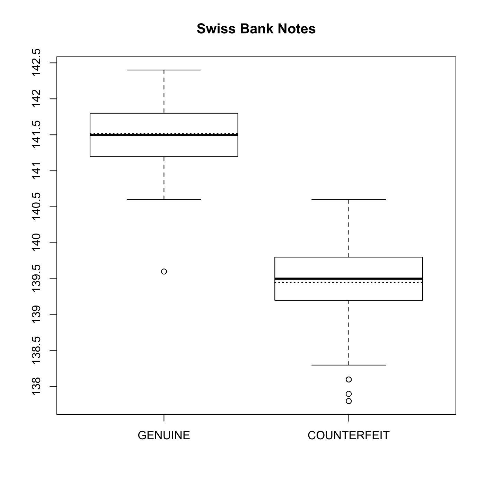
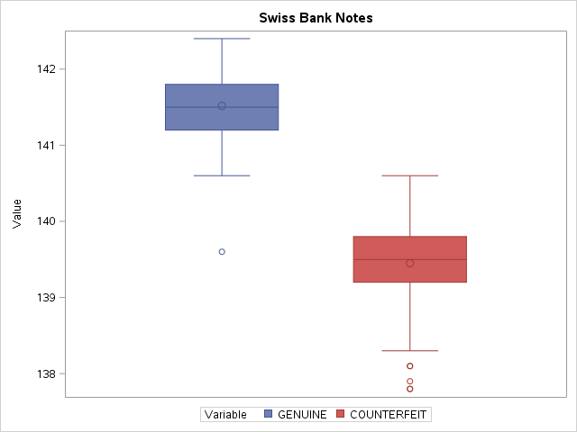

[](http://quantlet.de/index.php?p=info)

## [](http://quantlet.de/) **MVAboxbank6** [](http://quantlet.de/d3/ia)

```yaml

Name of QuantLet : MVAboxbank6

Published in : Applied Multivariate Statistical Analysis

Description : 'Computes boxplots for the diagonal (X6 variable) of the genuine and forged banknotes
from the Swiss bank data.'

Keywords : 'descriptive, descriptive-statistics, financial, data visualization, boxplot, plot,
graphical representation, sas'

See also : MVAboxbank1, MVAboxbhd, MVAboxcar, MVAboxcity

Author : Vladimir Georgescu, Jorge Patron, Song Song

Author[SAS] : Svetlana Bykovskaya

Submitted : Tue, September 09 2014 by Awdesch Melzer

Submitted[SAS] : Wen, April 6 2016 by Svetlana Bykovskaya

Datafiles : bank2.dat

```






### R Code:
```r

# clear variables and close windows
rm(list = ls(all = TRUE))
graphics.off()

# load data
x  = read.table("bank2.dat")
m1 = mean(x[1:100, 6])
m2 = mean(x[101:200, 6])

# plot
boxplot(x[1:100, 6], x[101:200, 6], axes = FALSE, frame = TRUE)
axis(side = 1, at = seq(1, 2), label = c("GENUINE", "COUNTERFEIT"))
axis(side = 2, at = seq(130, 150, 0.5), label = seq(130, 150, 0.5))
title("Swiss Bank Notes")
lines(c(0.6, 1.4), c(m1, m1), lty = "dotted", lwd = 1.2)
lines(c(1.6, 2.4), c(m2, m2), lty = "dotted", lwd = 1.2)
```

### SAS Code:
```sas

* Import the data;
data b2;
  id + 1;
  infile '/folders/myfolders/Sas-work/data/bank2.dat';
  input x1-x6;
  drop x1-x5;
run;

data obs1;
  set b2 (firstobs = 1 obs = 100);
  GENUINE = x6;
  drop x6;
run;

data obs2;
  set b2 (firstobs = 101 obs = 200);
  COUNTERFEIT = x6;
  drop x6;
run;

data b2;
  merge obs1 obs2;
run;

proc transpose data = b2 out = b2_t;
  by id;
run;

data b2_t;
  set b2_t;
  label _name_ = "Variable";
  label col1 = "Value";
run;

title "Swiss Bank Notes";
proc sgplot data = b2_t;
  vbox col1 / group = _name_ ;
run;
```
