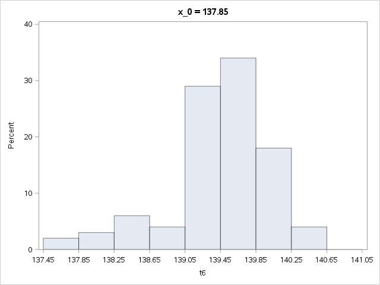

[](http://quantlet.de/index.php?p=info)

## [](http://quantlet.de/) **MVAhisbank2** [](http://quantlet.de/d3/ia)

```yaml

Name of QuantLet : MVAhisbank2

Published in : Applied Multivariate Statistical Analysis

Description : 'Computes 4 histograms for the diagonal of the forged Swiss bank notes. The
histograms are different with respect to their origin.'

Keywords : 'binwidth, data visualization, descriptive, descriptive-statistics, distribution,
empirical, histogram, origin, plot, graphical representation, sas'

See also : MVAhisbank1

Author : Song Song, Vladimir Georgescu, Jorge Patron, Awdesch Melzer

Author[SAS] : Svetlana Bykovskaya

Submitted : Tue, September 09 2014 by Awdesch Melzer

Submitted[SAS] : Wen, April 6 2016 by Svetlana Bykovskaya

Datafiles : bank2.dat

Example : 'Diagonal of counterfeit bank notes. Histogram with h = 0.4 and origins x0 = 137.65
(upper left), x0 = 137.75 (lower left), x0 = 137.85 (upper right), x0 = 137.95 (lower right).'

```





### R Code:
```r

# clear variables and close windows
rm(list = ls(all = TRUE))
graphics.off()

# load data
x = read.table("bank2.dat")
x = x[101:200, 6]

origin1 = 137.65
origin2 = 137.75
origin3 = 137.85
origin4 = 137.95

y1 = seq(origin1, 141.05, 0.4)
y2 = seq(origin2, 141.05, 0.4)
y3 = seq(origin3 - 0.4, 141.05, 0.4)  # origin>min(x)
y4 = seq(origin4 - 0.4, 141.05, 0.4)  # origin>min(x)

par(mfrow = c(2, 2))
hist(x, y1, ylab = "Diagonal", xlab = "x_0 = 137.65", xlim = c(137.5, 141), ylim = c(0, 
    42), main = "Swiss Bank Notes", axes = FALSE)
axis(side = 1, at = seq(138, 141), labels = seq(138, 141))
axis(side = 2, at = seq(0, 40, 20), labels = seq(0, 40, 20))

hist(x, y3, ylab = "Diagonal", xlab = "x_0 = 137.85", xlim = c(137.5, 141), ylim = c(0, 
    42), main = "Swiss Bank Notes", axes = FALSE)
axis(side = 1, at = seq(138, 141), labels = seq(138, 141))
axis(side = 2, at = seq(0, 40, 20), labels = seq(0, 40, 20))

hist(x, y2, ylab = "Diagonal", xlab = "x_0 = 137.75", xlim = c(137.5, 141), ylim = c(0, 
    42), main = "Swiss Bank Notes", axes = FALSE)
axis(side = 1, at = seq(138, 141), labels = seq(138, 141))
axis(side = 2, at = seq(0, 40, 20), labels = seq(0, 40, 20))

hist(x, y4, ylab = "Diagonal", xlab = "x_0 = 137.95", xlim = c(137.5, 141), ylim = c(0, 
    42), main = "Swiss Bank Notes", axes = FALSE)
axis(side = 1, at = seq(138, 141), labels = seq(138, 141))
axis(side = 2, at = seq(0, 40, 20), labels = seq(0, 40, 20))
```

### SAS Code:
```sas

* Import the data;
data bank2;
  infile '/folders/myfolders/Sas-work/data/bank2.dat';
  input t1-t6;
  drop t1-t5;
run;

data b2;
  set bank2 (firstobs = 101 obs = 200);
run;
  
title 'Swiss Bank Notes';
proc univariate data = b2 noprint;
  histogram t6 / 
    odstitle = 'x_0 = 137.65'
    endpoints = 137.65 to 141.05 by 0.4;
  histogram t6 / 
    odstitle = 'x_0 = 137.75'
    endpoints = 137.75 to 141.05 by 0.4;
  histogram t6 / 
    odstitle = 'x_0 = 137.85'
    endpoints = 137.45 to 141.05 by 0.4; * origin>min(x);
  histogram t6 / 
    odstitle = 'x_0 = 137.95'
    endpoints = 137.55 to 141.05 by 0.4; * origin>min(x);
run;

```
