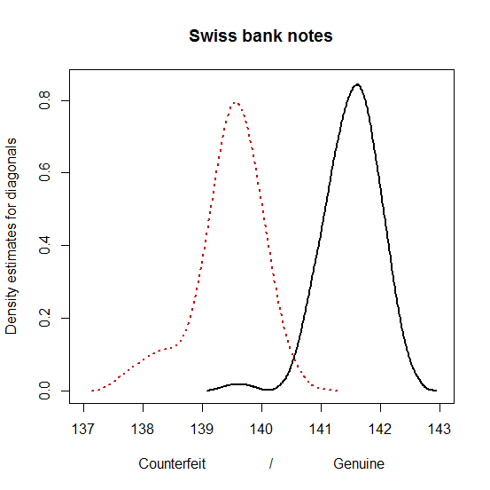

[](http://quantlet.de/index.php?p=info)

## [](http://quantlet.de/) **MVAdenbank** [](http://quantlet.de/d3/ia)

```yaml

Name of QuantLet : MVAdenbank

Published in : Applied Multivariate Statistical Analysis

Description : 'Computes kernel density estimates of the diagonal of the genuine and forged swiss
bank notes. The bandwidth parameter are chosen by Silverman rule of thumb.'

Keywords : 'Epanechnikov, Silverman, data visualization, plot, graphical representation, financial,
density, descriptive, descriptive-statistics, empirical, smoothing, gaussian, kde, kernel,
visualization, sas'

See also : 'MVAboxbank6, MVAcontbank3, MVAdenbank2, MVAdenbank3, MVAscabank456, SPMdenepatri,
SPMkdeconstruct, SPMkernel'

Author : Vladimir Georgescu, Jorge Patron, Song Song

Author[SAS] : Svetlana Bykovskaya

Submitted : Tue, September 09 2014 by Awdesch Melzer

Submitted[SAS] : Wen, April 6 2016 by Svetlana Bykovskaya

Datafiles : bank2.dat

```




### R Code:
```r

# clear variables and close windows
rm(list = ls(all = TRUE))
graphics.off()

# install and load packages
libraries = c("KernSmooth")
lapply(libraries, function(x) if (!(x %in% installed.packages())) {
install.packages(x)
})
lapply(libraries, library, quietly = TRUE, character.only = TRUE)

# load data
x  = read.table("bank2.dat")
x1 = x[1:100, 6]
x2 = x[101:200, 6]

# Compute kernel density estimate
fh1 = bkde(x1, kernel = "biweight")  
fh2 = bkde(x2, kernel = "biweight")  

# plot
plot(fh1, type = "l", lwd = 2, xlab = "Counterfeit                  /                 Genuine", 
    ylab = "Density estimates for diagonals", col = "black", main = "Swiss bank notes", 
    xlim = c(137, 143), ylim = c(0, 0.85)) 
lines(fh2, lty = "dotted", lwd = 2, col = "red3")

```

### SAS Code:
```sas

* Import the data;
data bank2;
  infile '/folders/myfolders/Sas-work/data/bank2.dat';
  input t1-t6;
  drop t1-t5;
run;

proc iml;
  * Read data into a matrix;
  use bank2;
    read all var _ALL_ into x; 
  close bank2;
  
  x1 = x[1:100];
  x2 = x[101:200];
  
  create plot var {"x1" "x2"};
    append;
  close plot;
quit;

ods graphics on;

proc kde data = plot;
  title 'Swiss bank notes';
  univar x1 x2/ plots = (densityoverlay) noprint;
run;

ods graphics off;

```
