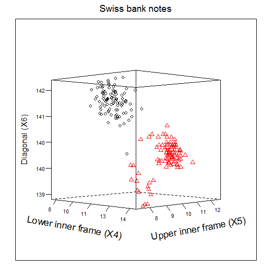

[](http://quantlet.de/index.php?p=info)

## [](http://quantlet.de/) **MVAscabank456** [](http://quantlet.de/d3/ia)

```yaml

Name of QuantLet : MVAscabank456

Published in : Applied Multivariate Statistical Analysis

Description : 'Computes a three dimensional scatterplot for
X4 vs. X6 vs. X5 (lower inner frame vs. diagonal vs. upper
inner frame) of the Swiss bank notes.'

Keywords :
- 3D
- data visualization
- graphical representation
- scatterplot
- plot
- financial

See also :
- MVAdenbank3
- MVAdraftbank4
- MVAdrafthousing
- MVAdrafthousingt
- MVAcorrnorm
- MVAregbank
- MVAregpull
- MVAscabank45
- MVAscabank56
- MVAscacar
- MVAscapull1
- MVAscapull2

Author :
- Vladimir Georgescu
- Jorge Patron
- Song Song

Submitted : Tue, September 09 2014 by Awdesch Melzer

Datafile : bank2.dat
```




```r

# clear all variables
rm(list = ls(all = TRUE))
graphics.off()

libraries = c("lattice")
lapply(libraries, function(x) if (!(x %in% installed.packages())) {
    install.packages(x)
})
lapply(libraries, library, quietly = TRUE, character.only = TRUE)

# load data
x    = read.table("bank2.dat")
x456 = x[, 4:6]
x1   = rep(1, 100)
x2   = rep(2, 100)
xx   = c(x1, x2)

# plot
cloud(x456[, 3] ~ x456[, 2] * x456[, 1], pch = c(xx), col = c(xx), ticktype = "detailed", 
    main = expression(paste("Swiss bank notes")), screen = list(z = -90, x = -90, 
        y = 45), scales = list(arrows = FALSE, col = "black", distance = 1, tick.number = c(4, 
        4, 5), cex = 0.7, z = list(labels = round(seq(138, 142, length = 6))), x = list(labels = round(seq(7, 
        14, length = 6))), y = list(labels = round(seq(7, 12, length = 6)))), xlab = list(expression(paste("Lower inner frame (X4)")), 
        rot = -10, cex = 1.2), ylab = list("Upper inner frame (X5)", rot = 10, cex = 1.2), 
    zlab = list("Diagonal (X6)", rot = 90, cex = 1.1))

```
