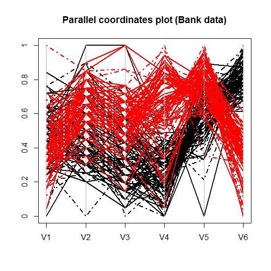

[](http://quantlet.de/index.php?p=info)

## [](http://quantlet.de/) **MVAparcoo2** [](http://quantlet.de/d3/ia)

```yaml

Name of Quantlet: MVAparcoo2

Published in: Applied Multivariate Statistical Analysis

Description: 'Computes a parallel coordinate plot for the
observations of the full bank note data set.'

Keywords:
- data visualization
- graphical representation
- plot
- parallel-coordinates-plot
- scaling
- financial

See also:
- MVAandcur
- MVAandcur2
- MVAparcoo1
- MVApcp1
- MVApcp2
- MVApcp3
- MVApcp4
- MVApcp5
- MVApcp7
- MVApcphousing

Author: Vladimir Georgescu, Jorge Patron, Song Song, Julia Wandke

Submitted: Tue, September 09 2014 by Awdesch Melzer

Datafile: bank2.dat
```




```r

# clear all variables
rm(list = ls(all = TRUE))
graphics.off()

# install and load packages
libraries = c("MASS")
lapply(libraries, function(x) if (!(x %in% installed.packages())) {
    install.packages(x)
})
lapply(libraries, library, quietly = TRUE, character.only = TRUE)


# load data
data = read.table("bank2.dat")
C    = c(rep(1, 100), rep(2, 100))
x    = data

# plot
ir   = rbind(x[, , 1], x[, , 2], x[, , 3], x[, , 4], x[, , 5], x[, , 6])
parcoord(log(ir)[, c(1, 2, 3, 4, 5, 6)], lty = c(rep(1, 5), rep(4, 5)), lwd = 2, col = C, main = "Parallel coordinates plot (Bank data)", 
    frame = TRUE)
axis(side = 2, at = seq(0, 1, 0.2), labels = seq(0, 1, 0.2))

```
