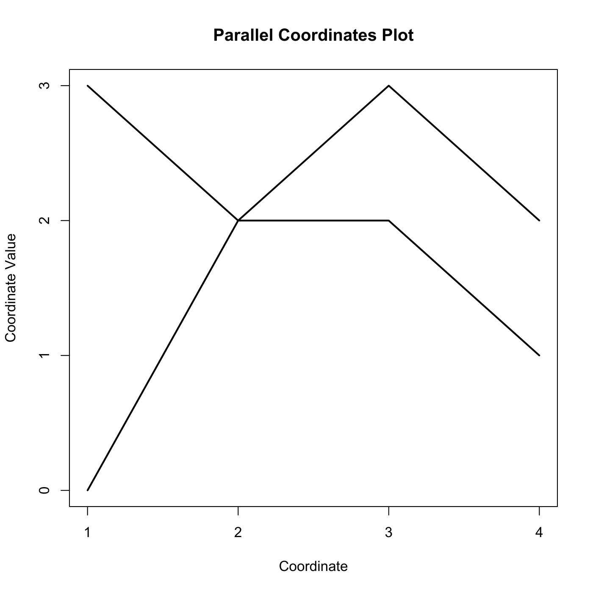

[](http://quantlet.de/index.php?p=info)

## [](http://quantlet.de/) **MVApcp7** [](http://quantlet.de/d3/ia)

```yaml
Name of QuantLet : MVApcp7
Published in : Applied Multivariate Statistical Analysis
Description : Computes parallel coordinates plot with intersection.
Keywords :
- pcp
- parallel-coordinates-plot
- financial
- data visualization, plot
- graphical representation
See also :
- MVApcphousing
- MVApcp1
- MVApcp2
- MVApcp3
- MVApcp4
- MVApcp5
- MVApcp6
- MVApcp8
Author :
- Ji Cao
- Song Song
- Vladimir Georgescu
- Awdesch Melzer
- Felix Jung
Submitted : Tue, September 09 2014 by Awdesch Melzer
Input : 'z1 - first data point; z2 - second data point'
```




```r
# −−−−−−−−−−−−−−−−−−−−−−−−−−−−−−−−−−−−−−−−−−−−−−−−−−−−−−
# Name of QuantLet : MVApcp7
# −−−−−−−−−−−−−−−−−−−−−−−−−−−−−−−−−−−−−−−−−−−−−−−−−−−−−−
# Published in : Applied Multivariate Statistical Analysis
# −−−−−−−−−−−−−−−−−−−−−−−−−−−−−−−−−−−−−−−−−−−−−−−−−−−−−−
# Description : Computes parallel coordinates plot with
# intersection.
# −−−−−−−−−−−−−−−−−−−−−−−−−−−−−−−−−−−−−−−−−−−−−−−−−−−−−−
# Keywords : pcp, parallel-coordinates-plot, financial, 
# data visualization, plot, graphical representation
# −−−−−−−−−−−−−−−−−−−−−−−−−−−−−−−−−−−−−−−−−−−−−−−−−−−−−−
# See also : MVApcphousing, MVApcp1, MVApcp2, MVApcp3, 
# MVApcp4, MVApcp5, MVApcp6, MVApcp8
# −−−−−−−−−−−−−−−−−−−−−−−−−−−−−−−−−−−−−−−−−−−−−−−−−−−−−−
# Author : Ji Cao, Song Song, Vladimir Georgescu, Awdesch Melzer, Felix Jung
# −−−−−−−−−−−−−−−−−−−−−−−−−−−−−−−−−−−−−−−−−−−−−−−−−−−−−−
# Submitted : Tue, September 09 2014 by Awdesch Melzer
# −−−−−−−−−−−−−−−−−−−−−−−−−−−−−−−−−−−−−−−−−−−−−−−−−−−−−−
# Input : z1 - first data point
#         z2 - second data point
# −−−−−−−−−−−−−−−−−−−−−−−−−−−−−−−−−−−−−−−−−−−−−−−−−−−−−−

# clear all variables
rm(list = ls(all = TRUE))
graphics.off()

# parameter settings
z1 = c(0, 2, 3, 2)
z2 = c(3, 2, 2, 1)

# Plot
plot(z1, type = "l", ylim = c(0, 3), xlim = c(1, 4), xlab = "Coordinate", lwd = 2, 
    ylab = "Coordinate Value", frame = TRUE, axes = FALSE)
lines(z2, lwd = 2)
axis(side = 1, at = seq(1, 4), labels = seq(1, 4))
axis(side = 2, at = seq(0, 3), labels = seq(0, 3))
title("Parallel Coordinates Plot") 

```
