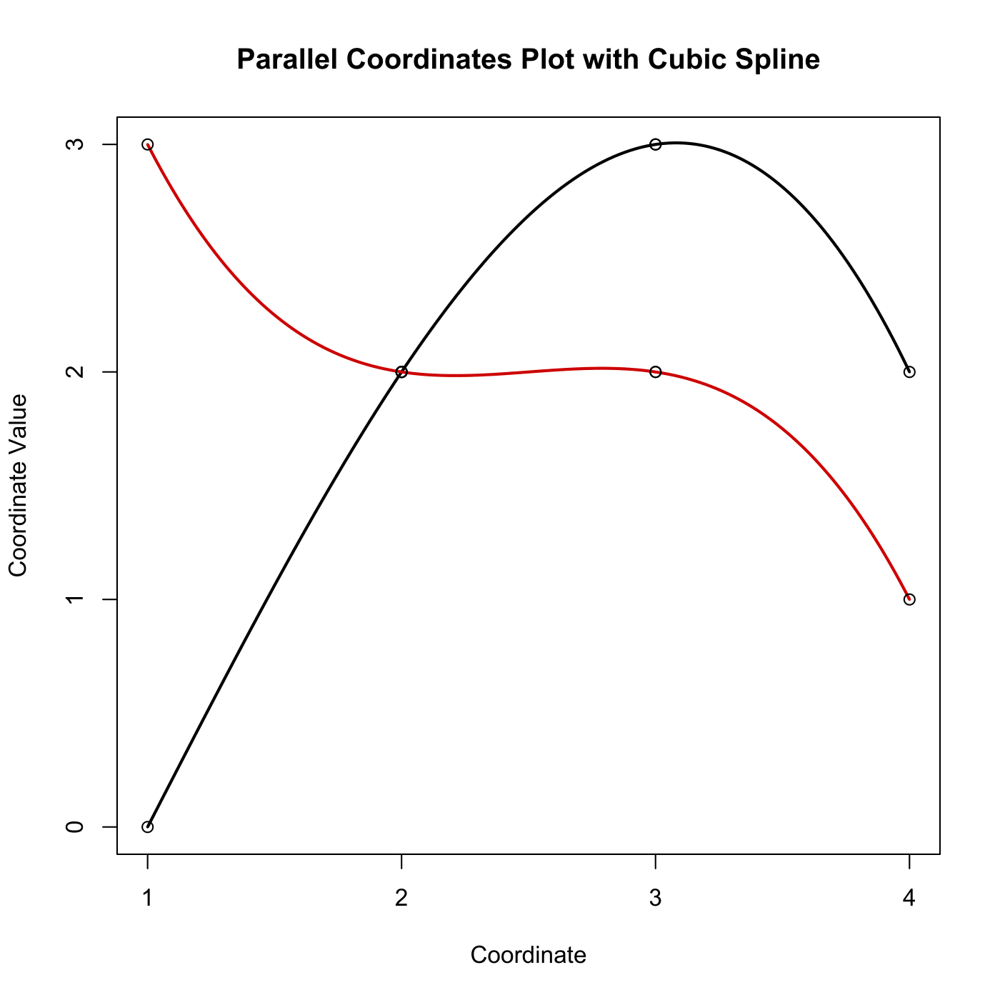

## <center>QID-1579-MVApcp8</center>

 
 
```R
# −−−−−−−−−−−−−−−−−−−−−−−−−−−−−−−−−−−−−−−−−−−−−−−−−−−−−−
# Name of QuantLet : MVApcp8
# −−−−−−−−−−−−−−−−−−−−−−−−−−−−−−−−−−−−−−−−−−−−−−−−−−−−−−
# Published in : Applied Multivariate Statistical Analysis
# −−−−−−−−−−−−−−−−−−−−−−−−−−−−−−−−−−−−−−−−−−−−−−−−−−−−−−
# Description : Computes parallel coordinates plot with 
# cubic spline interpolation.
# −−−−−−−−−−−−−−−−−−−−−−−−−−−−−−−−−−−−−−−−−−−−−−−−−−−−−−
# Keywords : pcp, parallel-coordinates-plot, financial,
# spline, interpolation, data visualization, plot, 
# graphical representation
# −−−−−−−−−−−−−−−−−−−−−−−−−−−−−−−−−−−−−−−−−−−−−−−−−−−−−−
# See also : MVApcphousing, MVApcp1, MVApcp2, MVApcp3, 
# MVApcp4, MVApcp5, MVApcp6, MVApcp7
# −−−−−−−−−−−−−−−−−−−−−−−−−−−−−−−−−−−−−−−−−−−−−−−−−−−−−−
# Author : Ji Cao, Song Song, Vladimir Georgescu, Awdesch Melzer
# −−−−−−−−−−−−−−−−−−−−−−−−−−−−−−−−−−−−−−−−−−−−−−−−−−−−−−
# Submitted : Tue, September 09 2014 by Awdesch Melzer
# −−−−−−−−−−−−−−−−−−−−−−−−−−−−−−−−−−−−−−−−−−−−−−−−−−−−−−
# Input : z1 - first data point
#         z2 - second data point
# −−−−−−−−−−−−−−−−−−−−−−−−−−−−−−−−−−−−−−−−−−−−−−−−−−−−−−

# clear all variables
rm(list = ls(all = TRUE))
graphics.off()

# parameter settings
z1  = c(0, 2, 3, 2)
z2  = c(3, 2, 2, 1)
n   = 400

x1  = spline(z1, n = n)
x2  = spline(z2, n = n)

# Plot
plot(x1, lwd = 2, type = "l", ylab = "Coordinate Value", xlab = "Coordinate", frame = TRUE, 
    axes = FALSE, xlim = c(1, 4), ylim = c(0, 3))
lines(x2, lwd = 2, col = "red3")
points(c(1, 2), c(3, 2))
points(c(1, 2), c(0, 2))
points(c(2, 3), c(2, 2))
points(c(2, 3), c(2, 3))
points(c(3, 4), c(3, 2))
points(c(3, 4), c(2, 1))
axis(side = 1, at = seq(1, 4), labels = seq(1, 4))
axis(side = 2, at = seq(0, 3), labels = seq(0, 3))
title("Parallel Coordinates Plot with Cubic Spline") 
```