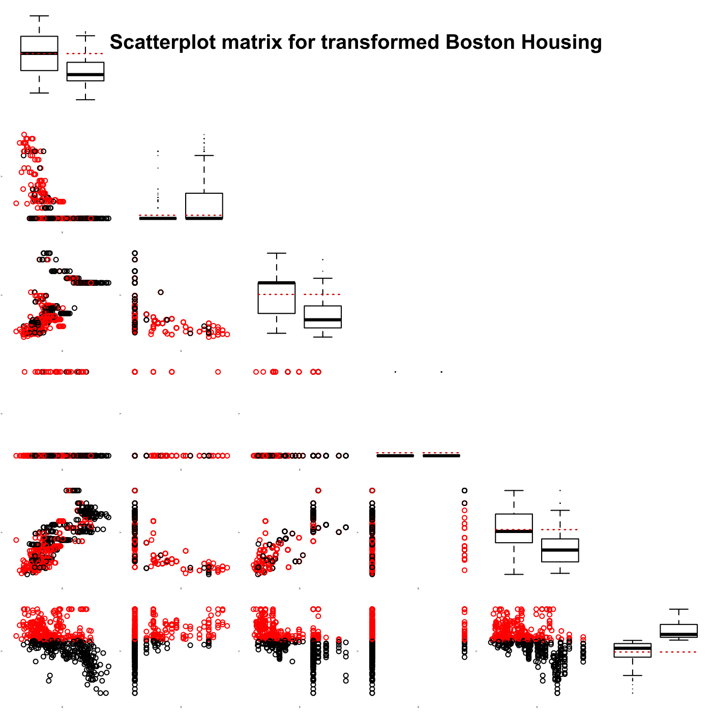

[](http://quantlet.de/index.php?p=info)

## [](http://quantlet.de/) **MVAdrafthousingt** [](http://quantlet.de/d3/ia)

```yaml
Name of QuantLet : MVAdrafthousingt

Published in : Applied Multivariate Statistical Analysis

Description : 'Plots the scatterplot matrix for the transformed Boston housing data variables
X1, . . . ,X5 and X14.'

Keywords :
- financial
- data visualization
- boxplot
- scatterplot
- plot
- graphical representation

See also :
- MVAdrafthousing
- MVApcphousing

Author :
- Vladimir Georgescu
- Jorge Patron
- Song Song
- Julia Wandke
- Awdesch Melzer

Submitted : Tue, September 09 2014 by Awdesch Melzer

Datafile : bostonh.dat
```




```r

# clear all variables
rm(list = ls(all = TRUE))
graphics.off()

# load data
data = read.table("bostonh.dat")
x    = data

# data transfomation
K = as.numeric(data[, 14] > median(data[, 14])) + 1
x = cbind(log(x[, 1]), x[, 2], x[, 3], x[, 4], log(x[, 5]), log(x[, 14]), K)

# subset creation for subset means
z    = data.frame(x)
z1   = subset(z, z$K == 1)
z2   = subset(z, z$K == 2)
m1   = apply(z1, 2, mean)
m2   = apply(z2, 2, mean)
i    = 0
op   = par(mfrow = c(6, 6), cex = 0.15)

while (i < 6) {
    i = i + 1
    j = 0
    while (j < 6) {
        j = j + 1
        
        if (i == j) {
            boxplot(x[, i] ~ K, at = 1:2, axes = FALSE)
            lines(c(0.6, 1.4), c(m1[i], m1[i]), lty = "dotted", lwd = 1.2, col = "red3")
            lines(c(1.6, 2.4), c(m1[i], m1[i]), lty = "dotted", lwd = 1.2, col = "red3")
        }
        
        if (i > j) {
            yy = cbind(x[, j], x[, i], K)
            plot(yy[, -3], col = as.numeric(K), xlab = "X", ylab = "Y", cex = 4, 
                axes = FALSE)
        }
        
        if (i < j) {
            plot(i, type = "n", axes = FALSE, xlab = "", ylab = "", main = "")
        }
    }
}

title(main = list("Scatterplot matrix for transformed Boston Housing", cex = 8), 
    line = -16, outer = TRUE) 

```
