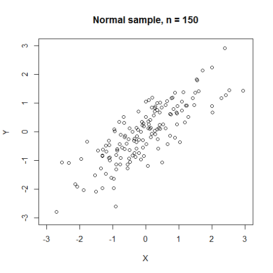

[](http://quantlet.de/index.php?p=info)

## [](http://quantlet.de/) **MVAcorrnorm** [](http://quantlet.de/d3/ia)

```yaml

Name of QuantLet : MVAcorrnorm

Published in : Applied Multivariate Statistical Analysis

Description : 'Computes a two dimensional scatterplot of two correlated normal random variables.' 

Keywords : 
- correlation
- gaussian
- plot
- graphical representation
- normal
- normal-distribution
- random
- scatterplot
- variable

See also : 
- MVAregbank
- MVAregpull
- MVAscabank45
- MVAscabank56
- MVAscabank456 
- MVAscacar
- MVAscapull1
- MVAscapull2
- MVAdraftbank4
- MVAdrafthousing
- MVAdrafthousingt

Author : 
- Vladimir Georgescu
- Jorge Patron
- Song Song
- Awdesch Melzer

Submitted : Mon, September 15 2014 by Awdesch Melzer

Input : 
- sig : Covariance matrix

```




```r

# clear all variables
rm(list = ls(all = TRUE))
graphics.off()

# install and load packages
libraries = c("matlab")
lapply(libraries, function(x) if (!(x %in% installed.packages())) {
    install.packages(x)
})
lapply(libraries, library, quietly = TRUE, character.only = TRUE)

set.seed(80)
n      = 150
sig    = rbind(c(1, 0.8), c(0.8, 1))               # Define a covariance matrix
value  = flipud(eigen(sig)$values)                 # Compute the eigentvalues
vector = fliplr(eigen(sig)$vectors)                # and eigenvectors for sig
ll     = rbind(c(sqrt(value[1]), 0), c(0, sqrt(value[2])))    # Square root of the eigenvalues
sh     = vector %*% ll %*% vector 
nr     = cbind(rnorm(n, 0, 1), rnorm(n, 0, 1))     # Normal random variables
y      = nr %*% t(sh)

# сreate scatterplot
plot(y[, 1], y[, 2], ylab = "Y", xlab = "X", ylim = c(-3, 3), xlim = c(-3, 3))
title(paste("Normal sample, n =", n))

```
