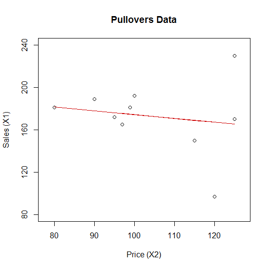

[](http://quantlet.de/index.php?p=info)

## [](http://quantlet.de/) **MVAregpull** [](http://quantlet.de/d3/ia)

```yaml

Name of QuantLet : MVAregpull

Published in : Applied Multivariate Statistical Analysis

Description : Computes and plots a linear regression of sales on price from the pullovers data set.

Keywords : 'R-squared, Testing, data visualization, graphical representation, linear-regression,
regression, scatterplot, plot, financial'

See also : 'MVAlinregbh, MVAcorrnorm, MVAregbank, MVAscabank45, MVAscabank56, MVAscabank456,
MVAscacar, MVAscapull1, MVAscapull2, MVAdraftbank4, MVAdrafthousing, MVAdrafthousingt'

Author : Jorge Patron, Vladimir Georgescu, Song Song, Awdesch Melzer

Submitted : Mon, September 15 2014 by Awdesch Melzer

Datafile : pullover.dat

```




```r

# clear all variables
rm(list = ls(all = TRUE))
graphics.off()

# load data
x  = read.table("pullover.dat")

# define variables of the model
y  = x[, 1]         # X1 (sales)
X2 = x[, 2]         # X2 (price)
X  = cbind(rep(1, length(X2)), X2)

# fit the model y~X
b  = solve(t(X) %*% X) %*% t(X) %*% y   # regression of (X1) sales on (X2) price

# degrees of freedom
mn = dim(X)
df = mn[1] - mn[2]

yhat  = X %*% b           # fitted values
r     = y - yhat          # residuals
mse   = t(r) %*% r/df     # mean square error
covar = solve(t(X) %*% X) %*% diag(rep(mse, 2))  # covariance matrix
se    = sqrt(diag(covar)) # standard deviation

# t-test
t = b/se
t2 = abs(t)
k = t2^2/(df + t2^2)
p = 0.5 * (1 + sign(t2) * pbeta(k, 0.5, 0.5 * df))
Pvalues = 2 * (1 - p)

tablex = cbind(round(b, 4), round(se, 4), round(t, 3), round(Pvalues, 4))
print("Table with coefficient estimates, Standard error, value of the t-statistic and ")
print("p-value (for the intercept (first line) and the price X2)")
tablex

# r-square
(r2 = sum((yhat - mean(y))^2)/sum((y - mean(y))^2))

# plot of Price X2 vs. Sales X1
plot(X2, y, xlab = "Price (X2)", ylab = "Sales (X1)", xlim = c(78, 127), ylim = c(80, 
    240), frame = TRUE, axes = FALSE)
lines(X2, yhat, col = "red3", lwd = 1.5)
title("Pullovers Data")
axis(side = 2, seq(80, 240, 40), seq(80, 240, 40))
axis(side = 1, seq(80, 130, 10), seq(80, 130, 10))

```
