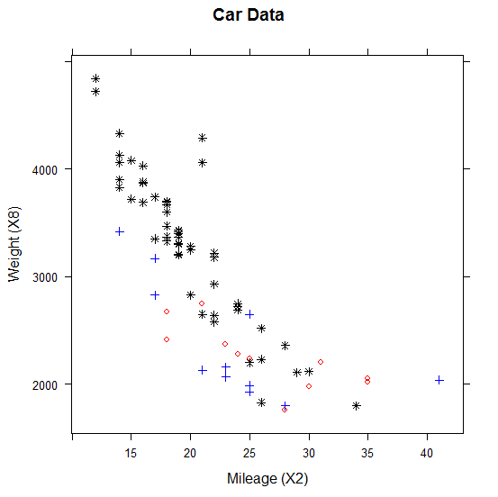

[](http://quantlet.de/index.php?p=info)

## [](http://quantlet.de/) **MVAscacar** [](http://quantlet.de/d3/ia)

```yaml

Name of QuantLet : MVAscacar

Published in : Applied Multivariate Statistical Analysis

Description : Computes a two dimensional scatterplot of mileage and weight from the car data set.

Keywords : data visualization, graphical representation, scatterplot, financial, plot

See also : 'MVAcorrnorm, MVAregbank, MVAregpull, MVAscabank45, MVAscabank56, MVAscabank456,
MVAscapull1, MVAscapull2, MVAdraftbank4, MVAdrafthousing, MVAdrafthousingt'

Author : Vladimir Georgescu, Jorge Patron, Song Song

Submitted : Mon, September 15 2014 by Awdesch Melzer

Datafile : carc.txt

```




```r

# clear all variables
rm(list = ls(all = TRUE))
graphics.off()

# install and load packages
libraries = c("lattice")
lapply(libraries, function(x) if (!(x %in% installed.packages())) {
    install.packages(x)
})
lapply(libraries, library, quietly = TRUE, character.only = TRUE)

# load data
x = read.table("carc.txt")

M = x[, 2]
W = x[, 8]
C = x[, 13]

# point definition
D = C
D[x[, 13] == 2] = 1
D[x[, 13] == 1] = 8

# color definition
P = C
P[x[, 13] == 3] = 4
P[x[, 13] == 2] = 2
P[x[, 13] == 1] = 1

leg = c(8, 1, 3)

# plot
xyplot(W ~ M, pch = D, col = P, xlab = "Mileage (X2)", ylab = "Weight (X8)", main = "Car Data")

```
