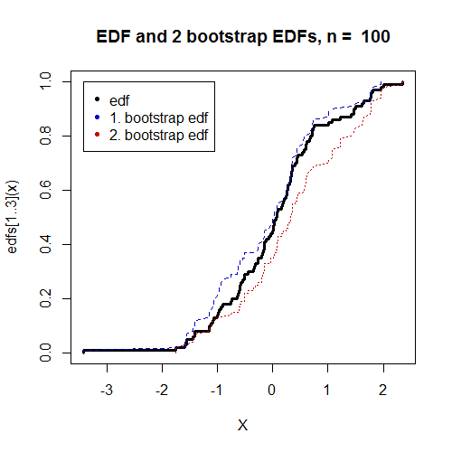

[](http://quantlet.de/index.php?p=info)

## [](http://quantlet.de/) **MVAedfbootstrap** [](http://quantlet.de/d3/ia)

```yaml

Name of QuantLet : MVAedfbootstrap

Published in : Applied Multivariate Statistical Analysis

Description : 'Draws bootstrap samples from a simulate data standard normal dataset and plots their
empirical distribution functions (edf).'

Keywords : edf, bootstrap, plot, graphical representation, multivariate, small-samples,
distribution

See also : MVAedfnormal

Author : Vladimir Georgescu, Jorge Patron, Song Song, Awdesch Melzer

Submitted : Thu, October 16 2014 by Petra Burdejova

```




```r

# clear variables and close windows
rm(list = ls(all = TRUE))
graphics.off()

# install and load packages
libraries = c("matlab")
lapply(libraries, function(x) if (!(x %in% installed.packages())) {
    install.packages(x)
})
lapply(libraries, library, quietly = TRUE, character.only = TRUE)

n   = 100
x   = rnorm(n, 0, 1)
x   = sort(x)
a   = (1:n - 1)/n
aa  = cbind(x[2:n], a[2:n])
bb  = cbind(x[1:n - 1], a[2:n])
cc  = rbind(aa, bb)
edf = apply(cc, 2, sort)
end = dim(edf)[1]
edf = rbind(c(edf[1, 1], 0), edf, c(edf[end, 1], 1))

# First bootstrap sample
xs1 = x[ceil(n * runif(n, 0, 1))]

# Second bootstrap sample
xs2 = x[ceil(n * runif(n, 0, 1))]

# Sorting the first sample
aa1   = cbind(xs1[2:n], a[2:n])
bb1   = cbind(xs1[1:n - 1], a[2:n])
cc1   = rbind(aa1, bb1)
edfs1 = apply(cc1, 2, sort)
end1  = dim(edfs1)[1]
edfs1 = rbind(c(edfs1[1, 1], 0), edfs1, c(edfs1[end1, 1], 1))

# Sorting the second sample
aa2   = cbind(xs2[2:n], a[2:n])
bb2   = cbind(xs2[1:n - 1], a[2:n])
cc2   = rbind(aa2, bb2)
edfs2 = apply(cc2, 2, sort)
end2  = dim(edfs2)[1]
edfs2 = rbind(c(edfs2[1, 1], 0), edfs2, c(edfs2[end2, 1], 1))

# Plot
plot(edf[, 1], edf[, 2], type = "l", col = "black", lwd = 3.5, xlab = "X", ylab = "edfs[1..3](x)")
title(paste("EDF and 2 bootstrap EDFs, n = ", n))
lines(edfs1[, 1], edfs1[, 2], col = "red3", lwd = 1.5, lty = "dotted")
lines(edfs2[, 1], edfs2[, 2], col = "blue3", lwd = 1.5, lty = "dashed")
legend(x = min(x), y = 1, legend = c("edf", "1. bootstrap edf", "2. bootstrap edf"), 
    pch = c(20, 20), col = c("black", "blue3", "red3")) 

```
