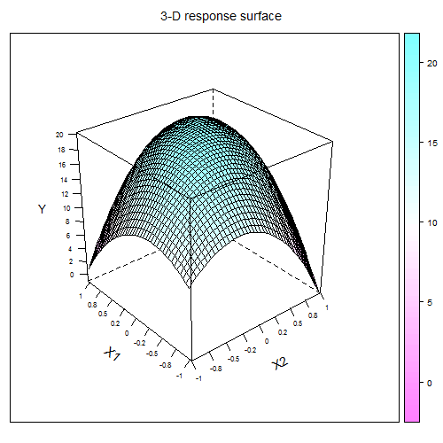
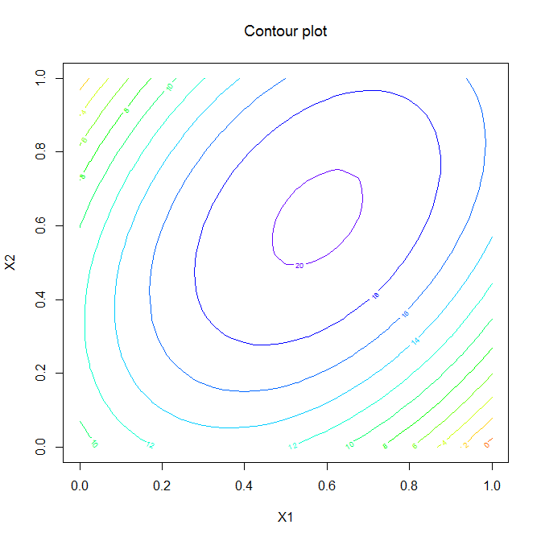

[](http://quantlet.de/index.php?p=info)

## [](http://quantlet.de/) **MVAresponsesurface** [](http://quantlet.de/d3/ia)

```yaml

Name of QuantLet : MVAresponsesurface

Published in : Applied Multivariate Statistical Analysis

Description : 'Plots 3D response surfaces and a contour plot for the variable y and the two factors
that explain the variation of y via the quadratic response model.'

Keywords : 3D, surface, contour, plot, graphical representation, response-model, regression

See also : MVAdrug

Author : Awdesch Melzer

Submitted : Wed, April 04 2012 by Dedy Dwi Prastyo

```






```r
# −−−−−−−−−−−−−−−−−−−−−−−−−−−−−−−−−−−−−−−−−−−−−−−−−−−−−−
# Name of QuantLet : MVAresponsesurface
# −−−−−−−−−−−−−−−−−−−−−−−−−−−−−−−−−−−−−−−−−−−−−−−−−−−−−−
# Published in : Applied Multivariate Statistical Analysis
# −−−−−−−−−−−−−−−−−−−−−−−−−−−−−−−−−−−−−−−−−−−−−−−−−−−−−−
# Description : Plots 3D response surfaces and a contour 
# plot for the variable y and the two factors that explain 
# the variation of y via the quadratic response model.
# −−−−−−−−−−−−−−−−−−−−−−−−−−−−−−−−−−−−−−−−−−−−−−−−−−−−−−
# Keywords : 3D, surface, contour, plot, graphical representation, response-model,
# regression
# −−−−−−−−−−−−−−−−−−−−−−−−−−−−−−−−−−−−−−−−−−−−−−−−−−−−−−
# See also : MVAdrug
# −−−−−−−−−−−−−−−−−−−−−−−−−−−−−−−−−−−−−−−−−−−−−−−−−−−−−−
# Author : Awdesch Melzer
# −−−−−−−−−−−−−−−−−−−−−−−−−−−−−−−−−−−−−−−−−−−−−−−−−−−−−−
# Submitted : Wed, April 04 2012 by Dedy Dwi Prastyo
# −−−−−−−−−−−−−−−−−−−−−−−−−−−−−−−−−−−−−−−−−−−−−−−−−−−−−−

# clear variables and close windows
rm(list = ls(all = TRUE))
graphics.off()

# install and load packages
libraries = c("lattice")
lapply(libraries, function(x) if (!(x %in% installed.packages())) {
    install.packages(x)
})
lapply(libraries, library, quietly = TRUE, character.only = TRUE)

# Define x1 and x2 between [-1:1].
x1 = seq(-1, 1, 0.05)
n1 = length(x1)
x2 = seq(-1, 1, 0.05)
n2 = length(x2)

# Set beta
b = c(20, 1, 2, -8, -6, 6)

L = NULL
x = NULL

# Calculate y
for (i in 1:n1) {
    xi = x1[i]
    temp = NULL
    for (j in 1:n2) {
        xj = x2[j]
        Lij = b[1] + b[2] * xi + b[3] * xj + b[4] * xi^2 + b[5] * xj^2 + b[6] * xi * 
            xj
        temp = cbind(temp, Lij)
    }
    L = rbind(L, temp)
}

wireframe(L, drape = T, xlab = list("X2", rot = 30, cex = 1.2), main = expression(paste("3-D response surface")), 
    ylab = list("X1", rot = -40, cex = 1.2), zlab = list("Y", cex = 1.1), scales = list(arrows = FALSE, 
        col = "black", distance = 1, tick.number = 8, cex = 0.7, x = list(at = seq(1, 
            41, 5), labels = round(seq(-1, 1, length = 9), 1)), y = list(at = seq(1, 
            41, 5), labels = round(seq(-1, 1, length = 9), 1))))

dev.new()
contour(L, col = rainbow(15), xlab = "X1", ylab = "X2", main = expression(paste("Contour plot")), 
    ) 

```
