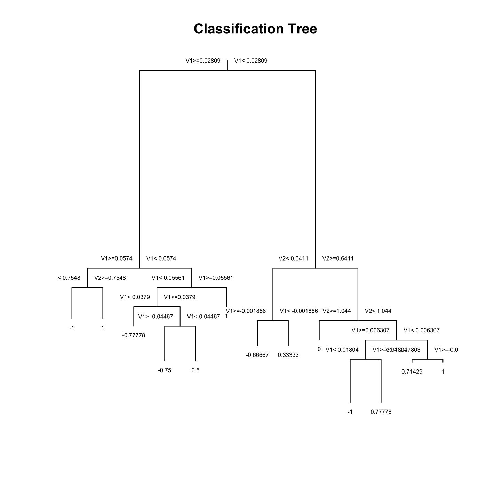

[](http://quantlet.de/index.php?p=info)

## [](http://quantlet.de/) **MVACARTBan2** [](http://quantlet.de/d3/ia)

```yaml

Name of QuantLet : MVACARTBan2

Published in : Applied Multivariate Statistical Analysis

Description : 'Performs classification analysis and plots the classification tree
for the US bankruptcy data with 84 companies employing the Gini index and a constraint.'

Keywords : 'plot, graphical representation, classification, analysis, financial, decision-tree, data, visualization'

See also : MVACARTGiniTree1, MVACARTTwoingTree1

Author : Awdesch Melzer

Submitted : Wed, April 25 2012 by Dedy Dwi Prastyo

Datafile : bankruptcy.dat

```




```r

# clear all variables
rm(list = ls(all = TRUE))
graphics.off()

# install and load packages
libraries = c("mvpart")
lapply(libraries, function(x) if (!(x %in% installed.packages())) {
    install.packages(x)
})
lapply(libraries, library, quietly = TRUE, character.only = TRUE)

# load data
x  = read.table("bankruptcy.dat")
xx = data.frame(x)

# set constraint: # of observations per node = 10
my.control = rpart.control(minsplit = 10, usesurrogate = 1, minbucket = 1, maxdepth = 30, 
    surrogatestyle = 1, cp = 0)

# create classification tree
t2 = rpart(V3 ~ V1 + V2, xx, parms = "gini", x = TRUE, y = TRUE, control = my.control)

# plot classification tree
plot(t2)
text(t2, cex = 0.5)
title(paste("Classification Tree ")) 

```
