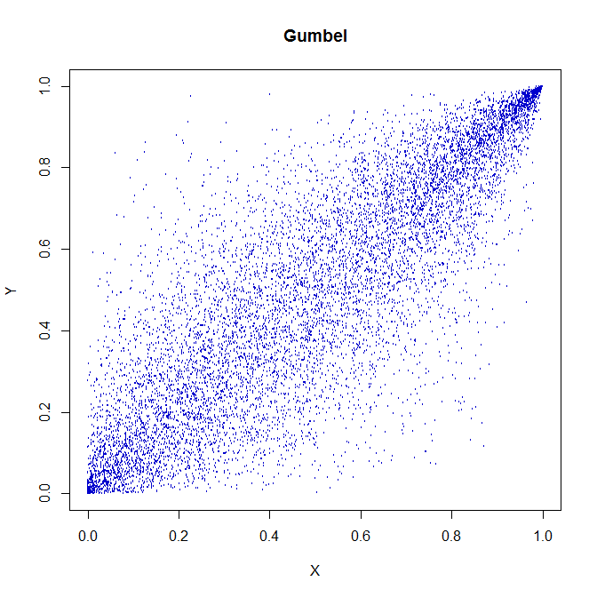
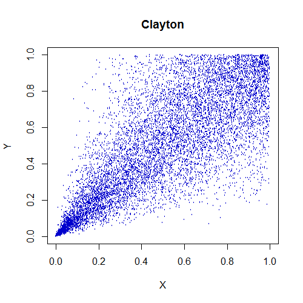

[](http://quantlet.de/index.php?p=info)

## [](http://quantlet.de/) **MVAgumbelclayton** [](http://quantlet.de/d3/ia)

```yaml

Name of QuantLet : MVAgumbelclayton

Published in : Applied Multivariate Statistical Analysis

Description : Produces Gumbel-Hougaard and Clayton copula sampling for fixed parameter theta.

Keywords : 'gumbel, clayton, copula, multivariate-copula, statistics, probability, plot, graphical
representation'

See also : MVAghsurface

Author : Awdesch Melzer

Submitted : Fri, May 18 2012 by Dedy Dwi Prastyo

```






```r

# clear variables and close windows
rm(list = ls(all = TRUE))
graphics.off()

# install and load packages
libraries = c("QRM")
lapply(libraries, function(x) if (!(x %in% installed.packages())) {
    install.packages(x)
})
lapply(libraries, library, quietly = TRUE, character.only = TRUE)

# Clayton copula sample
clay = rcopula.clayton(10000, theta = 3, 2)

# Gumbel-Hougaard copula sample
gum = rcopula.gumbel(10000, theta = 3, 2)

# Plot of Clayton copula sample
plot(clay, col = "blue3", ylab = "Y", xlab = "X", main = "Clayton", cex = 0.1)

# Plot of GH copula sample
dev.new()
plot(gum, col = "blue3", ylab = "Y", xlab = "X", main = "Gumbel", cex = 0.1) 

```
