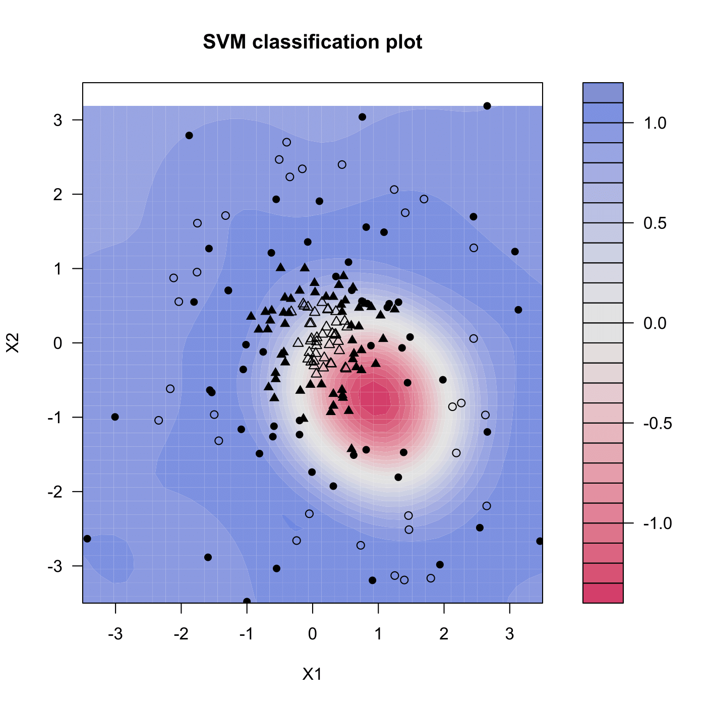

[](http://quantlet.de/index.php?p=info)

## [](http://quantlet.de/) **MVAsvmOrangePeel** [](http://quantlet.de/d3/ia)

```yaml

Name of QuantLet : MVAsvmOrangePeel

Published in : Applied Multivariate Statistical Analysis

Description : 'Plots the area of two different groups of orange peel data via svm classification
using anipotropic Gaussian kernel.'

Keywords : SVM, anitropic, gaussian, kernel, plot, graphical representation, classification

See also : MVAsvmSpiral, MVAppsib, ppsib, ppsibexample

Author : Dedy D. Prastyo

Submitted : Mon, March 17 2014 by Franziska Schulz

```




```r

# clear variables and close windows
rm(list = ls(all = TRUE))
graphics.off()

# install and load packages
libraries = c("kernlab", "tseries", "quadprog", "zoo")
lapply(libraries, function(x) if (!(x %in% installed.packages())) {
install.packages(x)
})
lapply(libraries, library, quietly = TRUE, character.only = TRUE)

# Generate 'orange peel' data n(-1)=n(+1)=100, n=200 x(-1) normally
# multivariate distributed N(mu=(0,0), sigma=diag(1/4, 1/4) diagonal matrix
# x(+1) normally multivariate distributed N(mu=(0,0), sigma=diag(4, 4) diagonal
# matrix

# generating 2-variate data, member of group x(+1)
sigma.p = matrix(c(4, 0, 0, 4), 2, 2)

Mp = t(chol(sigma.p))  # Cholesky square root

Zp = matrix(rnorm(200), 2, 100)  # 2 row, 50 columns
Xp = t(Mp %*% Zp)

Xp1 = Xp[, 1]
Xp2 = Xp[, 2]

# generating 2-variate data, member of group x(-1)
sigma.n = matrix(c(0.25, 0, 0, 0.25), 2, 2)

Mn = t(chol(sigma.n))  # Cholesky square root

Zn = matrix(rnorm(200), 2, 100)  # 2 row, 50 columns
Xn = t(Mn %*% Zn)

Xn1 = Xn[, 1]
Xn2 = Xn[, 2]

# Aggregating data
X1 = c(Xp1, Xn1)
X2 = c(Xp2, Xn2)

# generating indicator variable
yp = array(1:100, dim = c(100, 1))
yn = array(1:100, dim = c(100, 1))

for (i in 1:100) {
    yp[i] = 1
    yn[i] = -1
}

Y = rbind(yp, yn)
OrangePeel = cbind(X2, X1)

gaussian = function(xi, xj) {
    exp(-sum((xi - xj) * RB * (xi - xj)))
}
class(gaussian) = "kernel"

# compute Radial Basis (RB)
r = 0.5  # parameter r in anisotropic gaussian kernel
X = cbind(X2, X1)
RB = solve(cov(X))/(r)^2

# compute SVM score value
OrangePeelModel = ksvm(OrangePeel, Y, type = "C-svc", kernel = gaussian, kpar = list(RB), C = 20/200, prob.model = TRUE, cross = 4)

# C-svc : SVM for classification C : cost of constraints violation in the term
# of Lagrangian formulation create SVM classification plot

# plot
plot(OrangePeelModel, data = OrangePeel, xlim = c(-3.5, 3.5), ylim = c(-3.5, 3.5))

```
