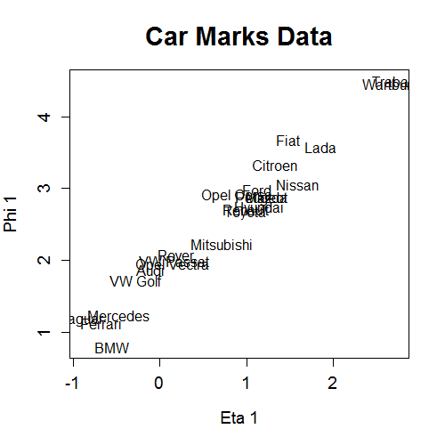

[](http://quantlet.de/index.php?p=info)

## [](http://quantlet.de/) **MVAcancarm** [](http://quantlet.de/d3/ia)

```yaml

Name of QuantLet : MVAcancarm

Published in : Applied Multivariate Statistical Analysis

Description : 'Performs a canonical correlation analysis for the car marks data and shows a plot of
the first canonical variables.'

Keywords : 'canonical, canonical-analysis, correlation, plot, graphical representation,
canonical-parameter, covariance, covariance-matrix, svd, data visualization'

See also : MVAcanus, SMScancarm, SMScancarm1, SMScancarm2, SMScanfood, SMScanus

Author : Zografia Anastasiadou

Submitted : Thu, September 11 2014 by Franziska Schulz

Datafile : carmean2.dat

```




```r

# clear all variables
rm(list = ls(all = TRUE))
graphics.off()

# read data
cardat  = read.table("carmean2.dat")

# delete first column (names of the car marks)
car     = cardat[, -1]

# define variable names
colnames(car) = c("economy", "service", "value", "price", "design", "sporty", "safety", 
    "handling")

# define car marks
rownames(car) = c("Audi", "BMW", "Citroen", "Ferrari", "Fiat", "Ford", "Hyundai", 
    "Jaguar", "Lada", "Mazda", "Mercedes", "Mitsubishi", "Nissan", "Opel Corsa", 
    "Opel Vectra", "Peugeot", "Renault", "Rover", "Toyota", "Trabant", "VW Golf", 
    "VW Passat", "Wartburg")

# reordering the columns of the matrix
cars    = cbind(car[, 4:3], car[, 1:2], car[, 5:8])
s       = cov(cars)
sa      = s[1:2, 1:2]
sb      = s[3:8, 3:8]
eiga    = eigen(sa)
eigb    = eigen(sb)
sa2     = eiga$vectors %*% diag(1/sqrt(eiga$values)) %*% t(eiga$vectors)
sb2     = eigb$vectors %*% diag(1/sqrt(eigb$values)) %*% t(eigb$vectors)
k       = sa2 %*% s[1:2, 3:8] %*% sb2
si      = svd(k)
a       = sa2 %*% si$u
b       = sb2 %*% si$v
eta     = as.matrix(cars[, 1:2]) %*% a[, 1]
phi     = as.matrix(cars[, 3:8]) %*% b[, 1]
etaphi  = cbind(eta, phi)

# plot
plot(etaphi, type = "n", xlab = "Eta 1", ylab = "Phi 1", main = "Car Marks Data", 
    cex.lab = 1.2, cex.axis = 1.2, cex.main = 1.8)
text(etaphi, rownames(car))

```
