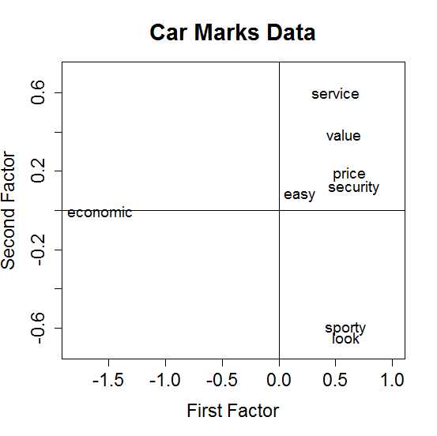

[](http://quantlet.de/index.php?p=info)

## [](http://quantlet.de/) **MVAfactcarm** [](http://quantlet.de/d3/ia)

```yaml

Name of QuantLet : MVAfactcarm

Published in : Applied Multivariate Statistical Analysis

Description : 'Performs a factor analysis for the car marks data and shows the eigenvalues of r-psi
and a plot of the factor loadings for the first two factors.'

Keywords : 'eigenvalues, factor, factor analysis, factor-loadings, spectral-decomposition, data
visualization, plot, graphical representation, financial'

See also : 'SMSfactbank, SMSfactfood, SMSfacthletic, SMSfactsigma, SMSfactushealth, MVAdecofood,
SMSdecobank'

Author : Zografia Anastasiadou, Awdesch Melzer

Submitted : Wed, June 04 2014 by Felix Jung

Datafiles : carmean.dat

```




```r

# clear variables and close windows
rm(list = ls(all = TRUE))
graphics.off()


# Note: R decomposes matrices differently from Matlab and Xplore, and hence some
# of the eigenvectors have different signs. This does not change the results, but
# it does change the order of the graph by inverting the axes around the origin
# (Not always, and not necessarily all of the axis; it depends on which
# eigenvectors we choose to plot)


# load data
xdat = read.table("carmean.dat")

# delete first column
x = xdat[, -1]

# define variable names
colnames(x) = c("economic", "service", "value", "price", "look", "sporty", "security", 
    "easy")

# correlation matrix
r = cor(x)
m = r

for (i in 1:ncol(r)) {
    m[i, i] = r[i, i] - 1
}

psi = matrix(1, 8, 8)
for (i in 1:8) {
    psi[i, i] = 1 - max(abs(m[, i]))
}

# spectral decomposition
eig = eigen(r - psi)
ee  = eig$values[1:2]
vv  = eig$vectors[, 1:2]
vv  = t(t(vv[, 1:2]) * sign(vv[2, 1:2]))
q1  = sqrt(ee[1]) * vv[, 1]
q2  = sqrt(ee[2]) * vv[, 2]
q   = cbind(q1, q2)

# plot
plot(q, type = "n", xlab = "First Factor", ylab = "Second Factor", main = "Car Marks Data", 
    xlim = c(-1.8, 1), ylim = c(-0.7, 0.7), cex.lab = 1.4, cex.axis = 1.4, cex.main = 1.8)
text(q, colnames(x), cex = 1.2, xpd = NA)
abline(v = 0)
abline(h = 0)

```
