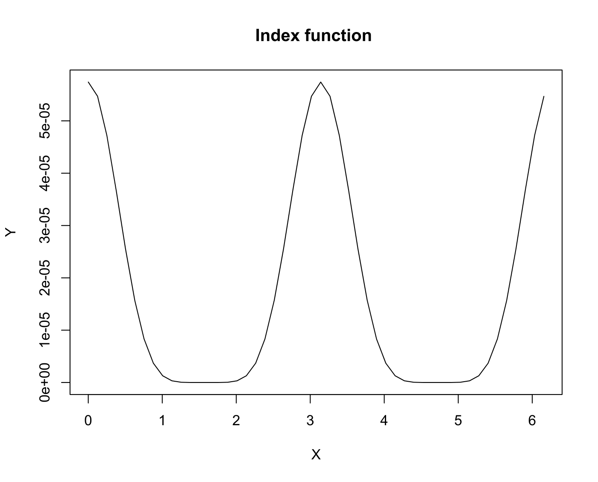

[](http://quantlet.de/index.php?p=info)

## [](http://quantlet.de/) **ppsib** [](http://quantlet.de/d3/ia)

```yaml

Name of QuantLet : ppsib

Published in : Applied Multivariate Statistical Analysis

Description : 'Computes the Sibson Jones index which considers the deviations from the normal
density for univariate data.'

Keywords : 'projection-pursuit, projection, EPP, exploratory-projection-pursuit, Jones and Sibson
index'

See also : 'MVAsimdep1, MVAsirdata, MVAsir2data, MVAsimdepex, MVAppexample, MVAppsib, ppsibexample,
ppexample, ppf'

Author : Awdesch Melzer

Submitted : Wed, September 25 2013 by Awdesch Melzer

Datafile[example] : bank2.dat

Input: 
- px: n x 1 matrix containing the projected data

Output: 
- ind: scalar, the corresponding Sibson Jones index

Example : 'Contents of ind [1] 0.001988516, The plot of the index function in dependence of the
projection vector. The projection vector is parametrized by the angle phi. Since the projection
vector v and -v generate the same projection, we see the index function doubled. Note that the
maxima at phi=1,76 and phi=2,8 represent the most interesting projections.'

```




```r

ppsib = function(px){
  n   = NROW(px)
  m   = NCOL(px)
  cx  = px - matrix(apply(px,2,mean),nrow=n,ncol=m,byrow=T)
  mu  = rbind(apply(cx,2,mean),apply(cx^2,2,mean),apply(cx^3,2,mean),apply(cx^4,2,mean))
  k3  = mu[3]
  k4  = mu[4] - (3*(mu[2]^2))
  ind = ((k3^2)+((k4^2)/4))/12
  return(ind)
}


### Example 1 
# set.seed(100)                 # initialize random generator
# x = matrix(rnorm(100,0,1))    # generate a dataset with mean(x)=0 and var(x)=1            
# ppsib(x)                      # compute the index with Scott's rule


### Example 2
# plotindex1 = function(x) {
#     n   = 50
#     phi = seq(0, by = 2 * pi/n, length = n)
#     ind = matrix(0, n, 1)
#     i   = 0
#     while (i < n) {
#         i       = i + 1
#         xp      = x %*% c(cos(phi[i]), sin(phi[i]))
#         ind[i]  = ppsib(xp)
#         matplot(phi, ind, type = "l", xlab = "X", ylab = "Y")
#     }
# }

# sphere = function(x) {
#     x = x - matrix(apply(x, 2, mean), nrow = NROW(x), ncol = NCOL(x), byrow = T)
#     s = svd(var(x))
#     s = s$u/matrix(sqrt(s$d), nrow(s$u), ncol(s$u), byrow = T)
#     x = as.matrix(x) %*% as.matrix(s)
#     return(x)
# }

# x = read.table("bank2.dat")
# x = sphere(x[, c(4, 6)])
# plotindex1(x)
# title(paste("Index function ")) 

```
