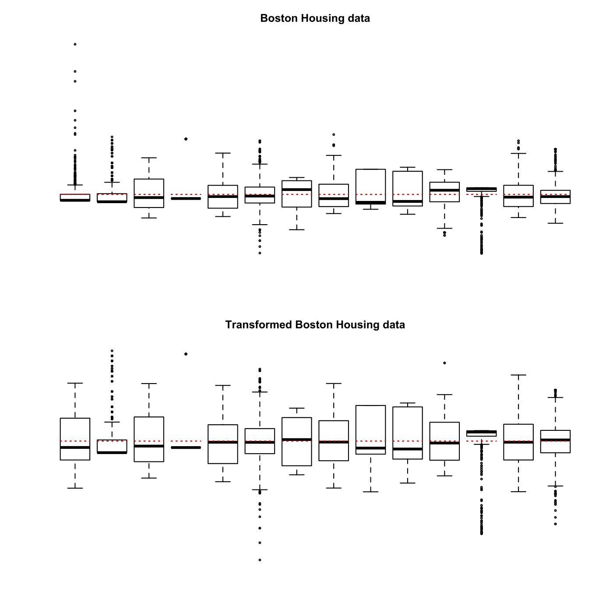

[](http://quantlet.de/index.php?p=info)

## [](http://quantlet.de/) **MVAboxbhd** [](http://quantlet.de/d3/ia)

```yaml

Name of QuantLet : MVAboxbhd

Published in : Applied Multivariate Statistical Analysis

Description : Computes boxplots for the 14 variables of Boston Housing data.

Keywords : 'descriptive, descriptive-statistics, financial, standardize, transformation, data
visualization, boxplot, plot, graphical representation'

See also : MVAboxbank1, MVAboxbank6, MVAboxbhd, MVAboxcar

Author : Julia Wandke, Franziska Schulz

Submitted : Tue, September 09 2014 by Awdesch Melzer

Datafiles : bostonh.dat

```




```r

# clear variables and close windows
rm(list = ls(all = TRUE))
graphics.off()

# load data
x  = read.table("bostonh.dat")
zz = x
i  = 1

while (i <= 14) {
    zz[, i] = (x[, i] - mean(x[, i]))/(sqrt(var(x[, i])))
    i = i + 1
}

xt = cbind(log(x[, 1]), x[, 2], x[, 3], x[, 4], log(x[, 5]), log(x[, 6]), (x[, 
    7]^(2.5)), log(x[, 8]), log(x[, 9]), log(x[, 10]), exp(0.4 * x[, 11]), x[, 
    12], sqrt(x[, 13]), log(x[, 14]))

tt = x
i  = 1

while (i <= 14) {
    tt[, i] = (xt[, i] - mean(xt[, i]))/(sqrt(var(xt[, i])))
    i = i + 1
}

# plot
par(mfrow = c(2, 1), ask = FALSE, cex = 0.5)
boxplot(zz, at = 1:14, axes = FALSE, main = "Boston Housing data", cex.main = 1.5)

for (i in 1:14) {
    lines(c(i - 0.4, i + 0.4), c(mean(zz[, i]), mean(zz[, i])), col = "red3", lty = "dotted", 
        lwd = 1.2)
}

boxplot(tt, at = 1:14, axes = FALSE, main = "Transformed Boston Housing data", 
    cex.main = 1.5)

for (i in 1:14) {
    lines(c(i - 0.4, i + 0.4), c(mean(tt[, i]), mean(tt[, i])), col = "red3", lty = "dotted", 
        lwd = 1.2)
}
```
