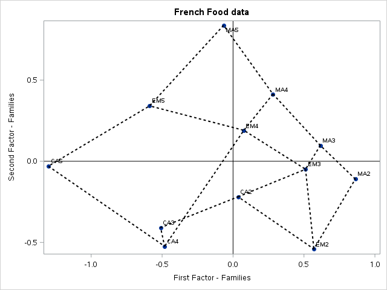
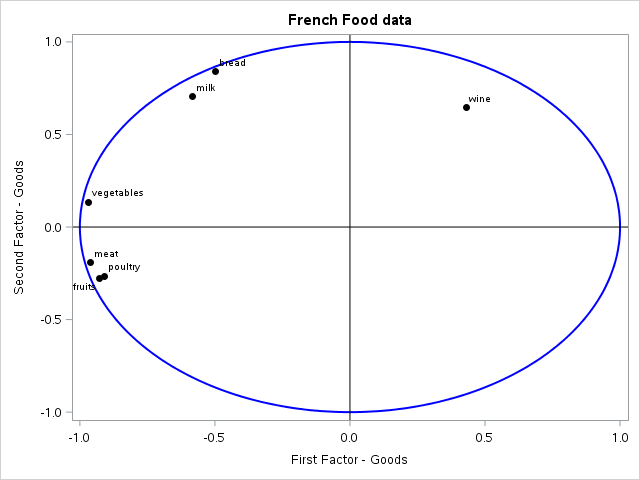

[](http://quantlet.de/index.php?p=info)

## [](http://quantlet.de/) **MVAnpcafood** [](http://quantlet.de/d3/ia)

```yaml

Name of QuantLet : MVAnpcafood

Published in : Applied Multivariate Statistical Analysis

Description : 'Performs a PCA for the standardized French food data and shows the first two
principal components for the individuals and the variables. The normalization corresponds to that
of Lebart/Morineau/Fenelon.'

Keywords : 'principal-components, pca, npca, eigenvalues, dimension-reduction, standardization,
eigenvalue-decomposition, normalization, plot, graphical representation, data visualization, sas'

See also : 'MVAnpcabanki, MVAnpcahous, MVAnpcahousi, MVAnpcatime, MVAnpcabank, MVAnpcausco,
MVAnpcausco2, MVAnpcausco2i, MVAcpcaiv, MVApcabank, MVApcabanki, MVApcabankr, MVApcasimu'

Author : Zografia Anastasiadou, Awdesch MelzerMon

Author[SAS] : Svetlana Bykovskaya

Submitted : Mon, September 08 2014 by Franziska Schulz

Submitted[SAS] : Wen, April 6 2016 by Svetlana Bykovskaya

Datafile : food.dat

Example: 
- 1: Representation of the individuals.
- 2: Representation of the variables.

```






### R Code:
```r

# clear all variables
rm(list = ls(all = TRUE))
graphics.off()

# load data
x  = read.table("food.dat")
p  = ncol(x)
n  = nrow(x)
x  = x[, 2:p]
x1 = sqrt((n - 1) * apply(x, 2, var)/n)
x2 = x - matrix(apply(as.matrix(x), 2, mean), nrow = n, ncol = p - 1, byrow = T)
x  = as.matrix(x2/matrix(x1, nrow = n, ncol = p - 1, byrow = T))  # standardizes the data matrix

# compute eigenvalues
e  = eigen(x %*% t(x)/n)
e1 = e$values
e2 = e$vectors
a  = e2[, 1:2]
w  = -a * sqrt(matrix(e1[1:2], nrow(a), ncol(a), byrow = TRUE))

# Plot 1: the representation of the individuals
dev.new()
plot(w, type = "n", xlab = "First Factor - Families", ylab = "Second Factor - Families", 
    main = "French Food data", cex.lab = 1.2, cex.axis = 1.2, cex.main = 1.8, lwd = 2)
text(w, c("MA2", "EM2", "CA2", "MA3", "EM3", "CA3", "MA4", "EM4", "CA4", "MA5", "EM5", 
    "CA5"), cex = 1.2)
abline(h = 0, v = 0)
segments(w[1, 1], w[1, 2], w[2, 1], w[2, 2], lty = 3, lwd = 2)
segments(w[2, 1], w[2, 2], w[3, 1], w[3, 2], lty = 3, lwd = 2)
segments(w[1, 1], w[1, 2], w[4, 1], w[4, 2], lty = 3, lwd = 2)
segments(w[2, 1], w[2, 2], w[5, 1], w[5, 2], lty = 3, lwd = 2)
segments(w[4, 1], w[4, 2], w[5, 1], w[5, 2], lty = 3, lwd = 2)
segments(w[5, 1], w[5, 2], w[6, 1], w[6, 2], lty = 3, lwd = 2)
segments(w[6, 1], w[6, 2], w[9, 1], w[9, 2], lty = 3, lwd = 2)
segments(w[8, 1], w[8, 2], w[9, 1], w[9, 2], lty = 3, lwd = 2)
segments(w[5, 1], w[5, 2], w[8, 1], w[8, 2], lty = 3, lwd = 2)
segments(w[7, 1], w[7, 2], w[8, 1], w[8, 2], lty = 3, lwd = 2)
segments(w[4, 1], w[4, 2], w[7, 1], w[7, 2], lty = 3, lwd = 2)
segments(w[7, 1], w[7, 2], w[10, 1], w[10, 2], lty = 3, lwd = 2)
segments(w[8, 1], w[8, 2], w[11, 1], w[11, 2], lty = 3, lwd = 2)
segments(w[9, 1], w[9, 2], w[12, 1], w[12, 2], lty = 3, lwd = 2)
segments(w[10, 1], w[10, 2], w[11, 1], w[11, 2], lty = 3, lwd = 2)
segments(w[11, 1], w[11, 2], w[12, 1], w[12, 2], lty = 3, lwd = 2)

g  = eigen(t(x) %*% x/n)
g1 = g$values
g2 = g$vectors
b  = g2[, 1:2]
z  = b * sqrt(matrix(g1[1:2], nrow(b), ncol(b), byrow = TRUE))

# Plot 2: the representation of the variables
dev.new()
ucircle = cbind(cos((0:360)/180 * pi), sin((0:360)/180 * pi))
plot(ucircle, type = "l", lty = "solid", col = "blue", xlim = c(-1.05, 1.05), ylim = c(-1.05, 
    1.05), xlab = "First Factor - Goods", ylab = "Second Factor - Goods", main = "French Food data", 
    cex.lab = 1.2, cex.axis = 1.2, cex.main = 1.8, lwd = 2)
abline(h = 0, v = 0)
label = c("bread", "vegetables", "fruits", "meat", "poultry", "milk", "wine")
text(z, label) 

```

### SAS Code:
```sas

* Import the data;
data food;
  infile '/folders/myfolders/data/food.dat';
  input temp1 $ temp2-temp8;
run;

proc iml;
  * Read data into a matrix;
  use food;
    read all var _ALL_ into x; 
  close food;
  
  n = nrow(x);
  p = ncol(x);
  
  x1 = sqrt((n - 1) * var(x)/n);
  x2 = x - repeat(x(|:,|), n, 1);
  x = x2 / repeat(x1, n, 1); * standardizes the data matrix;
  
  *  compute eigenvalues;
  e  = x * x`/n;
  e1 = eigval(e);
  e2 = eigvec(e);
  a  = e2[, 1:2];
  w  = - a # sqrt(repeat(e1[1:2]`, nrow(a),1));
  
  x1  = w[,1];
  x2  = w[,2]; 
  names = {"MA2", "EM2", "CA2", "MA3", 
           "EM3", "CA3", "MA4", "EM4", 
           "CA4", "MA5", "EM5", "CA5"};
  z1 = w[1,] // w[4,] // w[7,] // w[10,] // w[11,] // w[12,] // w[9,] // w[6,] //
       w[3,] // w[2,] // w[1,];
  z2 = w[4,] // w[5,] // w[8,] // w[11,];
  z3 = w[7,] // w[8,] // w[9,];
  z4 = w[3,] // w[5,] // w[2,];

  x3  = z1[,1];
  x4  = z1[,2]; 
  x5  = z2[,1];
  x6  = z2[,2];
  x7  = z3[,1];
  x8  = z3[,2];
  x9  = z4[,1];
  x10 = z4[,2];
  
  food = {"bread", "vegetables", "fruits", "meat", "poultry", "milk", "wine"};
  g  = x` * x / n;
  g1 = eigval(g);
  g2 = eigvec(g);
  b  = g2[, 1:2];
  z  = b # sqrt(repeat(g1[1:2]`, nrow(b),1));
  
  y1 = z[,1];
  y2 = -z[,2];
 
  pi = constant("pi");
  uc = (cos((0:360)/180 * pi) // sin((0:360)/180 * pi))`;
  u1 = uc[,1];
  u2 = uc[,2];
  
  create plot var {"x1" "x2" "x3" "x4" "x5" "x6" "x7" "x8" "x9" "x10" "names"
                   "y1" "y2" "u1" "u2" "food"};
    append;
  close plot;
quit;

proc sgplot data = plot
    noautolegend;
  title 'French Food data';
  scatter x = x1 y = x2 / markerattrs = (symbol = circlefilled)
    datalabel = names;
  series x = x3 y = x4 / 
    lineattrs = (color = black THICKNESS = 2 pattern = shortdash);
  series x = x5 y = x6 / 
    lineattrs = (color = black THICKNESS = 2 pattern = shortdash);
  series x = x7 y = x8 / 
    lineattrs = (color = black THICKNESS = 2 pattern = shortdash);
  series x = x9 y = x10 / 
    lineattrs = (color = black THICKNESS = 2 pattern = shortdash);
  refline 0 / lineattrs = (color = black);
  refline 0 / axis = x lineattrs = (color = black);
  xaxis label = 'First Factor - Families';
  yaxis label = 'Second Factor - Families';
run;

proc sgplot data = plot
    noautolegend;
  title 'French Food data';
  series  x = u1 y = u2 / lineattrs = (color = blue THICKNESS = 2);
  scatter x = y1 y = y2 / markerattrs = (color = black symbol = circlefilled)
    datalabel = food;
  refline 0 / lineattrs = (color = black);
  refline 0 / axis = x lineattrs = (color = black);
  xaxis label = 'First Factor - Goods';
  yaxis label = 'Second Factor - Goods';
run;
```
