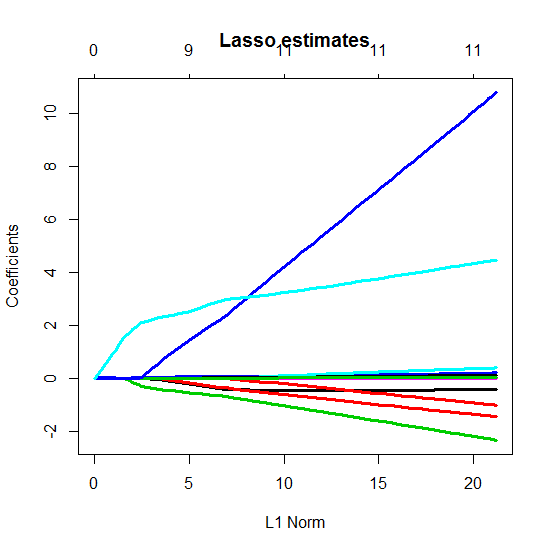
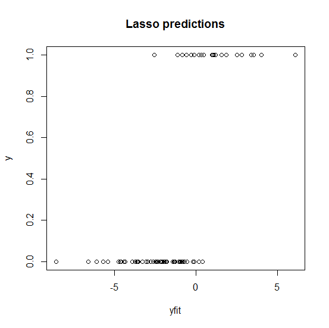

[](http://quantlet.de/index.php?p=info)

## [](http://quantlet.de/) **MVAlassologit** [](http://quantlet.de/d3/ia)

```yaml

Name of QuantLet : MVAlassologit

Published in : Applied Multivariate Statistical Analysis

Description : 'Performs a logit model using the Lasso methodology. The estimates become nonzero at
a point that means the variables enter the model equation sequentially as the shrinkage parameter
increases. The Lasso technique results in variable selection. Finally, the resulting Lasso
estimates and predictions are plotted.'

Keywords : 'estimation, lasso, lasso shrinkage, logistic, logit, regression, forecast, data
visualization, plot, graphical representation, financial'

See also : MVAlassocontour, MVAlassoregress, SMSlassocar, SMSlassoridge, LCPvariance

Author : Sergey Nasekin, Dedy D. Prastyo

Submitted : Tue, July 29 2014 by Franziska Schulz

Datafiles : carc.dat

Example: 
- 1: Lasso estimates
- 2: Lasso predictions

```






```r

# clear variables and close windows
rm(list = ls(all = TRUE))
graphics.off()

# install and load packages
libraries = c("glmnet")
lapply(libraries, function(x) if (!(x %in% installed.packages())) {
install.packages(x)
})
lapply(libraries, library, quietly = TRUE, character.only = TRUE)

# load data
data = read.table("carc.dat")

# recode the response, y = 1 for y > 6000, otherwise y = 0
y   = data[, 2]
n   = length(y)
y   = ifelse(y <= 6000, 0, 1)

x1  = data[, 3]
x2  = data[, 4]
x3  = data[, 5]
x4  = data[, 6]
x5  = data[, 7]
x6  = data[, 8]
x7  = data[, 9]
x8  = data[, 10]
x9  = data[, 11]
x10 = data[, 12]
x11 = data[, 13]
x12 = data[, 14]

x = cbind(x2, x3, x4, x5, x6, x7, x8, x9, x10, x11, x12)

# lasso
alpa = 1
(lasso.regress = glmnet(x, y, family = "binomial", alpha = alpa, nlambda = 100))
summary(lasso.regress)

# extract coefficients at a single value of lambda
coef(lasso.regress, s = 0.01)

# make predictions
yfit = predict(lasso.regress, newx = x[1:n, ], s = c(0.01))

# plot estimates
win.graph()
plot(lasso.regress, lwd = 3, main = "Lasso estimates")

# plot predictions
plot(yfit, y, main = "Lasso predictions")

```
