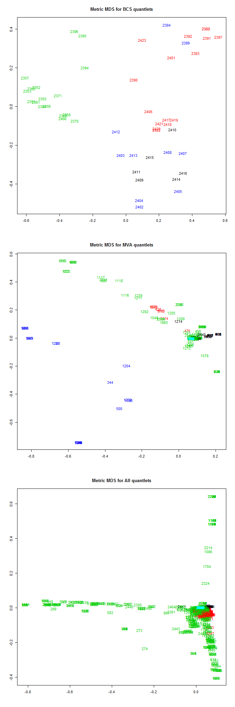

##  **MVAQnetClusKmeansB**

```yaml
Name of QuantLet : MVAQnetClusKmeansB
Published in : Applied Multivariate Statistical Analysis
Description : 'The document similarity of quantlets is calculated 
based on their keywords. For this purpose quantlets are taken from
the MVA book, BCS project and the whole Quantnet. First the keywords 
are transformed into the vector representation, basis model is used.
Finally the k-means algorithm is applied for clustering (four clusters)
and the data are represented via MDS (multidimensional scaling).'
Keywords : 
- cluster-analysis
- plot
- graphical representation
- kmeans
- distance
- euclidean
- euclidean-norm
- multi-dimensional
- scaling
- MDS
- similarity
- data visualization
See also : 
- MVAQnetClusKmeans
- MVAQnetClusKmeansT
- MVAclus8p
- MVAclusbank
- MVAclusbh
- MVAclusfood
- MVAclususcrime
- MVAdrugsim
- SMSclus8p
- SMSclus8pd
- SMSclus8pmst2
- SMSclushealth
- SMScluscrimechi2
- SMSclusbank
- SMSclusbank2
- SMSclusbank3
- SMScluscomp
- SMScluscrime
Author : 
- Awdesch Melzer
- Simon Trimborn
- Lukas Borke
Submitted : Tue, August 26 2014 by Lukas Borke
Datafile : export_q_kw_141.dat, export_q_kw_310.dat, export_q_kw_All.dat
Example : MDS for model B of BCS Qs (upper panel), MVA Qs (middle panel) and all Qs (lower panel)

```




 
```R
# clear all variables
rm(list = ls(all = TRUE))
graphics.off()

# read data
D     = as.matrix(read.table("export_q_kw_141.dat"))  
G     = as.matrix(read.table("export_q_kw_310.dat"))

# take everything but ID
E     = D[, -1]
H     = G[, -1]

# Quantlet IDs
IDM   = D[, 1]
IDB   = G[, 1]

# transpose and norm to one column-wise, then a column equals the vector representation of a Qlet
norm.E  = apply(t(E), 2, function(v) {
    v/sqrt(sum(v * v))
})
norm.E[is.na(norm.E)] = 0
norm.H  = apply(t(H), 2, function(v) {
    v/sqrt(sum(v * v))
})
norm.H[is.na(norm.H)] = 0
par(mfrow = c(3, 1))              # set plot for 3 columns

# BCS
set.seed(12345)                   # set pseudo random numbers
d       = dist(t(norm.H))         # Euclidean norm
clusBCS = kmeans(t(norm.H), 4)    # kmeans for 4 clusters/centers
mdsBCS  = cmdscale(d, k = 2)      # mds for 2 dimensions
plot(mdsBCS, type = "n", xlab = "", ylab = "", main = "Metric MDS for BCS quantlets")
text(mdsBCS[, 1], mdsBCS[, 2], IDB, col = clusBCS$cluster)

# MVA
set.seed(12345)                   # set pseudo random numbers
d       = dist(t(norm.E))         # Euclidean norm
clusMVA = kmeans(t(norm.E), 4)    # kmeans for 4 clusters/centers
mdsMVA  = cmdscale(d, k = 2)      # mds for 2 dimensions
plot(mdsMVA, type = "n", xlab = "", ylab = "", main = "Metric MDS for MVA quantlets")
text(mdsMVA[, 1], mdsMVA[, 2], IDM, col = clusMVA$cluster)

# Displaying Null-Vectors in cyan color
D_T_141_null = apply(norm.E^2, 2, sum)
text(mdsMVA[D_T_141_null == 0, 1], mdsMVA[D_T_141_null == 0, 2], IDM[D_T_141_null == 
    0], col = 5)

# All Qlets
Qall      = as.matrix(read.table("export_q_kw_All.dat"))
IDall     = Qall[, 1]
E         = Qall[, -1]

# transpose and norm to one column-wise, then a column equals the vector representation of a Qlet
norm.E    = apply(t(E), 2, function(v) {
    v/sqrt(sum(v * v))
})
norm.E[is.na(norm.E)] = 0
D_global  = norm.E

set.seed(12345)                   # set pseudo random numbers
d         = dist(t(D_global))
clusAll   = kmeans(t(D_global), 4)
mdsAll    = cmdscale(d, k = 2)
plot(mdsAll, type = "n", xlab = "", ylab = "", main = "Metric MDS for All quantlets")
text(mdsAll[, 1], mdsAll[, 2], IDall, col = clusAll$cluster)

# Displaying Null-Vectors in cyan color
D_global_null = apply(D_global^2, 2, sum)
text(mdsAll[D_global_null == 0, 1], mdsAll[D_global_null == 0, 2], IDall[D_global_null == 
    0], col = 5)

```
