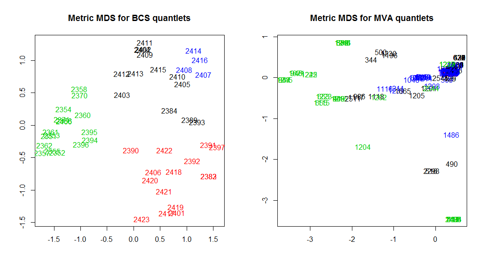

[](http://quantlet.de/index.php?p=info)

## [](http://quantlet.de/) **MVAQnetClusKmeans** [](http://quantlet.de/d3/ia)

```yaml
Name of QuantLet : MVAQnetClusKmeans
Published in : Applied Multivariate Statistical Analysis
Description : 'The document similarity of quantlets is calculated
based on their keywords. For this purpose quantlets are taken from
the MVA book and BCS project. First the keywords are transformed
into the vector representation. Then the scalar product is applied
calculating so the similarity measure. The advanced term-term
correlation model additionally uses the term-term correlation matrix
between the terms of all documents. Finally the k-means algorithm with
the Euclidean norm is applied for clustering (four clusters) and
the data are represented via MDS (multidimensional scaling) showing
metric MDS for BCS quantlets and metric MDS for MVA quantlets.'

Keywords :
- cluster-analysis
- plot
- graphical representation
- kmeans
- distance
- euclidean
- euclidean-norm
- multi-dimensional
- scaling
- MDS
- similarity
- data visualization
See also :
- MVAQnetClusKmeansB
- MVAQnetClusKmeansT
- MVAclus8p
- MVAclusbank
- MVAclusbh
- MVAclusfood
- MVAclususcrime
- MVAdrugsim
- SMSclus8p
- SMSclus8pd
- SMSclus8pmst2
- SMSclushealth
- SMScluscrimechi2
- SMSclusbank
- SMSclusbank2
- SMSclusbank3
- SMScluscomp
- SMScluscrime
Author :
- Awdesch Melzer
- Simon Trimborn
- Lukas Borke
Submitted : Sun, September 07 2014 by Awdesch Melzer
Datafile :
- export_q_kw_141.dat
- export_q_kw_310.dat
- export_q_kw_All.dat
Example : Metric MDS for BCS and MVA quantlets
```




```r
# −−−−−−−−−−−−−−−−−−−−−−−−−−−−−−−−−−−−−−−−−−−−−−−−−−−−−−
# Name of QuantLet : MVAQnetClusKmeans
# −−−−−−−−−−−−−−−−−−−−−−−−−−−−−−−−−−−−−−−−−−−−−−−−−−−−−−
# Published in : Applied Multivariate Statistical Analysis
# −−−−−−−−−−−−−−−−−−−−−−−−−−−−−−−−−−−−−−−−−−−−−−−−−−−−−−
# Description : The document similarity of quantlets is calculated 
# based on their keywords. For this purpose quantlets are taken from
# the MVA book and BCS project. First the keywords are transformed 
# into the vector representation. Then the scalar product is applied
# calculating so the similarity measure. The advanced term-term 
# correlation model additionally uses the term-term correlation matrix
# between the terms of all documents. Finally the k-means algorithm with
# the Euclidean norm is applied for clustering (four clusters) and 
# the data are represented via MDS (multidimensional scaling) showing 
# metric MDS for BCS quantlets and metric MDS for MVA quantlets.
# −−−−−−−−−−−−−−−−−−−−−−−−−−−−−−−−−−−−−−−−−−−−−−−−−−−−−−
# Keywords : cluster-analysis, plot, graphical representation, kmeans,
# distance, euclidean, euclidean-norm, multi-dimensional, scaling, MDS,
# similarity, data visualization
# −−−−−−−−−−−−−−−−−−−−−−−−−−−−−−−−−−−−−−−−−−−−−−−−−−−−−−
# See also : MVAQnetClusKmeansB, MVAQnetClusKmeansT, MVAclus8p, 
# MVAclusbank, MVAclusbh, MVAclusfood, MVAclususcrime, MVAdrugsim, 
# SMSclus8p, SMSclus8pd, SMSclus8pmst2, SMSclushealth, SMScluscrimechi2
# SMSclusbank, SMSclusbank2, SMSclusbank3, SMScluscomp, SMScluscrime
# −−−−−−−−−−−−−−−−−−−−−−−−−−−−−−−−−−−−−−−−−−−−−−−−−−−−−−
# Author : Awdesch Melzer, Simon Trimborn, Lukas Borke
# −−−−−−−−−−−−−−−−−−−−−−−−−−−−−−−−−−−−−−−−−−−−−−−−−−−−−−
# Submitted : Sun, September 07 2014 by Awdesch Melzer
# −−−−−−−−−−−−−−−−−−−−−−−−−−−−−−−−−−−−−−−−−−−−−−−−−−−−−−
# Datafile : export_q_kw_141.dat, export_q_kw_310.dat, export_q_kw_All.dat
# −−−−−−−−−−−−−−−−−−−−−−−−−−−−−−−−−−−−−−−−−−−−−−−−−−−−−−
# Example : Metric MDS for BCS and MVA quantlets
# −−−−−−−−−−−−−−−−−−−−−−−−−−−−−−−−−−−−−−−−−−−−−−−−−−−−−−

# clear all variables
rm(list = ls(all = TRUE))
graphics.off()

D         = as.matrix(read.table("export_q_kw_All.dat"))

# take everything but ID
E         = D[, -1]
IDall     = D[, 1]                  # Quantlet IDs 

# transpose and norm to one columnwise, then a column equals the vector representation of a Qlet
norm.E    = apply(t(E), 2, function(v) {
    v/sqrt(sum(v * v))
})
norm.E[is.na(norm.E)] = 0

# cache global Qlet matrix as norm, needed for following transformations
D_global  = norm.E

# read vector matrix from BCS and norm it
D         = as.matrix(read.table("export_q_kw_310.dat"))
E         = D[, -1]                 # extract everything but ID
IDB       = D[, 1]                  # set ID

# transpose and norm to one columnwise, then a column equals the vector representation of a Qlet
norm.E    = apply(t(E), 2, function(v) {
    v/sqrt(sum(v * v))
})
norm.E[is.na(norm.E)] = 0

# transpose the BCS vector representation of the basis model into T model
# (term-term-correlation) one column in D_T_310 is equivalent to the vector
# representation of a Qlet in the T model
D_T_310   = t(D_global) %*% norm.E

# read vector matrix from MVA and norm it
D         = as.matrix(read.table("export_q_kw_141.dat"))
E         = D[, -1]                 # extract everything but ID
IDM       = D[, 1]                  # set ID

# transpose and norm to one columnwise, then a column equals the vector representation of a Qlet
norm.E    = apply(t(E), 2, function(v) {
    v/sqrt(sum(v * v))
})
norm.E[is.na(norm.E)] = 0

# transpose the MVA vector representation of the basis model into T model
# (term-term-correlation) one column in D_T_141 is equivalent to the vector
# representation of a Qlet in the T model
D_T_141   = t(D_global) %*% norm.E

# MDS + kmeans for BCS
set.seed(12345)                     # set pseudo random numbers
d         = dist(t(D_T_310))        # Euclidean norm
clusBCS   = kmeans(d, 4)            # kmeans for 4 clusters/centers
mdsBCS    = cmdscale(d, k = 2)      # mds for 2 dimensions
par(mfrow = c(1, 2))                # set plot for 2 columns

# Plot 1
plot(mdsBCS, type = "n", xlab = "", ylab = "", main = "Metric MDS for BCS quantlets")
text(mdsBCS[, 1], mdsBCS[, 2], IDB, col = clusBCS$cluster)

# MDS + kmeans for MVA
set.seed(12345)                     # set pseudo random numbers
d         = dist(t(D_T_141))
clusMVA   = kmeans(d, 4)
mdsMVA    = cmdscale(d, k = 2)

# Plot 2
plot(mdsMVA, type = "n", xlab = "", ylab = "", main = "Metric MDS for MVA quantlets")
text(mdsMVA[, 1], mdsMVA[, 2], IDM, col = clusMVA$cluster)

```
