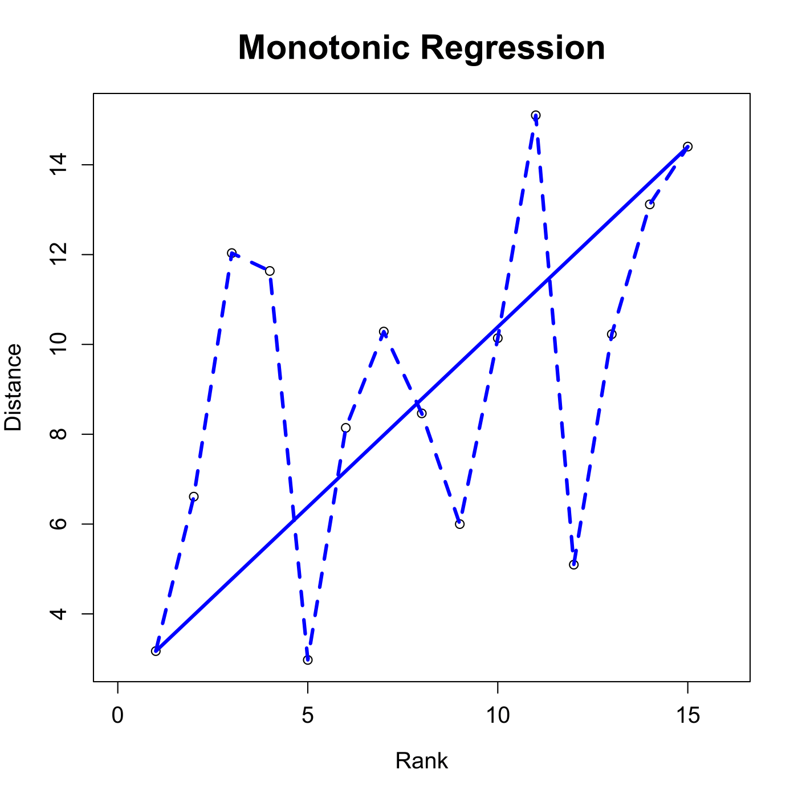

[](http://quantlet.de/index.php?p=info)

## [](http://quantlet.de/) **MVAMDSnonmstart** [](http://quantlet.de/d3/ia)

```yaml
Name of QuantLet : MVAMDSnonmstart
Published in : Applied Multivariate Statistical Analysis
Description : 'Computes the monotonic regression and shows the
rank order of dissimilarities for the pool-adjacent violators
(PAV) algorithm.'
Keywords :
- MDS
- non-metric-MDS
- multi-dimensional
- scaling
- PAV
- violators
- Shepard-Kruskal
- regression
- plot
- graphical representation
See also :
- MVAMDScity1
- MVAMDScity2
- MVAMDSpooladj
- MVAmdscarm
- MVAnmdscar1
- MVAnmdscar2
- MVAnmdscar3
- MVAcarrankings
- PAVAlgo
Author : Zografia Anastasiadou
Submitted : Tue, October 28 2014 by Felix Jung
Example : Ranks and distances.
```




```r
# −−−−−−−−−−−−−−−−−−−−−−−−−−−−−−−−−−−−−−−−−−−−−−−−−−−−−−
# Name of QuantLet : MVAMDSnonmstart
# −−−−−−−−−−−−−−−−−−−−−−−−−−−−−−−−−−−−−−−−−−−−−−−−−−−−−−
# Published in : Applied Multivariate Statistical Analysis
# −−−−−−−−−−−−−−−−−−−−−−−−−−−−−−−−−−−−−−−−−−−−−−−−−−−−−−
# Description : Computes the monotonic regression and shows the 
# rank order of dissimilarities for the pool-adjacent violators        
# (PAV) algorithm.
# −−−−−−−−−−−−−−−−−−−−−−−−−−−−−−−−−−−−−−−−−−−−−−−−−−−−−−
# Keywords : MDS, non-metric-MDS, multi-dimensional, scaling, PAV, 
# violators, Shepard-Kruskal, regression, plot, graphical representation 
# −−−−−−−−−−−−−−−−−−−−−−−−−−−−−−−−−−−−−−−−−−−−−−−−−−−−−−
# See also : MVAMDScity1, MVAMDScity2, MVAMDSpooladj, MVAmdscarm, 
# MVAnmdscar1, MVAnmdscar2, MVAnmdscar3, MVAcarrankings, PAVAlgo
# −−−−−−−−−−−−−−−−−−−−−−−−−−−−−−−−−−−−−−−−−−−−−−−−−−−−−−
# Author : Zografia Anastasiadou
# −−−−−−−−−−−−−−−−−−−−−−−−−−−−−−−−−−−−−−−−−−−−−−−−−−−−−−
# Submitted : Tue, October 28 2014 by Felix Jung
# −−−−−−−−−−−−−−−−−−−−−−−−−−−−−−−−−−−−−−−−−−−−−−−−−−−−−−
# Example : Ranks and distances.
# −−−−−−−−−−−−−−−−−−−−−−−−−−−−−−−−−−−−−−−−−−−−−−−−−−−−−−

# clear all variables
rm(list = ls(all = TRUE))
graphics.off()

ber = c(0, 2, 4, 12, 11, 3)
dre = c(2, 0, 6, 10, 7, 5)
ham = c(4, 6, 0, 8, 15, 1)
kob = c(12, 10, 8, 0, 9, 13)
mue = c(11, 7, 15, 9, 0, 14)
ros = c(3, 5, 1, 13, 14, 0)

dist = rbind(ber, dre, ham, kob, mue, ros)

# a,b,h,i are matrices
a = (dist^2) * (-0.5)
i = diag(6)
u = rep(1, 6)
h = i - (1/6 * (u %*% t(u)))
b = h %*% a %*% h           # Determine the inner product matrix
e = eigen(b)

g1  = cbind(e$vectors[, 1], e$vectors[, 2])
g2  = diag(e$values[1:2])
x   = g1 %*% (g2^0.5)       # Determine the coordinate matrix

# Determine the dissimilarities
d12 = ((x[1, 1] - x[2, 1])^2 + (x[1, 2] - x[2, 2])^2)^0.5
d13 = ((x[1, 1] - x[3, 1])^2 + (x[1, 2] - x[3, 2])^2)^0.5
d14 = ((x[1, 1] - x[4, 1])^2 + (x[1, 2] - x[4, 2])^2)^0.5
d15 = ((x[1, 1] - x[5, 1])^2 + (x[1, 2] - x[5, 2])^2)^0.5
d16 = ((x[1, 1] - x[6, 1])^2 + (x[1, 2] - x[6, 2])^2)^0.5

d23 = ((x[2, 1] - x[3, 1])^2 + (x[2, 2] - x[3, 2])^2)^0.5
d24 = ((x[2, 1] - x[4, 1])^2 + (x[2, 2] - x[4, 2])^2)^0.5
d25 = ((x[2, 1] - x[5, 1])^2 + (x[2, 2] - x[5, 2])^2)^0.5
d26 = ((x[2, 1] - x[6, 1])^2 + (x[2, 2] - x[6, 2])^2)^0.5

d34 = ((x[3, 1] - x[4, 1])^2 + (x[3, 2] - x[4, 2])^2)^0.5
d35 = ((x[3, 1] - x[5, 1])^2 + (x[3, 2] - x[5, 2])^2)^0.5
d36 = ((x[3, 1] - x[6, 1])^2 + (x[3, 2] - x[6, 2])^2)^0.5

d45 = ((x[4, 1] - x[5, 1])^2 + (x[4, 2] - x[5, 2])^2)^0.5
d46 = ((x[4, 1] - x[6, 1])^2 + (x[4, 2] - x[6, 2])^2)^0.5

d56 = ((x[5, 1] - x[6, 1])^2 + (x[5, 2] - x[6, 2])^2)^0.5

dd = rbind(c(0, d12, d13, d14, d15, d16), c(d12, 0, d23, d24, d25, d26), c(d13, 
    d23, 0, d34, d35, d36), c(d14, d24, d34, 0, d45, d46), c(d15, d25, d35, d45, 
    0, d56), c(d16, d26, d36, d46, d56, 0))

f = cbind(c(1:15), c(d12, d13, d14, d15, d16, d23, d24, d25, d26, d34, d35, d36, 
    d45, d46, d56))  # Determine the rank order to dissimilarities

l = cbind(c(15, 1), c(14.4, 3.17))

# Plot
plot(f, xlim = c(0, 16), xlab = "Rank", ylab = "Distance", main = "Monotonic Regression", 
    cex.axis = 1.2, cex.lab = 1.2, cex.main = 1.8)
lines(f, lty = 2, lwd = 3, col = "blue")
segments(l[1, 1], l[1, 2], l[2, 1], l[2, 2], lwd = 3, col = "blue") 

```
