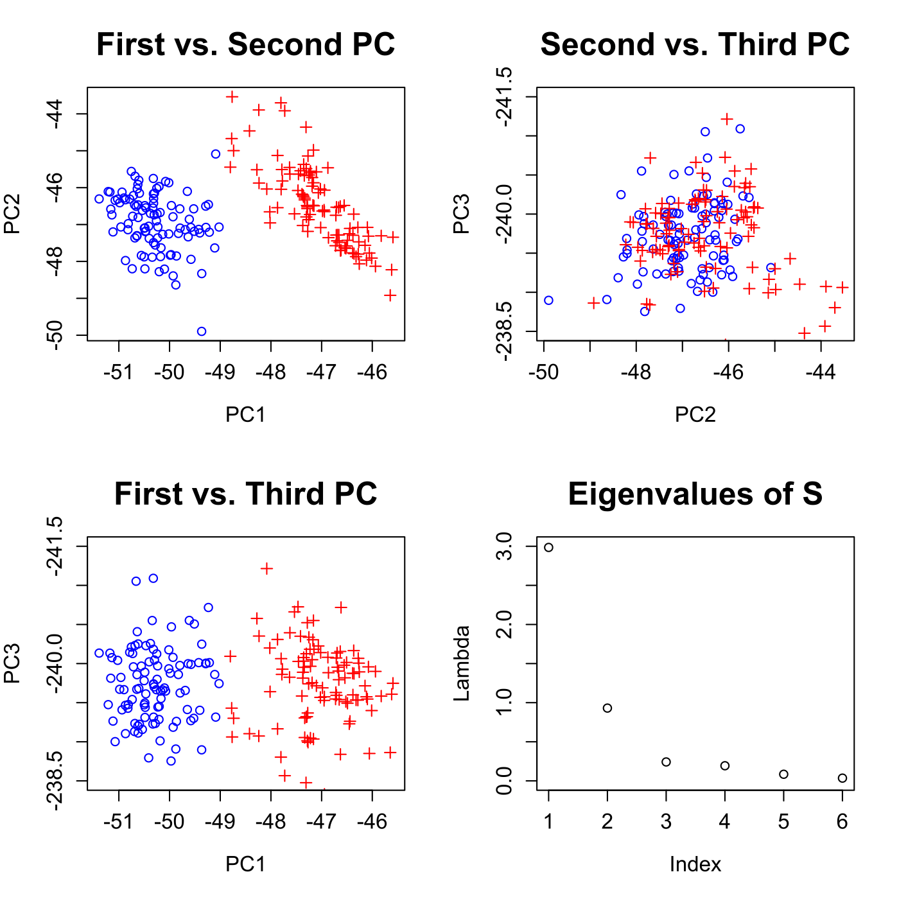
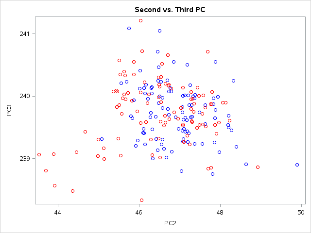
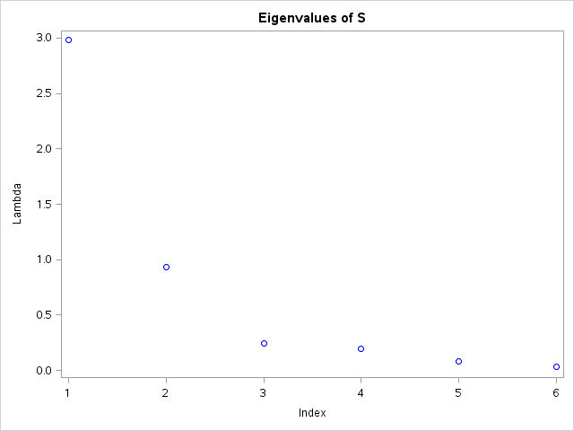

[](http://quantlet.de/index.php?p=info)

## [](http://quantlet.de/) **MVApcabank** [](http://quantlet.de/d3/ia)

```yaml

Name of QuantLet : MVApcabank

Published in : Applied Multivariate Statistical Analysis

Description : 'Performs a PCA for the Swiss bank notes and shows the first three principal
components in two-dimensional scatterplots. Additionally, a screeplot of the eigenvalues is
displayed.'

Keywords : 'principal-components, pca, eigenvalues, screeplot, scatterplot, plot, graphical
representation, data visualization, sas'

See also : 'MVAnpcabanki, MVAnpcabank, MVAnpcahousi, MVAnpcatime, MVAnpcafood, MVAnpcausco,
MVAnpcausco2, MVAnpcausco2i, MVAcpcaiv, MVAnpcahous, MVApcabanki, MVApcabankr, MVApcasimu'

Author : Zografia Anastasiadou

Author[SAS] : Svetlana Bykovskaya

Submitted : Mon, June 30 2014 by Franziska Schulz

Submitted[SAS] : Tue, April 5 2016 by Svetlana Bykovskaya

Datafile : bank2.dat

Example : Principal components of the bank data.

```










### R Code:
```r

# clear all variables
rm(list = ls(all = TRUE))
graphics.off()

# load data
x = read.table("bank2.dat")
n = nrow(x)

e  = eigen((n - 1) * cov(x)/n)   # calculates eigenvalues and eigenvectors and sorts them by size
e1 = e$values
x  = as.matrix(x) %*% e$vectors  # data multiplied by eigenvectors

# plot of the first vs. second PC
par(mfrow = c(2, 2))
plot(x[, 1], x[, 2], pch = c(rep(1, 100), rep(3, 100)), col = c(rep("blue", 100), 
    rep("red", 100)), xlab = "PC1", ylab = "PC2", main = "First vs. Second PC", cex.lab = 1.2, 
    cex.axis = 1.2, cex.main = 1.8)

# plot of the second vs. third PC
plot(x[, 2], x[, 3], pch = c(rep(1, 100), rep(3, 100)), col = c(rep("blue", 100), 
    rep("red", 100)), ylim = c(-238.5, -241.5), xlab = "PC2", ylab = "PC3", main = "Second vs. Third PC", 
    cex.lab = 1.2, cex.axis = 1.2, cex.main = 1.8)

# plot of the first vs. third PC
plot(x[, 1], x[, 3], pch = c(rep(1, 100), rep(3, 100)), col = c(rep("blue", 100), 
    rep("red", 100)), ylim = c(-238.5, -241.5), xlab = "PC1", ylab = "PC3", main = "First vs. Third PC", 
    cex.lab = 1.2, cex.axis = 1.2, cex.main = 1.8)

# plot of the eigenvalues
plot(e1, ylim = c(0, 3), xlab = "Index", ylab = "Lambda", main = "Eigenvalues of S", 
    cex.lab = 1.2, cex.axis = 1.2, cex.main = 1.8) 

```

### SAS Code:
```sas

* Import the data;
data bank2;
  infile '/folders/myfolders/data/bank2.dat';
  input temp1-temp6;
run;

proc iml;
  * Read data into a matrix;
  use bank2;
    read all var _ALL_ into x; 
  close bank2;
  
  n  = nrow(x);
  e  = (n - 1) * cov(x)/n; * calculates eigenvalues and eigenvectors and sorts them by size; 
  e1 = 1:6;
  e2 = eigval(e);
  id = (repeat ({1}, 1, 100) || repeat ({2}, 1, 100))`;
  x  = x * eigvec(e);      * data multiplied by eigenvectors;
  
  x1 = x[,1];
  x2 = x[,2];
  x3 = x[,3];
  create plot var {"x1" "x2" "x3" "e1" "e2" "id"};
    append;
  close plot;
quit;

proc sgplot data = plot
    noautolegend;
  title 'First vs. Second PC';
  scatter x = x1 y = x2 / colorresponse = id colormodel = (blue red);
  xaxis label = 'PC1';
  yaxis label = 'PC2';
run;

proc sgplot data = plot
    noautolegend;
  title 'Second vs. Third PC';
  scatter x = x2 y = x3 / colorresponse = id colormodel = (blue red);
  xaxis label = 'PC2';
  yaxis label = 'PC3';
run;

proc sgplot data = plot
    noautolegend;
  title 'First vs. Third PC';
  scatter x = x1 y = x3 / colorresponse = id colormodel = (blue red);
  xaxis label = 'PC1';
  yaxis label = 'PC3';
run;

proc sgplot data = plot
    noautolegend;
  title 'Eigenvalues of S';
  scatter x = e1 y = e2 / markerattrs = (color = blue);
  xaxis label = 'Index';
  yaxis label = 'Lambda';
run;


```
