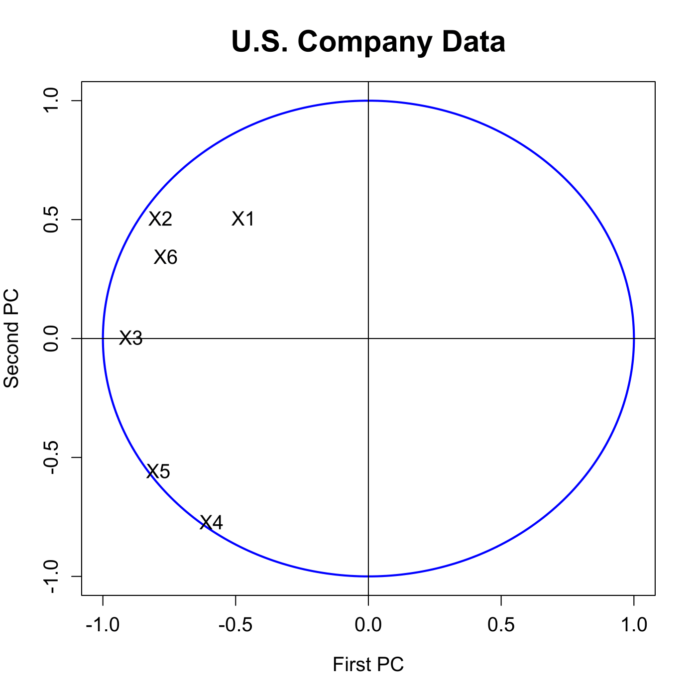

[](http://quantlet.de/index.php?p=info)

## [](http://quantlet.de/) **MVAnpcausco2i** [](http://quantlet.de/d3/ia)

```yaml

Name of QuantLet : MVAnpcausco2i

Published in : Applied Multivariate Statistical Analysis

Description : 'Shows a screeplot of the eigenvalues for the PCA
of the standardized US company data. It computes
the correlations between the variables and the principal
components and displays the first two of them.'

Keywords :
- principal-components
- pca
- npca
- eigenvalues
- standardization
- spectral-decomposition
- screeplot
- plot
- graphical representation
- data visualization
- correlation

See also :
- MVAnpcabanki
- MVAnpcabank
- MVAnpcahousi
- MVAnpcatime
- MVAnpcafood
- MVAnpcahous
- MVAnpcausco
- MVAnpcausco2
- MVAcpcaiv
- MVApcabank
- MVApcabanki
- MVApcabankr
- MVApcasimu

Author : Zografia Anastasiadou

Submitted : Tue, March 18 2014 by Awdesch Melzer

Datafile : uscomp2.dat

Example :
- Screeplot of the eigenvalues for the PCA of the standardized US company data.
- First vs Second PC.
```





```r

# clear all variables
rm(list = ls(all = TRUE))
graphics.off()

# load data
x  = read.table("uscomp2.dat")
x  = x[, 2:7]
x  = rbind(x[1:37, ], x[39, ], x[41:79, ])
n  = nrow(x)
x  = scale(x)                   # standardizes the data matrix
e  = eigen((n - 1) * cov(x)/n)  # calculates eigenvalues and eigenvectors and sorts them by size
e1 = e$values

# plot for the relative proportion of variance explained by PCs
plot(e1, xlab = "Index", ylab = "Lambda", main = "U.S. Company Data", cex.lab = 1.2, 
    cex.axis = 1.2, cex.main = 1.8)

m    = mean(x)
temp = as.matrix(x - matrix(m, n, ncol(x), byrow = T))
r    = temp %*% e$vectors
r    = cor(cbind(r, x))         # correlation between PCs and variables
r1   = r[7:12, 1:2]             # correlation of the two most important PCs and variables

# plot for the correlation of the original variables with the PCs
dev.new()
ucircle = cbind(cos((0:360)/180 * pi), sin((0:360)/180 * pi))
plot(ucircle, type = "l", lty = "solid", col = "blue", xlab = "First PC", ylab = "Second PC", 
    main = "U.S. Company Data", cex.lab = 1.2, cex.axis = 1.2, cex.main = 1.8, lwd = 2)
abline(h = 0, v = 0)
label = c("X1", "X2", "X3", "X4", "X5", "X6")
text(r1, label, cex = 1.2) 

```
