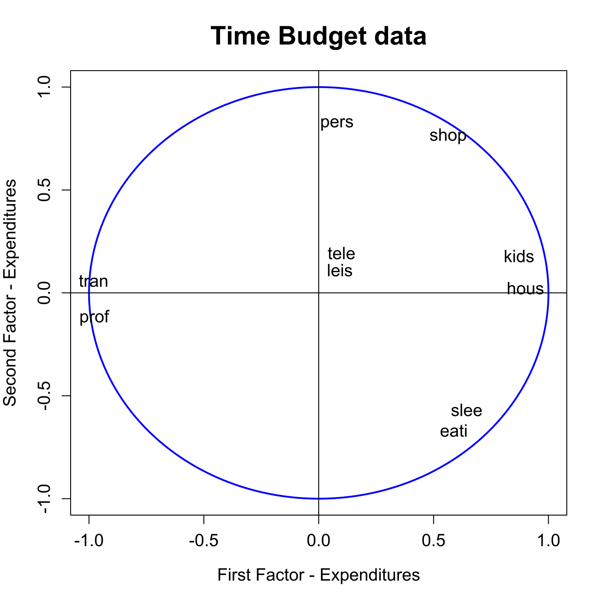

[](http://quantlet.de/index.php?p=info)

## [](http://quantlet.de/) **MVAnpcatime** [](http://quantlet.de/d3/ia)

```yaml

Name of QuantLet : MVAnpcatime

Published in : Applied Multivariate Statistical Analysis

Description : 'Performs a PCA for the standardized time budget data and shows the first two
principal components for the individuals and the variables.'

Keywords : 'principal-components, pca, npca, eigenvalues, standardization,
eigenvalue-decomposition, plot, graphical representation, data visualization'

See also : 'MVAnpcabanki, MVAnpcahous, MVAnpcahousi, MVAnpcabank, MVAnpcafood, MVAnpcausco,
MVAnpcausco2, MVAnpcausco2i, MVAcpcaiv, MVApcabank, MVApcabanki, MVApcabankr, MVApcasimu'

Author : Zografia Anastasiadou, Awdesch Melzer

Submitted : Wed, April 02 2014 by Awdesch Melzer

Datafile : timebudget.dat

Example: 
- 1: Representation of the individuals.
- 2: Representation of the variables.

```





```r

# clear all variables
rm(list = ls(all = TRUE))
graphics.off()

# load data
x  = read.table("timebudget.dat")
n  = nrow(x)                            # number of rows
p  = ncol(x)                            # number of columns
x1 = sqrt((n - 1) * apply(x, 2, var))   # estimated std error for each variable
x2 = x - matrix(apply(as.matrix(x), 2, mean), nrow = n, ncol = p, byrow = T)  # X - mean(X)
x  = as.matrix(x2/matrix(x1, nrow = n, ncol = p, byrow = T))                  # Standardizes Data
e  = eigen(x %*% t(x)/n)                # Eigenvalues/Eigenvectors
e1 = e$values
e2 = e$vectors
a  = e2[, 1:2]                          # first two Eigenvectors corresponding to largest 2 Eigenvalues
w  = a * sqrt(matrix(e1[1:2], nrow(a), ncol(a), byrow = TRUE))                # coordinates of individuals

# Plot 1: the representation of the individuals
plot(w, type = "n", xlab = "First Factor - Individuals", ylab = "Second Factor - Individuals", 
    main = "Time Budget data", cex.lab = 1.2, cex.axis = 1.2, cex.main = 1.8, lwd = 2)
label = c("maus", "waus", "wnus", "mmus", "wmus", "msus", "wsus", "mawe", "wawe", 
    "wnwe", "mmwe", "wmwe", "mswe", "wswe", "mayo", "wayo", "wnyo", "mmyo", "wmyo", 
    "msyo", "wsyo", "maes", "waes", "wnes", "mmes", "wmes", "mses", "wses")
text(w, label, cex = 1.2)
abline(h = 0, v = 0)

g  = eigen(t(x) %*% x)  # Eigenvalues/Eigenvectors
g1 = g$values
g2 = g$vectors
b  = g2[, 1:2]          # first 2 vectors corresponding to largest 2 Eigenvalues
z  = b * sqrt(matrix(g1[1:2], nrow(b), ncol(b), byrow = TRUE))  # coordinates of variables
dev.new()

# Plot 2: the representation of the variables
ucircle = cbind(cos((0:360)/180 * pi), sin((0:360)/180 * pi))
plot(ucircle, type = "l", lty = "solid", col = "blue", xlab = "First Factor - Expenditures", 
    ylab = "Second Factor - Expenditures", main = "Time Budget data", cex.lab = 1.2, 
    cex.axis = 1.2, cex.main = 1.8, lwd = 2)
abline(h = 0, v = 0)
label = c("prof", "tran", "hous", "kids", "shop", "pers", "eati", "slee", "tele", 
    "leis")
text(z, label, cex = 1.2) 

```
